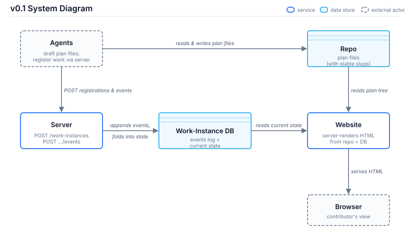

# v0.1 Design: Work-Streams Tool

This document describes the design for v0.1 — the first shipping version of the work-streams tool. It builds on the framing established in [`vision.md`](vision.md). v0.1 is intentionally smaller than the full vision: most of the vision's richer features (the intent layer, sub-stage cells, the triage zone, tier-based sorting, actor lineage) are deferred to later versions. The point of v0.1 is to prove the core loop — agents register, the plan tree gets visualized, and the contributor can see what's happening across their parallel work — before investing in the harder pieces.

The structural rules for the plan-tree docs the tool consumes — slug format, Status lifecycle, layout convention, doc-type taxonomy, backlog format — are codified in [`../spec/`](../spec/) and not re-described here. This design doc covers what's specific to *the tool*: architecture, API, data model, and implementation stack. Where a section needs to refer to plan-doc structure, it points at the spec.

## 1. Scope

**What's in v0.1:**

- A local website that the contributor opens in a browser to see their current work.
- The website reads the plan tree from a single hardcoded repository path. No configurability for which repo.
- A local server that accepts agent registration calls and writes them to a local database.
- A bare-bones visualization: forest topology of plan-tree roots, with status colors per node and a marker for which agent is currently working on which node. No sub-stage cells, no triage zone, no intent strip, no tier-based sorting.
- Stable slug IDs in plan-file frontmatter, generated by the server on demand per the slug rule in [`../spec/planning/shared.md`](../spec/planning/shared.md).
- An event log of all agent calls, retained in the database for debugging and future state reconstruction.

**What's not in v0.1:**

- Intent layer UI (whether intent appears in the data model at all is a deferred decision; the UI is definitely out).
- Sub-stage cells (drafting / planning / implementation / validation) on each node.
- The triage zone for work-instances that aren't yet attached to a plan-tree node.
- Tier-based sorting of root nodes (active / in-flight / landed).
- Actor lineage edges between agents.
- Authoring nudges for missing intent.
- Multi-repository support.
- Multi-contributor support.
- Any push from server back to agents — the tool stays one-way.

The vision document describes most of these as eventual features. v0.1 is the smallest viable slice that delivers the headline value (cross-agent visibility into parallel work) without committing to the harder pieces.

## 2. System Architecture

The system has five logical components plus the contributor's browser. The diagram below shows them and their relationships.



**The Repo** is the contributor's project directory, containing planning documents under `docs/plans/<root-slug>/` per the layout convention in [`../spec/planning-doc-location.md`](../spec/planning-doc-location.md). Each plan document carries a stable slug in its frontmatter (see Section 3). From the tool's perspective the repo is read-only: it is the source of truth for the plan tree, and the website reads from it directly. The server never reads the repo.

**Agents** are the things doing work — typically AI coding sessions running in worktrees of the repo. Each agent does two things relative to the tool: it reads and writes plan files in the repo (drafting documents, including writing the stable slug into a new file's frontmatter), and it calls the server to register and update work-instances.

**The Server** is a small local process that accepts agent calls through two API endpoints (Section 4). It writes events and work-instance state to the local database. The server does not read the repo, does not push state back to agents, and does not serve the website's HTML — those are separate responsibilities.

**The Work-Instance DB** is a local database storing two things: an append-only log of every event the server has received, and the derived current-state object for each work-instance. The current state is recomputed by the server when each event is processed. The DB is the authoritative source for "what work-instances exist and what their state is."

**The Website** is the read side of the system. On each browser request, it reads the plan tree from the repo, joins it with current work-instance state from the DB, and renders an HTML page. The website is server-rendered — no client-side JavaScript polls for updates, no JSON API is exposed for reads. The contributor refreshes the page to see new state.

**The Browser** is the contributor's view into the website. Refreshing the page triggers the website to re-read both data sources and produce fresh HTML.

In implementation, the Server and the Website are likely to be the same local process — one HTTP server that handles both the write side (agent calls) and the read side (HTML page requests). The diagram shows them as logically separate to keep the architecture clear; the build can merge them.

## 3. The Plan Tree

The plan tree is the structural skeleton the visualization renders. v0.1 reads it directly from the contributor's repo, where it lives as a set of markdown documents organized per the layout convention in [`../spec/planning-doc-location.md`](../spec/planning-doc-location.md): every plan-tree root in its own folder under `docs/plans/<root-slug>/`, with the root doc at `<root-slug>/README.md` and descendants as siblings.

**Slugs and Status are owned by the spec.** Every plan-tree doc carries a stable `slug` and a `Status` value in YAML frontmatter. The slug rule (hierarchical format, four-segment cap, position-encoding-at-creation) is defined in [`../spec/planning/shared.md`](../spec/planning/shared.md) "Plan-doc identity (slug)"; the canonical Status lifecycle (`In draft` / `Proposed` / `In progress` / `Validating` / `Landed` / `Deferred — <reason>`) is defined in the same file under "Plan-doc Status." The tool consumes both as inputs and does not redefine them. The plan-doc `slug` frontmatter is also what the agent resolves a natural-language prompt to during the session-start registration handshake (Section 4, exact-slug flow); the slug carried here is the authoritative identity that handshake registers against.

**The website reading the tree.** On each browser request, the website walks `docs/plans/<root-slug>/` for each root, reads each plan file, parses the frontmatter to extract `slug` and `Status`, and builds an in-memory plan tree. The structure of the tree comes from the slug hierarchy (each descendant's slug encodes its position relative to the root); the folder layout is the human-friendly arrangement, not the parsing contract. The website then joins the tree with current work-instance state from the DB and renders.

For v0.1, this walk happens on every request. The contributor's repo is small enough that the cost is negligible. If it becomes slow as the repo grows, in-memory caching with file-watcher invalidation is the natural next step — but that's not part of v0.1.

## 4. The API

The server exposes two endpoints. Both are POST.

**POST `/work-instances`** — register a new work-instance.

The agent calls this when starting a piece of work. There are three flows: a new root, a descendant of an existing node, or a caller-supplied exact slug (create-or-attach).

*Root case (epic or standalone task).* The agent supplies its desired root slug:

```
{ root_slug: "madrona-feedback", node_type: "epic", actor: "..." }
```

The server validates the slug format per the spec's kebab-case rule (see [`../spec/planning/shared.md`](../spec/planning/shared.md) "Plan-doc identity (slug)"), checks for collisions with existing roots, and registers the root. The agent's supplied slug is the authoritative identifier.

*Descendant case (milestone, task, or phase).* The agent supplies the parent context and the server generates the slug:

```
{ root_slug: "madrona-feedback", parent_path: "m1-t2", node_type: "phase", actor: "..." }
```

The server finds existing children of the specified parent, picks the next available position number, constructs the descendant slug (e.g., `madrona-feedback-m1-t2-p3`), and returns it.

*Exact-slug case (create-or-attach).* The agent supplies the slug verbatim via an optional `exact_slug` field:

```
{ exact_slug: "madrona-feedback-m1-t1", actor: "..." }
```

When `exact_slug` is non-empty it selects this third flow and `parent_path` / `root_slug`-derived generation are not consulted. The server registers a work-instance at exactly that slug — no slug derivation, no descendant generation, and **no root-conflict check** (only the bare root case still rejects a duplicate root). There is no precondition that a work-instance already exists for the slug: if none exists this creates the slug's first work-instance; if one or more exist it attaches an additional one. The slug must be well-formed under the slug grammar (kebab-case root, optionally followed by `mN`/`tN`/`pN` position segments); a malformed `exact_slug` is rejected with HTTP 400. The server does not verify the slug names a real plan-tree doc — it never reads the repo — so an "orphan" work-instance at a doc-less slug is permitted (deferred triage-zone concern, not policed here). This is the flow automatic agent registration consumes for first-registration; `exact_slug` is optional and omitted by v0.1 callers, whose behavior is unchanged. Automatic registration consumes this flow through the `workstream-tracker register` subcommand, invoked by the agent during the session-start narration handshake (see [`../AGENTS.md`](../AGENTS.md) "Session-start work-instance registration"); it is a pure consumer — no endpoint, request/response field, or schema change.

*Idempotency.* Across all three flows, before inserting, the server checks for an already-active work-instance for the resolved `(slug, actor)` pair. If one exists, no new row and no new `register` event are written and the existing work-instance ID and slug are returned (HTTP 201). The idempotency key is `(slug, actor, state = active)`: a new registration is permitted once the prior work-instance for the pair has reached a terminal state (serial resume after pause), and is permitted concurrently for a different actor on the same slug (co-working). For the bare root case the duplicate-root rejection fires before this check. The check and insert run inside one `BEGIN IMMEDIATE` transaction, so two concurrent registrations for the same pair cannot both insert.

In all cases, the server appends a `register` event to the event log (except the idempotent no-op above), creates the work-instance record with initial state `active`, and returns the work-instance ID and the slug.

The agent then writes the slug into the new file's frontmatter and constructs the file path from the slug using the layout convention in [`../spec/planning-doc-location.md`](../spec/planning-doc-location.md). The slug determines the initial path; after creation, the slug is immutable and the path can move freely without touching the slug.

**POST `/work-instances/:id/events`** — record an event on an existing work-instance.

Two event shapes are valid in v0.1:

*Heartbeat* — no state change. Empty payload (or `{ metadata: {...} }` with optional extras). Server updates the work-instance's `last-updated-at` timestamp.

*State transition* — `{ state: "completed" | "abandoned", metadata: {...} }`. Server records the event, updates current state, sets the terminal timestamp. Once a work-instance reaches a terminal state, further state-change events are not expected (the v0.1 model treats `completed` and `abandoned` as final).

The optional `metadata` field on either event shape is a free-form blob. Agents can include fields like `pr_number`, `session_name`, `branch`, etc. v0.1's UI does not render the metadata; the server stores it for forward-compatible use in later versions.

There is no `/state` endpoint for reading. The website queries the database directly when rendering pages.

## 5. Data Model

The Work-Instance DB stores two things: the event log and the current-state records.

**Event log (append-only).** Each entry carries:

- An event identifier (server-generated).
- The work-instance identifier the event applies to.
- The event type (`register`, `heartbeat`, or `state_transition`).
- The event payload — for `register`, initial values; for `state_transition`, the new state; for `heartbeat`, nothing required.
- An optional `metadata` blob (free-form), used for forward-compatible extras like `pr_number`, `session_name`, `branch`.
- A server-side timestamp recording when the event arrived.

**Current-state records.** Derived from folding the event log. Each record carries:

- The work-instance identifier.
- The slug the work-instance is attached to. A slug is **not unique**: it carries N≥1 work-instances over its lifetime — serially (a session that pauses and later resumes) and concurrently (two actors co-working the same node). The slug column is indexed (non-unique) for the registration lookups; uniqueness is enforced only at the `(slug, actor, state = active)` level by the registration idempotency rule in Section 4, not by the schema.
- The actor identifier.
- The current state — one of `active`, `completed`, or `abandoned`.
- A created-at timestamp (when the work-instance was first registered).
- A last-updated-at timestamp.
- A terminal-at timestamp (nullable; set when the work-instance enters `completed` or `abandoned`).

When the server processes an event, it appends to the log and updates the current-state record by folding the event into it. If the database's current-state table is ever lost, it can be rebuilt by replaying the event log.

**Two state channels.** The work-instance `state` (`active` / `completed` / `abandoned`) is the runtime channel — "is an agent currently doing work against this node." The other channel is the **plan-doc `Status`** the spec defines (`In draft` / `Proposed` / `In progress` / `Validating` / `Landed` / `Deferred — <reason>`), which lives in plan-file frontmatter and describes the durable lifecycle of the planning artifact. The two evolve independently; see [`../spec/planning/shared.md`](../spec/planning/shared.md) "Plan-doc Status" for the relationship.

## 6. Concurrency

v0.1 uses **last-write-wins** for concurrent updates. The server timestamps each event when it arrives and folds events into current state in arrival order. If a stale request arrives after a fresh one, the stale value overwrites — but this is rare in practice given the localhost setup and single-contributor pattern.

The transition operations are naturally idempotent: the same call with the same payload produces the same final state (setting state to `completed` twice still leaves the work-instance completed).

**Forward compatibility with version-checking.** The schema and API are designed so that adding optimistic concurrency control later (a version field on work-instances, server rejection of stale updates) is additive. Nothing in v0.1 prevents that addition in v0.2 or beyond.

## 7. What the Website Renders

The page renders as two regions side by side: a **forest region** (~2/3, left) and a **roster region** (~1/3, right), one page scroll, the roster top-aligned so it shows without scrolling on a tall window, and the regions stacking (roster below forest) below a desktop-narrow width — mobile is out of scope (m2 t1, the two-region site skeleton). The roster region currently holds a deliberate, intentional placeholder ("the session roster lands in a later task"); the bound/unbound session roster itself is later m2 work. The rest of this section describes the forest region.

The forest region shows the plan-tree forest — every plan-tree root that exists in the repo, with its descendants nested inside it. Each node renders as its own box (epic/root → milestone → task → phase): a box with children is a native HTML `<details>`/`<summary>` element so it is independently collapsible, and a leaf box (no children) has no disclosure control (m2 t2, the expanded in-root nested-box render). A box's header carries its plan-doc Status badge (read from frontmatter, per the canonical lifecycle in [`../spec/planning/shared.md`](../spec/planning/shared.md) "Plan-doc Status"; unknown Status values fall back to a neutral color, per the spec's graceful-fallback rule) and, where a work-instance is currently active on the node, a marker indicating which actor is attached. A collapsible box renders expanded iff it, or any descendant, has an active work-instance, and collapsed otherwise — the expand state is recomputed from live work-instance data on every request, with no stored UI state, so the view auto-focuses wherever agents are currently working. Inside the box, a node also renders — as static HTML — its long description (the plan doc's markdown body) and a list of related PRs. Related PRs come from two sources: the optional `related_prs` frontmatter field (author-curated, authoritative — see [`../spec/planning/shared.md`](../spec/planning/shared.md) "Optional `related_prs` field"), and best-effort auto-discovery via a single `gh pr list` call per page request that attaches any PR whose title contains the node's verbatim slug, merged after the frontmatter entries and deduped by URL. The `gh` discovery is additive and degrades silently: if `gh` is missing, unauthenticated, offline, run outside a git repo, or slow past a short timeout, the node still renders its frontmatter PRs (or none) and the page never fails. A node with neither — including a bare `slug` + `Status: In draft` stub — renders as a valid box with just its badge and label.

The remaining v0.1 render is otherwise bare-bones by design. No tier sorting, no sub-stage cells, no intent strip, no triage zone, no actor sidebar, no lineage edges. The collapse mechanism is native HTML only — no JavaScript and no new route (the m2 t2 resolution superseded the narrower v0.2 "no expand/collapse" task decision while preserving the durable server-rendered, refresh-to-update, no-read-API tenet). Everything is rendered on one page, refresh-to-update.

The richer visualization described in the vision document (see Section 4 of [`vision.md`](vision.md), and the strawman in [`workstreams-view.svg`](workstreams-view.svg)) is the longer-term target. v0.1 deliberately strips it back to verify the core loop before investing in the polish.

## 8. Resolved Decisions

The four design choices that were originally deferred have since been resolved. They're captured here as a record, with pointers to where each one lives in the doc.

**Where the database physically lives.** Resolved: a local SQLite database (via `modernc.org/sqlite`, pure-Go). See Section 10 (Implementation Stack).

**The slug-generation input shape.** Resolved: `{ root_slug, parent_path, node_type, actor }`, with two flows depending on whether the registration is for a root or a descendant. See Section 4 (The API). Slug *format* rules (kebab-case roots, type prefixes `m`/`t`/`p`, four-segment cap, position-encoding-at-creation) live in [`../spec/planning/shared.md`](../spec/planning/shared.md) "Plan-doc identity (slug)."

**What an update event can contain.** Resolved: heartbeat (no state change) or state transition to `completed` / `abandoned`. Plus an optional free-form `metadata` blob for forward-compatible extras. See Section 4 (The API).

**Plan-doc structure extracted to `spec/`.** What used to live inline in this design doc — slug rules, layout convention, doc-type taxonomy, authoring rules — now lives in [`../spec/`](../spec/) as the canonical authority for consumer projects. This design doc covers the tool; the spec covers the plan-doc shape the tool consumes.

**Plan-doc Status lifecycle codified.** Six canonical values: `In draft` / `Proposed` / `In progress` / `Validating` / `Landed` / `Deferred — <reason>`. The `Validating` Status is optional, used when a project has a meaningful post-merge validation gap (manual walkthrough, prod smoke, async verification); projects without that gap transition `In progress` → `Landed` directly. See [`../spec/planning/shared.md`](../spec/planning/shared.md) "Plan-doc Status."

**Per-root-folder layout convention.** Every plan-tree root lives in its own folder at `docs/plans/<root-slug>/`, with the root doc at `<root-slug>/README.md` and descendants as siblings. v0.0 hardcodes this layout; configurability is deferred. See [`../spec/planning-doc-location.md`](../spec/planning-doc-location.md).

**Backlog format codified.** A flat list of pre-plan work items at `docs/backlog.md`, with `Open` / `Graduated — <plan-slug>` lifecycle. Backlog entries are NOT plan-tree nodes — separate concept the tool understands and renders in a separate panel. See [`../spec/backlog.md`](../spec/backlog.md).

Stale active work-instances (agent crashed without sending a terminal state) are tolerated rather than auto-cleaned in v0.1 — the UI relies on `last-updated-at` staleness for liveness judgments. Auto-abandon can come later if it becomes a real problem.

## 9. Out of Scope for v0.1

These features are deliberately not in v0.1. Some appear in the vision document as eventual goals; some are out for the foreseeable future.

- Intent layer UI. The data model may carry intent if it proves useful for v0.2, but v0.1 doesn't display it.
- Sub-stage cells on plan-tree nodes (D / P / I / V).
- The triage zone for uncategorized work-instances.
- Tier-based sorting of root nodes (active / in-flight / landed-or-abandoned).
- Actor lineage rendering (which agent spawned which).
- Authoring nudges that prompt the contributor to capture missing intent.
- Multi-repository support.
- Multi-contributor support.
- Server-to-agent push (the tool stays one-way).
- Time-series history of state evolution beyond what the event log captures.
- Real-time updates without browser refresh.
- Mobile or other-device interfaces.
- Cross-project aggregation.

## 10. Implementation Stack

The following technical choices are locked for v0.1. Each was deliberated against alternatives; the short justifications below capture why each won.

**Language: Go.** Chosen partly for personal-development reasons (the contributor wants experience building in Go) and partly because Go compiles to a single static binary, has a strong stdlib for HTTP servers, and produces a runtime that's appropriate for a long-running local process.

**HTML rendering: stdlib `html/template`** (formally accepted; revised from `templ`). This was originally locked as `templ` — a community library that compiles JSX-like template files (`.templ`) into Go code, giving type-safe HTML rendering with a React-like component model, picked over the stdlib for ergonomics at the cost of one less-than-foundational dependency. At v0.1 implementation the decision was deliberately reversed: the renderer uses the stdlib `html/template`, with `templ` deferred "until there are real reusable components" (rationale in git, commit `60040be`). The deferred decision was resolved by the `templ-render-adoption` task ([`docs/plans/templ-render-adoption/README.md`](../docs/plans/templ-render-adoption/README.md)): a throwaway spike showed that a `templ` port minifies the whitespace the renderer's byte-identity tests pin (so migration is not output-neutral) and adds a code-generation CLI plus a `templ generate` step to an intentionally Go-toolchain-only validation gate, for marginal type-safety value at a three-thin-template surface. **`html/template` is therefore the standing choice.** Re-trigger condition: the tripwire is render-surface *complexity*, not interactivity — the site is server-rendered by design (§9: no real-time updates, no server push), so the v1.0+ roadmap (intent bar, tier sorting, sub-stage cells, triage zone, actor lineage) grows more server-rendered structure that `html/template` can express. Revisit `templ` when the partial set, recursion/conditional depth, and typed data threaded through the templates grow such that the stringly-typed `{{template}}`/`FuncMap` indirection and the lack of compile-time field checks become a real readability and refactor-safety hazard; a growing file count alone, and "interactive components" specifically, are not the tripwire. The migration is bounded and linear (clean render-layer separation, leaf-up component port); the one accreting cost is the per-partial byte-identity test ratchet, which the plan's Risk Register mitigates by asserting semantic (not byte-exact) output on net-new partials. This bullet supersedes the original `templ` lock; git history carries the original justification.

**HTTP routing: `chi`.** A small, well-established community router that adds idiomatic routing patterns (middleware chaining, route groups) on top of stdlib `net/http`. Picked over stdlib alone for the case where the API grows past two endpoints; chi makes that growth path clean.

**Database: SQLite via `modernc.org/sqlite`.** Pure-Go SQLite driver, no CGO dependency. SQLite chosen over embedded NoSQL options (bbolt, BadgerDB) because the data model has relational properties (events reference work-instances, work-instances reference slugs); chosen over a server database (Postgres, MySQL) to avoid requiring the contributor to run a separate database process.

**Markdown + frontmatter: `goldmark` + `goldmark-meta`.** Pure-Go markdown parser with CommonMark compliance, plus an extension that handles YAML frontmatter in the same parser pipeline. Picked over a no-parser-library approach (stdlib + regex) for robustness against formatting variation in plan documents.

**Project structure: Go-idiomatic, single-process.**

```
/
  cmd/
    workstream-tracker/
      main.go        # entry point
  internal/
    api/             # work-instance API handlers
    site/            # HTML rendering (stdlib html/template)
    db/              # DB access
    models/          # shared types (work-instance, event, etc.)
  go.mod
```

The `cmd/<name>/main.go` pattern is standard for Go binaries. `internal/` prevents external packages from importing these modules — appropriate for a tool that doesn't expose a public API. The folder structure separates API, site, and DB responsibilities at the source level, supporting a future split into two processes if one is ever wanted.

**Concurrency posture: last-write-wins.** v0.1 doesn't use optimistic concurrency or sequence-number ordering. Added to the schema only if real-world use surfaces a need. Version-checking remains forward-compatible — adding a version field later is additive.
