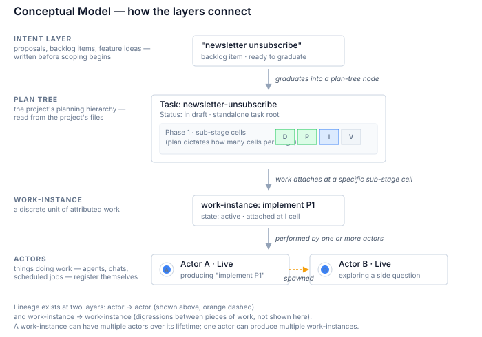
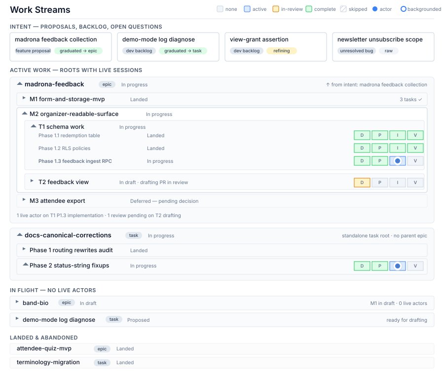

# Vision: Work-Streams Tool

## Summary

This vision describes a new tool that visualizes the progress of parallel-running agents as they work on different stories within the same project. As AI coding agents become more capable, it has become practical to run several of them at the same time — each one working on its own piece of the project, in its own workspace. The tool gives the person managing those agents a single place to see what each one is working on, how far along it is, and how the pieces relate to each other. It does this by reading the project's existing planning documents and by listening to each agent as it starts, makes progress, and finishes. The tool is deliberately not a project-management tool — projects already have plenty of those, and this project's existing planning system already does that job well. What the tool adds is the live, cross-agent view that today only exists in the contributor's head.

## 1. Purpose

AI coding agents are now capable enough to run several at a time, each working on a different piece of the same project, in its own workspace, with its own conversation thread. Running them in parallel multiplies how much one person can get done in a day. But it also creates a new problem: keeping track of what each one is doing.

Today, the only thing tracking that information is the contributor's memory. And when there are two, three, or five agents running at once, that memory starts to fail in specific, recurring ways.

**The workspace's name doesn't say what's in it.** Workspaces get auto-generated names when they're created — strings like `quirky-khayyam-fc90c0` or `wonderful-rhodes-baaefb`. Unique, but uninformative. To remember which workspace contains which work, the contributor has to open it. A quick "where was I doing the authentication thing?" turns into opening every workspace until one looks right.

**The connection between agents is invisible.** It often happens that one agent surfaces a question that doesn't quite fit its current work — "wait, does the assumption this is built on actually hold?" — and the right move is to spin off a second agent in a separate workspace to chase that question, while the first one keeps going. Once the second agent is running, nothing in the setup remembers that it was spawned from the first, or what question it was meant to answer. The thread between parent and child lives only in the contributor's head. When attention moves on to something else, that thread fades. Half-finished side investigations get abandoned because they can't be found again later.

**There's no quick way to see what each agent is doing.** At any moment, some agents are actively writing code, some are waiting for the contributor to review what they've produced, some are paused because they have a question, and some have finished and are essentially done. Today, the only way to know which is which is to visit each one in turn. "What should I look at next?" turns into a survey of every agent, rather than a glance at a single view.

**Switching between agents costs time, and the cost grows.** Every time the contributor leaves one agent and comes back later, there is a re-orientation tax: re-reading the conversation, re-loading the mental thread, re-discovering what state the work is in. The longer the gap, the higher the tax. With many agents, the tax compounds.

People in this situation have tried various workarounds, and each one falls short in its own way. Keeping a written list inside the project — "agent X is working on Y" — captures the missing information, but only if it's updated every time an agent starts, pivots, or finishes; the maintenance cost is high and the value decays the moment the list gets out of date. Writing a small command that lists the current workspaces and any open code reviews can print a one-time snapshot, but a snapshot can't capture which agent spawned which, and it can't update itself as state changes. Tools that show multiple agent windows side-by-side help in the moment, but only within a single screen — they don't unify the view, don't know what each agent is for, and don't surface state at a glance.

What's missing isn't a project-management tool. There are plenty of those, and this project's existing planning system already records what each piece of work is for, where it sits in the hierarchy, and what state it's in. What's missing is a layer between the contributor and the live agent activity: a record of which agents are running right now, what each one is working on, how they relate to each other, and where they sit on the planning hierarchy that already exists. The tool described in this document fills that layer.

## 2. Goals and Non-Goals

What success looks like for this tool, stated as concretely as possible.

**A single view of what each agent is doing.** When the tool is working, the contributor opens one screen and sees every agent that's currently running, what piece of the project each one is on, what stage of that work it's at (still planning, actively writing, waiting on review), and how the pieces relate. No mental survey, no clicking through windows — the cross-agent picture is right there.

**A place for work that hasn't found its home yet.** Not every agent starts with a clear assignment. Sometimes one starts to investigate a question that may or may not become a real piece of work — exploring the backlog, weighing whether a feature is worth building, chasing a bug that may not exist. The tool gives that exploratory activity a visible slot of its own, distinct from the agents working on the planning-tracked pieces. That slot is where the contributor decides whether the exploration becomes a real piece of work or quietly fades away.

**Active work is what you see first.** A project accumulates a lot of completed and parked work over time. The view sorts itself so the agents that are currently running surface at the top, the work that's set up but not currently moving sits below them, and everything finished or abandoned compresses into a small zone at the bottom. The contributor doesn't have to wade through history to find what's live right now.

**A nudge toward writing down intent before scoping the solution.** Most pieces of work benefit from a short written description of what's being attempted and why, written before the planning document that lays out how the work will be done. Today, that "what and why" capture is uneven — sometimes done thoroughly, sometimes skipped entirely. The tool makes those gaps visible, so the contributor is more likely to fill them in before agents start work that gets pulled off-target by missing context.

The tool is also deliberately *not* a few things, and those non-goals shape the design as much as the goals do.

**Not a replacement for the project's planning system.** The project already has a disciplined way of writing down what each piece of work is for, how it breaks down into smaller pieces, and what state each piece is in. That system stays where it is, in the project's own files. The tool reads from it; it doesn't replace it or pull the planning out into a separate place.

**Not the features that bigger project-management tools provide.** Things like sharing views with stakeholders, capturing notes from a phone, getting notifications in chat or email, working across multiple projects — those are valuable in many settings, but they aren't what's missing here, and trying to provide them would turn a focused tool into a generic one. Tools like Linear, Notion, and GitHub Projects exist for those cases.

**Not multi-contributor, not multi-project.** The tool is for one person managing several agents on one project. Adding contributors or additional projects introduces shared-state and access questions that this version doesn't try to answer. If that need arises later, it gets addressed later.

**Not a record of state over time.** The tool shows what is happening *now*. It does not keep a history of what was happening last week or last month. A finished piece of work stays visible as a finished piece of work, but the moment-by-moment journey it took to get there is not tracked. Adding that capability is possible but inflates the tool well past "useful side project," and the day-to-day need is the present, not the past.

## 3. Conceptual Model

This section names the load-bearing concepts the tool reasons about. The full picture has a few layers stacked on top of each other, with relationships that connect across them. The diagram below shows how the layers fit together; the prose underneath defines each piece in turn.

**Agents and other actors.** The tool tracks any "thing" that can register itself as doing work — most commonly a coding agent working in its own workspace, but also things like an interactive chat that isn't tied to a specific workspace, a scheduled background job, or in principle anything else that knows how to talk to the tool's open interface. The tool calls these things *actors*. The kind of actor (a coding agent, a chat, a scheduled job) is a label the visualization can use for color or hover information, but it isn't part of the actor's identity — the tool treats them all the same in terms of how they register, what they report, and how they close.

When an actor starts working, it sometimes spawns a second actor to investigate a side question while the first one keeps going. The tool remembers that lineage: actor B was spawned by actor A. This is the parent-child thread that today gets lost the moment either side closes.

**Work-instances.** When an actor knows what it's working on, it registers a *work-instance* with the tool: a record that says "this piece of work is being done, at this place in the project's plan." Work-instances are the durable units of attributed work. A single actor can produce multiple work-instances over its lifetime — for example, an agent working on Task X that pauses to land a small fix to the backlog file, then returns to Task X, has produced two work-instances. Conversely, a single work-instance can be touched by multiple actors over its lifetime, because real work often outlives any individual agent: implementing a feature might start in agent A, pause overnight, and continue in agent B the next morning.

Some work-instances don't yet know where they belong in the project's plan. An exploratory agent investigating "is this feature worth doing?" can register as a work-instance without being attached to any specific piece of the plan. That work-instance sits in a *triage* zone in the view, waiting either to find its home in the plan or to be discarded.

**The plan tree.** The project's existing planning system describes work in a hierarchy. An *epic* is a large multi-part effort that contains *milestones*; each milestone contains *tasks*; and each task may break down into smaller *phases*. The tool reads this hierarchy directly from the project — it doesn't invent its own. One important thing to know about the hierarchy is that it isn't always four levels deep: smaller pieces of work often skip the epic and milestone layers entirely and live as standalone tasks. So what the tool actually renders is a *forest* — a collection of separate trees — where each tree's root might be a full epic with milestones and tasks beneath it, or a single standalone task that's its own root.

Every node in the forest — every epic, milestone, task, and phase — has its own *status*: drafting, in progress, in validation, landed, deferred, and so on. The status comes from the planning document itself; the tool reads it rather than computes it.

**Sub-stages within a node.** At the leaf of the plan tree — the smallest piece of work, whether a phase inside a task or a task that has no further breakdown — work goes through four stages in order: *drafting* (writing a short document describing the problem and the constraints), *planning* (writing a document that describes how the work will be done), *implementation* (writing the code), and *validation* (confirming the work is correct in production). Each stage produces one or more pull requests, and the number varies by what the plan calls for. Drafting and planning each typically produce one. Implementation can be split across several pull requests when the work is large. Validation can be zero (when no separate close-out step is needed), one (a single close-out pull request), or rarely more. The tool renders one cell per pull request the plan calls for, so the number of cells per stage reflects the current plan.

**The intent layer.** Above the plan tree sits another kind of document the project either has or could grow: a *proposal* describing what's being attempted and why, written before the planning document that says how. The intent layer is heterogeneous — it can contain backlog items with a paragraph of context, full feature proposals describing a multi-milestone effort, or in-between cases like product proposals and unresolved-bug write-ups. When an intent document is ready, it *graduates* into the plan tree at whatever altitude its size demands: an epic-sized intent becomes an epic root in the forest, a task-sized intent becomes a standalone task. After graduation, the intent document persists in the project as a historical anchor, and the plan-tree node it became carries a link back upward to its parent intent.

**State at three layers.** Different layers of the model carry different kinds of state, and the visualization surfaces all three. *Node status* is the planning document's own status (drafting, in progress, in validation, landed, deferred), read directly from the project. *Sub-stage state* has four values that follow the natural progression of work toward a merged pull request: *none* (not started), *active* (work in progress, no pull request open yet), *in-review* (pull request opened, awaiting review or merge), and *complete* (the pull request has merged). *Work-instance state* is the richest, because it describes the actor's engagement rather than the artifact's lifecycle: an *active* work-instance is the one the actor is currently focused on; *awaiting-user* means the actor has paused to ask the contributor something; *awaiting-external* means the actor is paused waiting for review or CI or some other non-contributor input; *backgrounded* means the actor moved on to a different work-instance and this one is on the back burner; *completed* and *abandoned* are terminal states. Cell state and work-instance state describe different things and don't always agree — a pull request can sit in *in-review* at the cell level with no live work-instance currently attached, if the actor that opened it has closed.

**Lineage at two layers.** The tool surfaces two kinds of cross-relationship. *Actor lineage* records that one actor spawned another — the parent-child relationship for the side-investigation case described above. *Work-instance lineage* records that one piece of work emerged as a digression from another. The two often coincide — when an actor spawns a sub-actor to chase a question, the work-instances on each side are also related — but they don't have to. A single actor working on two unrelated things produces two work-instances with no lineage between them, just shared actorship.

## 4. User Experience

The visualization is a single vertical view, ordered top to bottom by attention priority. Things the contributor needs to see first appear at the top; things that don't currently need attention sit lower or get compressed. The diagram below shows one possible layout — a strawman to react to, not a finished design — to anchor the description.

**Intent strip near the top.** Above the plan tree sits a horizontal row of intent docs (the proposals and backlog items described in Section 3), each shown as a small card with its name, type, and current status — whether it has graduated into the plan tree, is being refined, or is still raw. Empty placeholder slots appear where a new intent doc could go. The strip sits near the top by design, so that the absence of captured intent is visible by default. (How the tool actively encourages the contributor to fill those gaps is a design question for later; what the visualization commits to is making the gaps visible.)

**Three tiers of plan-tree roots.** Below the intent strip, the forest of plan-tree roots renders in three tiers, each progressively more compressed than the one above.

The first tier is *active work* — roots that have at least one live actor working somewhere inside. These render with their internal structure fully expanded along the path of currently-active work, so the contributor can see down through the milestone, the task, and the phase to the specific sub-stage cell where work is happening, with the actor icon sitting on that cell. Inactive branches inside an active root collapse by default, to keep the visual weight on what's live.

The second tier is *in flight, no live actors* — roots that have been started (drafting begun, planning underway, or implementation in progress) but where no actor is currently working on any part of them. These render as one-line strips showing the root's name, type, status, and a short summary of internal state. The contributor can expand any one of them to drill in, but the default is compressed because nothing is happening live there right now.

The third tier is *landed and abandoned* — roots whose work is done or has been given up on. These render as the smallest, dimmest strips at the bottom, primarily as a record that the work existed. Expansion is still possible but rare.

**Sub-stage cells and actor icons.** Inside an expanded root, the leaf-level pieces of work (phases, or standalone tasks with no further breakdown) display their sub-stage cells in a row — D for drafting, P for planning, I for implementation, V for validation — colored by their state (none, active, in-review, complete) and with the number of cells per stage reflecting what the plan calls for. When an actor is currently working on a specific cell, a small icon for the actor sits on top of that cell. The view can show multiple actors across the forest at once, each on its specific cell, so the contributor sees "where is work happening right now" in a single glance. Cells in *in-review* state appear in a distinct color (amber, in the strawman) so pull requests that need attention stand out from cells where work is still being written.

**Triage zone for uncategorized work.** Set aside from the plan-tree forest is a zone for work-instances that haven't yet attached to a specific node — exploratory agents investigating questions that may or may not become real pieces of work. Each uncategorized work-instance shows its registered actor, a short description of what it's exploring, and the actor that spawned it if there is one. The contributor uses this zone to decide whether the exploration becomes a plan-tree node or fades away. The triage zone isn't shown in the strawman above to keep the picture focused on the forest tiers; the full layout includes it.

**Visual decisions deliberately left open.** The mock above uses a specific layout — vertical stacking, particular colors, cell sizes, how lineage is rendered — but those are illustrative. Whether epics and standalone-task roots should be visually distinguished from each other beyond their type pill, how cross-actor lineage edges render when several actors have been spawned, whether closed actors stay visible in the actor list or get tucked away, and the right at-rest layout for the actor sidebar are all design questions to resolve when the tool is built. The vision commits to *what* the view shows and *how* it sorts; the design commits to *how it looks*.

## 5. Tool Boundaries

The tool stays useful by being narrow. A few commitments shape what's inside it and what isn't, and stating them explicitly here keeps later design work from quietly expanding the scope.

**It listens; it doesn't talk back.** Information flows from agents into the tool, never the other way. When an agent starts a piece of work, it tells the tool. When an agent moves to a different piece of work, it tells the tool. When an agent finishes or closes, it tells the tool. But the tool does not send instructions back to agents — not while they're running, not by injecting context into their conversations, not by directing what they do. Agents remain independent; the tool is a viewer of what they report.

This is a deliberate choice. Earlier framings of the idea included the tool talking back to agents — for example, automatically feeding the contributor's captured intent into an agent's context so the agent wouldn't drift onto work that wasn't part of the plan. That capability is set aside as a possible future addition, not committed to here. The benefit it would provide (preventing agent drift) comes from a different mechanism in this version: the tool encourages the contributor to write down intent in plain markdown files in the project, and agents that read the project's files pick up that intent the same way they pick up any other planning content. The agent-drift safeguard works through the project, not through a direct line from the tool.

**The project's existing planning system stays where it is.** The project already has a careful way of writing down what each piece of work is for, how it breaks down, and what state it's in. That system stays in the project's own files. The tool reads those files but doesn't move them somewhere else and doesn't replace them with its own structure. If the planning system grows new conventions over time, the tool adapts to read them; the planning system doesn't have to bend to fit the tool.

One related question stays open: whether the tool can ever *write* to the project's files. The case for it is convenience — if the contributor wants to type a new intent description directly in the tool, it would be nice if the tool could save that description as a markdown file in the right place, rather than asking the contributor to copy-paste into a text editor. The case against is keeping the trust boundary clean — a tool that only reads can never accidentally corrupt the project. The design picks one or the other; the vision flags the choice but doesn't make it.

**The view is kept current; how it's kept current is a design choice.** What the contributor sees in the tool reflects the current state of the project's files and the current state of the running agents. The view is *eventually consistent* — it catches up to reality reliably, but not necessarily within a fraction of a second. The mechanism that keeps it current — re-reading the project's files on each page refresh, watching for file changes and updating an internal cache, listening for events as agents do things — is a design question. Several reasonable approaches exist, and which one fits best depends on tradeoffs that come up at design time (responsiveness vs. complexity, the cost of re-reading unchanged files, how stale a cached view is allowed to get). The vision commits only to "the view reflects current state," not to how that's accomplished.

**The tool is tied to one contributor's way of working.** The tool is built around the way this contributor structures project management inside a repository: not just the names of the hierarchy levels (intent, epic, milestone, task, phase), but also the Status token conventions, the scoping and plan document patterns, the way work breaks down into sequenced phases, and the assumption that planning lives in markdown files alongside the code. All of those conventions show up in the tool's reading layer. The tool isn't built to handle other contributors' planning conventions in this version — that's a deliberate scoping choice. Making the tool useful for one specific way of working is the path to it being useful at all; trying to accommodate every approach would risk being useful to no one.

**Broader use is a real ambition, gated on a private-beta phase first.** Turning this into something other contributors could pick up and use is a long-term goal, but it isn't part of this version, and it isn't the next step either. The path there runs through extended personal use first — a private-beta phase where the contributor is the only user — to figure out which parts of this approach are genuinely generalizable and which are quirks of one person's discipline. That learning isn't available at vision time; it accumulates as the tool gets used. After enough personal use, the work of opening the model up to other hierarchies, other Status conventions, and other planning patterns can be approached with evidence rather than guess.

The underlying ideas — that there are nodes in a tree, that nodes have parents and children, that work happens at the leaves, that things have status — generalize naturally, and the structure stays sound when level names change. But the tool's reading and rendering layers are deliberately wired to one contributor's conventions, and unwiring them is work that follows the private-beta phase, not work the v0 design has to anticipate.

## 6. Alternatives Considered

A handful of alternative framings came up during vision discovery and were either rejected or set aside. Naming them explicitly here makes the design choices behind this version visible, so a reviewer can challenge them if they want.

**Treating this as a project-management tool.** On first description, the tool sounds like a project-management tool — Linear, Notion, GitHub Projects, Asana, and similar all offer hierarchical work tracking with status and dashboards. If that's all that was needed, building yet another one would be redundant. The reason this isn't a project-management tool is that the differentiated value sits somewhere those tools don't go: tracking which live agent is working on which piece, where it sits relative to its sibling agents, what side investigations spawned from what, and how all of that ties to the planning hierarchy the contributor already maintains. Those are concerns about live agent activity, not concerns about project tracking generally. A bigger feature set on top of that wouldn't help — it would just be features the existing tools already do better.

**Moving planning out of the repository into an external tool.** Another route would have been to pick a planning tool that lives outside the project — Notion, Linear, or something similar — keep all the planning there, and build the visualization on top of that external store instead of on top of the project's markdown files. That has real advantages in some settings: multi-stakeholder views, capture from a phone, easy filtering across many projects, less reliance on the contributor maintaining careful markdown discipline. It was rejected here because the contributor already has a working in-repo planning discipline that suits how the work actually happens. The plan lives next to the code it constrains, agents reading the code find the plan automatically, and planning changes go through the same review process as code changes. Moving the plan out would break those properties without giving back anything the contributor needs in this version.

**Designing for many people's planning styles from day one.** A general-purpose version of the tool — one where the level names, the picker rules, and the status conventions could be configured for any contributor's preferred way of organizing work — was considered briefly and set aside. The problem with that path is well-known in tool design: products that try to fit any workflow from day one tend to never become opinionated enough to be useful for any one workflow. The shape of the tool is what makes it sharp; the sharpness is what makes it useful. The decision was to build for one contributor's specific way of working, let the primitives underneath stay general (so they could be opened up later), and revisit broader generality only once enough personal use has produced real evidence about what generalizes and what doesn't. Section 5 describes the private-beta phase where that evidence accumulates.

**The tool actively talking back to agents to prevent drift.** During discovery, one of the strongest-feeling motivations for the tool was preventing agents from drifting onto work that wasn't actually on the roadmap — the kind of case where an agent, while working on the database schema, gets enthusiastic and adds columns to support a newsletter-unsubscribe feature that nobody asked for. The instinct was that the tool could solve this directly: when an agent starts a piece of work, the tool would feed the current intent into the agent's conversation so the agent could check its work against the plan in real time. That direct-injection idea was demoted to "possible future feature" rather than committed to in this version. The reason: drift prevention turns out to be achievable through a different, simpler mechanism. If the tool encourages the contributor to write down intent in plain markdown files inside the project, the agents reading the project's files pick that intent up the same way they pick up any other planning content. The protection happens through the project, not through a direct line from the tool to each agent. That keeps the tool one-way and removes a significant chunk of complexity from this version, while leaving the door open for direct-injection later if the indirect mechanism proves insufficient.

## 7. Open Questions

This section names the questions the vision deliberately leaves unresolved. Some belong to the high-level design pass that will follow; some are smaller calls that the design and the build can pick up as they come up. Either way, calling them out here keeps the design pass from accidentally treating them as already-decided.

**Which mechanism the tool uses to nudge intent authoring.** Section 2 commits to the tool making missing intent visible, but exactly how it encourages the contributor to fill the gaps in is unresolved. Several candidates exist. The tool could make empty intent slots visible by default so the gap itself is a prompt (negative-space pressure). It could flag uncategorized work-instances that have been sitting in the triage zone for too long (stale-triage pressure). It could highlight plan-tree nodes that have no parent intent document, motivating filling in the parent (orphan pressure). Or it could provide a low-friction way to write an intent doc directly inside the tool (cost reduction on the authoring side). The first three are pressure mechanisms; the fourth is a cost-reduction mechanism. The right answer might combine more than one. The design pass picks.

**The intent layer's exact document structure inside the project.** Section 3 describes the intent layer as a heterogeneous set of proposal-shaped documents — backlog items, feature proposals, unresolved-bug write-ups, and intermediate cases. Whether those live as one common document type with a tag for their kind, or as several separate document families in different folders, is unresolved. The design pass picks.

**Whether the tool can ever write to the project's files.** Section 5 names this as an open trade-off. Reading from the project is committed; writing is not. The case for writing is workflow continuity — the contributor types a new intent doc directly in the tool and the tool saves it to the project, making quick-capture nudges much cheaper to invoke. The case against is trust — a read-only tool can never accidentally corrupt the project. The design pass picks.

**How the tool turns plan-document prose into the data it renders.** The view needs to know, among other things, how many pull requests the plan calls for at each phase. That information lives somewhere in the plan document's prose. Three approaches are viable. The first extends the project's existing token conventions with explicit structured fields (a small line like "PR Counts: I=2, V=1" inside each phase plan) that a deterministic parser can read. The second uses an AI model to extract the same information from existing prose, with no convention changes required but with probabilistic results. The third is a hybrid — structured fields for the load-bearing numbers, AI extraction for softer signal. The design pass picks.

**How sessions automatically attach to plan-tree nodes when they register.** The simplest version of registration is fully manual: a session registers with the tool, lands in the triage zone, and the contributor moves it to its plan-tree node by hand. A richer version would have the tool infer the attachment from signals the session provides — the workspace's branch name, the files the session has touched, the prompt that started it. Auto-attach is convenient when it works and frustrating when it gets the wrong answer. v0 can launch with manual-only triage; auto-attach can be added later if manual proves painful in practice.

**The caching strategy for the view.** Section 5 commits to "eventually consistent" — the view reflects current state, via a mechanism the design picks. Options range from "re-read the project's files on every page refresh" (simplest, possibly slow when archived plans are loaded over and over) through "keep an in-memory cache and watch for file changes" (faster, more moving parts) to hybrid strategies that keep active work hot and archived work cold. The right choice depends on how fast file-walking turns out to be in practice and how the contributor uses the tool day-to-day. The design pass picks.

**Smaller open questions.** A few details don't rise to design-pass weight but still merit calling out so the build doesn't assume them. Whether work-instance lineage is stored as direct edges between work-instances or inferred from shared actorship: vision leans toward explicit edges given the many-to-many actor relationship, but the call is small and reversible. How the visualization renders sub-stage cells for nodes whose plan hasn't yet committed to a cell count: render placeholder cells (friendlier for not-yet-planned nodes) or render only what the plan has committed to (stricter, never misleading). Both are workable; the choice is small.

## 8. Out of Scope for v0

Naming what v0 explicitly does not include keeps the scope from creeping during design. These aren't promises that the items below will arrive in some future version — some might, some won't. They're boundary statements for *this* version.

**The tool pushing information back to agents.** Discussed in Section 5 and Section 6. The tool doesn't push intent, constraints, or any other content into an agent's conversation while the agent is running. If that capability becomes valuable later, it gets considered then.

**Time-series history of state.** The view shows what is happening now. It does not record what was happening yesterday, last week, or last month, and it doesn't let the contributor scrub backward in time to see how things evolved. Closed work-instances and finished pieces of work persist as records of their final state, but the moment-by-moment journey is not tracked.

**Support for multiple contributors or non-contributor viewers.** v0 is for one person. Adding other people as collaborators, or as read-only viewers, brings access-control and shared-state questions that this version doesn't try to answer. Same goes for sharing the view with stakeholders who aren't doing the work.

**Cross-project aggregation.** The tool runs against one project at a time. It does not roll up views across multiple repositories, even if the contributor works on more than one project.

**Adaptive hierarchies for other contributors' workflows.** As Section 5 explains, the tool is wired to one specific way of structuring planning. v0 is not a configuration surface for other contributors to plug their own hierarchies into. Opening that up is a path that runs through the private-beta phase first.

**Capture from mobile or other devices.** The tool runs in one place — the contributor's local environment — and is reached from the same browser they work in. Capturing notes from a phone, integrating with calendar or chat or email, or running anywhere other than the contributor's machine is not in v0.

**Drag-and-drop reorder and other workflow embellishments.** The visualization sorts its roots automatically by activity tier. The contributor doesn't manually reorder roots, tag work-instances, mark favorites, or otherwise customize the layout in v0. The tool is read-and-render, not a workspace organizer.

## 9. Risks

The risks worth naming fall into two kinds, and the distinction matters because they call for different responses.

**Feasibility risks: none load-bearing.** Section 5 mentions that the tool's view derives from a combination of straightforward inputs — the project's filesystem layout, the exact-match Status tokens the contributor already uses, the GitHub API for pull-request state, a small registration interface the agents talk to, and a modest amount of plan-document parsing for the parts that aren't strictly tokenized. None of those pieces require exotic infrastructure. The trickiest part is plan-document parsing, and Section 7 already names three workable approaches there. For a single-contributor side project, the system fits comfortably in scope; nothing in the technical stack threatens viability.

**Feature risk: the intent-authoring nudge may not be strong enough.** The drift-prevention benefit of this tool flows entirely through the contributor actually writing intent docs in the project (Section 6 and Section 7). If the nudge mechanism the design picks doesn't exert enough pull, intent gets written down inconsistently, the agent-drift benefit doesn't show up, and a meaningful part of the tool's value evaporates. Mitigation direction: try one nudge mechanism, watch whether intent-doc authoring actually increases, and iterate from there. The design pass that picks the mechanism should also pick something reversible.

**Feature risk: registration depends on user discipline for some kinds of sessions.** The tool counts on each agent or session calling its registration interface when its scope is known. For agents that load the project's instructions when they start, registration can be wired into those instructions and happen automatically. For other kinds of sessions that don't follow the same convention — interactive chats with an assistant outside the project's setup, exploratory work that hasn't loaded the project's instructions — the contributor has to invoke registration by hand. If that manual invocation is uneven, sessions go untracked, the cross-agent view silently develops gaps, and the visibility goal is undermined without an obvious symptom. Mitigation direction: make the manual invocation cheap and habit-forming (a short phrase, an explicit UI gesture), and surface unregistered work somehow in the view so the contributor notices the gap.

**Feature risk: the triage zone may accumulate stale work-instances.** The triage zone is where uncategorized work-instances live until they either attach to a plan-tree node or fade away. If the contributor doesn't tend to it — if work-instances accumulate without ever being graduated or discarded — the zone fills with clutter, the signal in it weakens, and the contributor ends up ignoring it. Mitigation direction: stale-triage pressure (one of the nudge candidates in Section 7) addresses this directly if the design picks it; otherwise the design needs an alternative way to keep the zone fresh.
