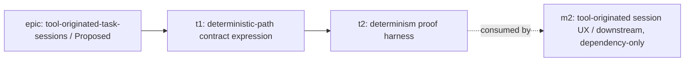

# m1 — Unwired Deterministic Slug-Carried Registration Path

Milestone doc for `tool-originated-task-sessions-m1`. Drafted by
this milestone-planning session against the merged code on
`origin/main` after the epic's promotion PR
([#37](https://github.com/kcrobinson-1/workstream-tracker/pull/37)).
Parent epic:
[`tool-originated-task-sessions`](../README.md) (`Proposed`).

The **WHAT** below is locked by the epic and is binding input —
not loosened here. This session re-derives **HOW** (task
breakdown, contracts, validation, risks) against actually-merged
code, per the parent-promotion-skeleton framing the prior
skeleton carried.

## Goal

Deliver the deterministic, handshake-free, slug-by-construction
registration path as a **first-class, sanctioned, additive
contract**, and **prove it end-to-end in isolation** — before any
tool-acting / agent-spawning UX exists — using an explicit slug
argument (manual / CLI invocation) as the stand-in slug producer.

The central finding of this session's reality check (see
Cross-Task Decisions D1) is that the deterministic registration
*mechanism* already exists end-to-end in merged code: the
exact-slug create-or-attach path honors a caller-supplied slug
verbatim with no natural-language resolution, no descendant
generation, and no root-conflict check (Verified by
[`design/v0.1-design.md` §4 exact-slug
case](../../../design/v0.1-design.md), and
[`internal/registerclient` package
doc](../../../internal/registerclient/client.go),
[`internal/api/handlers.go`
`registerWorkInstance` / `insertRegister`
exact-slug branch](../../../internal/api/handlers.go)), and the
`workstream-tracker register --slug <slug>` subcommand already
invokes exactly that path, prints the real receipt, and never
gates the session (Verified by
[`cmd/workstream-tracker/register.go`
`runRegister`](../../../cmd/workstream-tracker/register.go)). The
"narration handshake" is **not in the binary** — it is a layered
agent procedure described only in
[`docs/agents/local/session-registration.md`](../../../docs/agents/local/session-registration.md);
the CLI itself is already deterministic and handshake-free given
a construction-known slug.

Therefore m1 delivers **no new registration code surface**. Its
durable value is the contract *expression* that makes the
deterministic path a sanctioned sibling of the interactive
best-effort path (the epic's spec-coherence open question), and
its proof value is a determinism-specific end-to-end test that
de-risks the registration contract for the m2 UX milestone that
consumes it.

**Locked WHAT (inherited from the epic, not loosened).** Given a
construction-known canonical slug, a work-instance registers
deterministically — no natural-language resolution, no narration
handshake — exercised via an explicit slug argument. The existing
interactive (contributor-opened) best-effort grounded narration
handshake is unchanged: this is an *additional* path, not a
replacement. The spec's existing exact-slug create-or-attach
posture is preserved. (Verified by [epic Milestone Contracts, m1
row, and m1's Inherited Contract](../README.md).)

## Task Status

Task planning has not begun for any task; this is the milestone
session's output, before per-task scoping.

| Task | Slug | Status |
|---|---|---|
| t1 | `tool-originated-task-sessions-m1-t1` | Not started (no plan doc yet) |
| t2 | `tool-originated-task-sessions-m1-t2` | Not started (no plan doc yet) |

Task count is this milestone-planning session's output and is an
**estimate of scope shape**, not an epic-level commitment;
per-task PR counts are re-derived at each task's planning session
per [`task-plan.md`](../../../spec/planning/task-plan.md)
"PR-count predictions need a branch test".

## Sequencing

**Ship order and rationale.** t1 before t2. The dependency is
**conceptual, not a hard code block**: t2's proof exercises
already-merged code (there is no t1 product code to wait on), but
its assertions must mirror the determinism properties t1's
contract *names* — writing the proof first risks asserting
properties the sanctioned contract does not actually express.
Numbering reflects ship order, not strict dependency; t2 can be
*drafted* in parallel with t1's implementation under the
[`task-plan.md`](../../../spec/planning/task-plan.md)
parallel-drafting citation rules, but lands after t1 so the
proof's assertions cite the locked contract wording.

m2 is shown dependency-only and downstream: it consumes m1's
proven path as its construction-time slug producer; **m2 is out
of scope for this milestone entirely** (see Out of Scope).

## Task Contracts

Per-task **WHAT** contracts only; each task's **HOW** (file
inventory, signatures, validation-gate specifics, execution
ordering, risk register) is scoped at that task's own planning
session against then-merged code, per
[`shared.md`](../../../spec/planning/shared.md) "Parent-doc child
contracts" and [`milestone.md`](../../../spec/planning/milestone.md)
"Anti-goal: WHAT-contract each task, do not HOW-scope any task".

| Task | Short description | End result and what it preserves (WHAT) | Sibling interface |
|---|---|---|---|
| `tool-originated-task-sessions-m1-t1` | Deterministic-path contract expression | The deterministic, handshake-free, slug-by-construction registration path is expressed as a **first-class additive contract** in the plan-doc spec and the session-registration agent rule: when a session's canonical slug is known *by construction* (carried in, not resolved from a natural-language prompt), registration is deterministic and the narration handshake does not apply. **Preserves**, unchanged: the interactive best-effort grounded narration handshake for natural-language sessions; the spec's exact-slug create-or-attach posture; the API endpoint / request / schema (no change — the path is a pure consumer). Adds **no** tool-origination or spawn-UX content (that is m2). | Produces the **durable contract** the m2 UX milestone consumes when its spawn becomes the real construction-time slug producer. The reused entrypoint it sanctions is the existing `workstream-tracker register --slug <slug>` over the exact-slug create-or-attach flow. |
| `tool-originated-task-sessions-m1-t2` | Determinism proof harness | An end-to-end test proves that, given a construction-known slug supplied as an explicit argument with **no narration handshake**, a work-instance registers deterministically against the real exact-slug create-or-attach path: identity-by-construction (slug honored verbatim), idempotent create-or-attach on `(slug, actor, active)`, no natural-language-resolution path engaged, server repo-blind. The slug producer is the **minimal explicit `--slug` argument / test harness** — the stand-in for m2's future producer — scoped as the minimum to validate the contract, **not a durable UX**. **Preserves**: no product code surface added; the existing interactive-path tests unchanged. | Consumes t1's named determinism properties as the assertions it must demonstrate; produces the **proof artifact** that de-risks the registration contract before the m2 posture shift. |

## Cross-Task Invariants

Rules that thread both tasks; flag any task deliberation that
brushes against them.

- **No new registration surface.** Neither task adds an endpoint,
  request/response field, DB schema change, registration code
  path, or CLI flag. The existing exact-slug create-or-attach
  path and `workstream-tracker register --slug` are reused
  verbatim. (Verified by [`design/v0.1-design.md` §4: exact-slug
  is "a pure consumer — no endpoint, request/response field, or
  schema change"](../../../design/v0.1-design.md).)
- **Additive only.** The interactive best-effort grounded
  narration handshake
  ([`session-registration.md`](../../../docs/agents/local/session-registration.md))
  and the spec's exact-slug create-or-attach posture remain
  unchanged; the deterministic path is a sanctioned sibling,
  never a replacement. (Locked m1 Preserves clause.)
- **"Deterministic" stays epic-scoped.** Identity-by-construction
  for a session that *did* launch — not "the launch cannot
  fail," not enrichment made load-bearing for attachment. m1
  expresses and proves only the deterministic identity step.
  (Verified by [epic Cross-Cutting Invariants, "What
  'deterministic' is scoped to"](../README.md).)
- **Rule/spec-change discipline.** A
  [`docs/agents/local/**`](../../../docs/agents/local/) edit
  follows
  [`rule-additions.md`](../../../docs/agents/shared/meta/rule-additions.md)
  (name the rule retired/merged, or why none); a
  [`spec/**`](../../../spec/) edit follows the AGENTS.md
  `spec-authoring` pre-edit read; neither introduces
  tool-origination / spawn-UX content. (Verified by
  [`AGENTS.md` "Mandatory pre-edit reads" and "Adding to this
  rule set"](../../../AGENTS.md).)

## Cross-Task Decisions

- **D1 — Reuse the existing exact-slug create-or-attach path; no
  new registration surface.** *Resolved this session* (the carried
  technical-direction question). The deterministic mechanism
  already exists end-to-end: the server's `ExactSlug` flow
  validates slug grammar only, honors the caller's slug verbatim,
  does no NL resolution / descendant generation / root-conflict
  check, and is idempotent on `(slug, actor, active)` (Verified by
  [`internal/api/handlers.go` `registerWorkInstance` exact-slug
  validation + `insertRegister` exact-slug
  branch](../../../internal/api/handlers.go), and
  [`internal/api/slugs.go` /
  `internal/slugs/slugs.go` `IsWellFormed`: grammar-only,
  repo-blind](../../../internal/slugs/slugs.go)); the
  single-request client posts exactly that
  (Verified by [`internal/registerclient/client.go`
  `Register`](../../../internal/registerclient/client.go)); the
  CLI already carries `--slug`/`WST_SLUG`,
  `--actor`/`WST_ACTOR`, `--server`/`WST_SERVER`, prints the real
  receipt, and exits success regardless (Verified by
  [`cmd/workstream-tracker/register.go`
  `runRegister`](../../../cmd/workstream-tracker/register.go)); an
  end-to-end CLI test already drives this against a real API
  server (Verified by
  [`cmd/workstream-tracker/register_test.go`
  `TestRegisterCommandSuccessAndIdempotentRepeat`](../../../cmd/workstream-tracker/register_test.go)).
  m1 is therefore a thin slug-passing *use* of the existing path
  plus its first-class contract expression and a
  determinism-specific proof — not new registration surface. This
  satisfies the locked WHAT without loosening it and is the
  resolution the epic's Open Question #1 anticipated; **no epic
  reopen.**

- **D2 — The spec + agent-rule expression of the deterministic
  path is m1's, not deferred to m2.** *Resolved this session.* m1
  is "the determinism proof in isolation" that "de-risks the
  registration contract"; a proof of a contract expressed nowhere
  durable is not a de-risked contract, and m2 is contracted to
  *consume* m1's proven path. The epic flagged spec coherence as
  a conscious milestone input ([epic Open Questions Newly Opened
  #2](../README.md)); m1 takes it up as t1. The expression stays
  generic to construction-known slugs; it must not encode the
  node-affordance producer (that is m2).

- **D3 — Defer to t1's task planning:** the exact section
  placement and wording in
  [`shared.md`](../../../spec/planning/shared.md) and
  [`session-registration.md`](../../../docs/agents/local/session-registration.md),
  and the `rule-additions.md` retire-or-merge target for the
  agent-rule addition. These are HOW, are not a cross-task
  blocker (t2 does not depend on the wording, only on the named
  determinism properties), and are resolvable by t1's planner
  against then-merged docs. Deferring avoids recording wording
  assumptions that won't survive contact with the merged spec.

## Cross-Task Risks

- **"m1 is a no-op / throwaway scaffolding" perception.** Because
  no registration code is written, m1 can read as empty.
  Mitigation: m1's durable deliverable is the *contract
  expression* (t1) that m2 consumes; the proof (t2) is the
  determinism de-risking the epic explicitly scoped as a test
  harness, not durable UX (Verified by [epic Risk Register, "m1
  builds throwaway scaffolding"](../README.md)). The milestone
  doc states this up front so the value is legible at review.
- **Spec change reaches every consumer project.** A
  [`spec/**`](../../../spec/) edit changes the contract every
  consumer follows. Mitigation: the additive-only and no-new-
  surface invariants; the `spec-authoring` pre-edit read; the
  API is unchanged so vendored consumers' runtime behavior is
  untouched (Verified by [`design/v0.1-design.md` §4: exact-slug
  is a pure consumer, no schema change](../../../design/v0.1-design.md)).
- **Deterministic-path wording drifts into tool-origination /
  spawn-UX language, pulling m2 vision forward.** Mitigation:
  Cross-Task Invariant "Rule/spec-change discipline" and D2's
  generic-to-construction-known-slug bound; m1's producer is
  explicitly the manual/CLI stand-in.
- **Agent-rule edit inadvertently weakens the interactive
  handshake.** That handshake is a 1.0-epic-bound best-effort
  posture with an independent, earlier-binding
  `interactive-registration-tripwire`. Mitigation: the
  additive-only invariant; the interactive path and that tripwire
  are explicitly out of m1 scope (Verified by [epic Out of
  Scope](../README.md)).

## Documentation Currency

Map of which docs each task must keep accurate (per
[`milestone.md`](../../../spec/planning/milestone.md) required
"Documentation Currency"):

- **t1 edits:**
  [`spec/planning/shared.md`](../../../spec/planning/shared.md)
  (additive deterministic-path expression, near "Slug
  generation" / the registration posture) and
  [`docs/agents/local/session-registration.md`](../../../docs/agents/local/session-registration.md)
  (additive deterministic-path section; interactive handshake
  section unchanged). t1 must also keep
  [`AGENTS.md`](../../../AGENTS.md)'s session-registration pointer
  coherent if the agent-rule's shape changes.
- **t2 edits:** test files under
  [`cmd/workstream-tracker/`](../../../cmd/workstream-tracker/)
  (the existing `register_test.go` httptest-API pattern is the
  template); no product-doc edits.
- **Currency check, no edit expected:**
  [`design/v0.1-design.md` §4](../../../design/v0.1-design.md)
  already documents the exact-slug flow as a pure consumer with
  no schema change; both tasks must remain consistent with it and
  neither is expected to edit it. If a task finds it must, that
  is a signal to stop and reconcile, not silently diverge.

## Backlog Impact

No backlog changes in this milestone. The graduate/split of
`deterministic-interactive-registration` (determinism-resolution
thread → this epic) and the carve-outs
(`interactive-registration-tripwire`,
`unregistered-work-unobservable`) already landed in the epic's
promotion PR
([#37](https://github.com/kcrobinson-1/workstream-tracker/pull/37));
m1's implementing PRs touch no backlog entry. The tripwire and
the observability residual are out of m1 scope and are not
re-split or edited here (Verified by [epic Backlog Impact and Out
of Scope](../README.md)).

## Out of Scope

- **The m2 tool-originated-session UX.** The node affordance, the
  real construction-time slug producer, the session-start hook,
  spawn shape — all m2. m1's producer is a deliberate manual/CLI
  stand-in.
- **Any change to the interactive (contributor-opened)
  registration path** or the independent
  `interactive-registration-tripwire`. m1 adds a sibling path; it
  does not touch, resolve, or pull forward the interactive
  posture.
- **New registration code surface** — endpoint, request field,
  schema, registration code path, or CLI flag. Reuse is the
  decision (D1).
- **The tree-side observability heuristic**
  (`unregistered-work-unobservable`). Not an m1 deliverable.

## Related Docs

- [`../README.md`](../README.md) — the parent epic; locks m1's
  WHAT and carries the two open questions m1 resolves (reuse vs
  new surface; spec/agent-rule expression).
- [`../../../spec/planning/milestone.md`](../../../spec/planning/milestone.md)
  — the rules this milestone doc is structured against.
- [`../../../spec/planning/shared.md`](../../../spec/planning/shared.md)
  — cross-level planning rules; the "Slug generation" exact-slug
  create-or-attach posture m1 reuses and t1 expresses additively.
- [`../../../design/v0.1-design.md`](../../../design/v0.1-design.md)
  — §4 API: the exact-slug create-or-attach flow as a pure
  consumer with no schema change (the no-new-surface anchor).
- [`../../../docs/agents/local/session-registration.md`](../../../docs/agents/local/session-registration.md)
  — the interactive best-effort handshake t1 preserves unchanged
  and adds the deterministic sibling section beside.
- [`../../../internal/registerclient/client.go`](../../../internal/registerclient/client.go),
  [`../../../internal/api/handlers.go`](../../../internal/api/handlers.go),
  [`../../../cmd/workstream-tracker/register.go`](../../../cmd/workstream-tracker/register.go)
  — the merged registration path m1 reuses (D1's code grounding).
