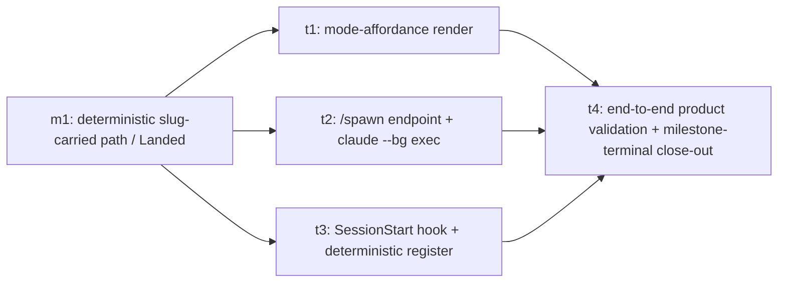

# m2 — Tool-Originated Session UX

Milestone doc for `tool-originated-task-sessions-m2`. Drafted by
this milestone-planning session against the merged code on
`origin/main` after m1 fully landed (close-out PR
[#56](https://github.com/kcrobinson-1/workstream-tracker/pull/56)).
Parent epic:
[`tool-originated-task-sessions`](../README.md) (`Proposed`).

The **WHAT** below is locked by the epic and is binding input —
not loosened here. This session re-derives the milestone's task
breakdown, cross-task contracts, cross-task decisions, and risks
against merged code. The **spawn-mechanism shape** is locked in
**D4** below against Claude Code's actual launcher surface: the
workstream-tracker server adds a single fire-and-forget POST
endpoint that execs `claude --bg --worktree …`, Claude Code's
supervisor process owns the agent's process lifetime, and the
contributor's takeable session is `claude attach <id>` in their
own terminal. Task breakdown lands at **four tasks**: t1
affordance render, t2 spawn endpoint, **t3 SessionStart hook
(its own task for review focus on the determinism-relevant
integration moment)**, and t4 validation + close-out
convergence.

## Goal

Deliver the **tool-originated-session UX**: the explicit
contributor action on a plan-tree node — **Begin planning** (the
node's scope isn't settled yet) or **Begin implementation** (the
node is ready to build) — that spawns a real local interactive
Claude Code session, hands it a mode-appropriate prompt for that
node, and carries the node's canonical slug out-of-band so the
session-start hook registers it deterministically via m1's
proven path before the model reasons. End state: the loop
described by the epic — "click the node, pick the mode, watch the
right session start and attach itself" — closes by construction
on the page the contributor is already looking at. Origination
stays in the contributor's single local environment; the
running session remains fully observe-only.

This milestone is the determinism-resolution home: m1's
slug-carried path becomes wired by the spawn that actually
produces the slug, dissolving the registration circularity for
this class of session in the merged binary's behavior, not only
in the contract expression. The fencing properties that keep the
epic's one-way carve-out narrow — *human-initiated*, *one-shot at
session birth*, *identity-not-correction*, *running session stays
observe-only* — are load-bearing through the task set and must
hold at every site.

## Locked WHAT (inherited from the epic, not loosened)

Binding input from [`../README.md`](../README.md) "Milestone
Contracts → m2 row," "Open Questions Resolved By This Epic," and
the Cross-Cutting Invariants.

**End result.** Given a construction-known canonical slug
attached to a plan-tree node, an explicit contributor action on
that node spawns a real local interactive Claude Code session,
handed the mode-appropriate prompt, carrying the node's slug
out-of-band; a session-start hook registers it deterministically
via m1's path before the model reasons; the agent self-provisions
its worktree as ordinary agent behavior. The work-instance
appears on the very node the contributor clicked, the loop closed
by construction.

**Preserves, unchanged.** Observe-only for every session the tool
did **not** originate (the interactive best-effort grounded
narration handshake remains the path for natural-language
sessions). The deterministic register CLI surface m1 sanctioned —
`workstream-tracker register --slug <slug>` over the exact-slug
create-or-attach path — is consumed verbatim with no new
registration code surface, no new endpoint, no new schema, no
new request/response field. The four fencing properties of the
one-way carve-out hold: human-initiated, one-shot at birth,
identity-not-correction, running session stays observe-only.

**Sibling interface.** Consumes m1's slug-carried registration
entrypoint as the **real construction-time slug producer** (m1's
manual `--slug` argument was the stand-in this milestone
replaces). Produces no new registration mechanism — only the
producer that drives it.

**Constraints carried from the epic.** Origination stays in the
contributor's single local environment (no daemon, no
multi-tenant surface, no remote hosting). "Deterministic" stays
epic-scoped — identity-by-construction for a session that *did*
launch, never "the launch cannot fail," never enrichment made
load-bearing for attachment. The agent-adapter seam is kept open:
Claude Code is the concrete first launcher, and the spawn-side
integration must not bake assumptions that would make a second
agent a rewrite rather than an added adapter.

## Task Status

Four tasks. Skeletons were seeded in the same PR that flipped
this milestone `In draft` → `Proposed`, per
[`shared.md`](../../../../spec/planning/shared.md) "Parent-doc
child contracts → Parent-promotion stub seeding."

| Task | Slug | Skeleton | Status |
|---|---|---|---|
| t1 | `tool-originated-task-sessions-m2-t1` | [`t1-mode-affordance-render.md`](./t1-mode-affordance-render.md) | In draft (skeleton — awaiting t1 drafting) |
| t2 | `tool-originated-task-sessions-m2-t2` | [`t2-spawn-endpoint.md`](./t2-spawn-endpoint.md) | In draft (skeleton — awaiting t2 drafting) |
| t3 | `tool-originated-task-sessions-m2-t3` | [`t3-session-start-hook.md`](./t3-session-start-hook.md) | In draft (skeleton — awaiting t3 drafting) |
| t4 | `tool-originated-task-sessions-m2-t4` | [`t4-end-to-end-validation.md`](./t4-end-to-end-validation.md) | In draft (skeleton — awaiting t4 drafting) |

Task count is this session's output and is an **estimate of
scope shape**, not an epic-level commitment; per-task PR counts
are re-derived at each task's planning session per
[`task-plan.md`](../../../../spec/planning/task-plan.md)
"PR-count predictions need a branch test."

## Sequencing

**Ship order and rationale.** t1, t2, and t3 are **three
independent surfaces** that can draft and ship in parallel under
[`task-plan.md`](../../../../spec/planning/task-plan.md)
parallel-drafting citation rules: t1 touches only the page-side
forest render ([`internal/site/forest.go`](../../../../internal/site/forest.go) +
[`internal/site/tree.go`](../../../../internal/site/tree.go)
template surface) and the locked mode-offer table; t2 touches
only the spawn endpoint (the new `POST /spawn` chi-router
handler, the `os/exec` of `claude --bg --worktree …`, and the
version-controlled mode-prompt files); t3 touches only the
committed project-scoped `.claude/settings.json` SessionStart
hook entry. Their coupling is the locked **slug-carry contract
(D1)**, the **form-submission contract (D4)** (t1 ↔ t2), and
the **SessionStart-hook runs the deterministic register
contract (D2)** (t2 ↔ t3, t3 ↔ m1). With D1 + D2 + D4 locked
here at milestone level, none of the three needs the others'
source to draft or land. The end-to-end determinism contract
wires up only when all three are in place; t4 validates that.
The Mermaid graph reflects intended ship order, not strict
dependency.

**t4 is a dedicated validation-and-land convergence node**, per
[`milestone.md`](../../../../spec/planning/milestone.md)
"Product acceptance and per-leaf validation → Dedicated
validation task node" and "A multi-leaf graph needs a terminal
convergence node." t4 depends on each of t1, t2, and t3, owns
the milestone's product-acceptance contract (end-to-end demo:
open page → click node → watch the right session start → see
the work-instance appear on the clicked node), and owns the
milestone-terminal close-out (batch deletion of the m2
`scoping/` subfolder, the m2 milestone doc's
`Proposed → Landed` flip, the parent epic's milestone-row
advance). The graph topology this creates: t4 is the sole leaf
and carries the mandatory `Validating` per
[`shared.md`](../../../../spec/planning/shared.md) "Plan-doc
Status"; t1, t2, and t3 are interior nodes that close on their
own technical gates.

## Task Contracts

Per-task **WHAT** contracts only; each task's **HOW** (file
inventory, signatures, validation-gate specifics, execution
ordering, risk register) is scoped at that task's own planning
session against then-merged code, per
[`shared.md`](../../../../spec/planning/shared.md) "Parent-doc child
contracts" and [`milestone.md`](../../../../spec/planning/milestone.md)
"Anti-goal: WHAT-contract each task, do not HOW-scope any task."

| Task | Short description | End result and what it preserves (WHAT) | Sibling interface | Product acceptance |
|---|---|---|---|---|
| `tool-originated-task-sessions-m2-t1` | Mode-affordance render on plan-tree nodes | The plan-tree forest renders a **mode-affordance** on each node — either **Begin planning**, **Begin implementation**, or neither — driven by the locked static map (D3) over the node's already-rendered facts (node-type + Status + has-children). The affordance is a **plain HTML `<form method="POST" action="/spawn">`** carrying the node's slug and the chosen mode in hidden inputs and a submit button labeled per the mode; clicking it POSTs to t2's spawn endpoint (D4). A node that offers no mode renders no form. **Preserves**: every node still renders its existing label, Status badge, work-instance markers, progress-cell row, long description, and related-PR list — none of those are modified. The forest's expand/collapse default, the **no-JavaScript** posture (the page stays pure server-rendered HTML+CSS with native `
`/`
`; a `<form>` submit needs no script), and the **walk-on-every-request** invariant for the GET render are unchanged. No new DB read, no new walk. | Produces the **affordance form surface** t2's `/spawn` endpoint consumes. The render side and the launch side are coupled by D1 (slug-via-`WST_SLUG`) and D4 (the form's `action`, method, and field names); both are locked here at milestone level. | A product reviewer opens the page and observes that every leaf-shape task and phase node renders the correct affordance per the locked mode map (Begin planning on `In draft` / no-doc; Begin implementation on `Proposed`; neither on `In progress`/`Validating`/`Landed`/`Deferred`); parent-shape nodes (epic/milestone, and tasks with phase children) render no affordance; the affordance is visible without expanding the node. |
| `tool-originated-task-sessions-m2-t2` | Spawn integration: `/spawn` endpoint + `claude --bg` exec | A new `POST /spawn` endpoint on the workstream-tracker local server accepts the slug + mode submitted by t1's affordance form and **fire-and-forget execs the Claude Code launcher in background-session mode** with the slug carried out-of-band via `WST_SLUG` (D1) and a mode-appropriate prompt body handed in via `--append-system-prompt-file`. The launcher invocation uses Claude Code's `--bg` (background session — supervisor process owns the agent's process lifetime; the workstream-tracker does **not** become a process manager) and `--worktree <name>` (Claude Code provisions a fresh worktree at `<repo>/.claude/worktrees/<name>` automatically — D5). The endpoint captures the printed session id from stdout and acknowledges it back to the page; the contributor's takeable session is `claude attach <id>` in their own terminal. The spawn **assumes t3's SessionStart hook is in place**: with the hook present, the spawned session auto-registers via m1's deterministic path before the model reasons; without it, the spawn still launches `claude` but no work-instance attaches — observable by the tree's emptiness for the launched slug. t2 does not commit the hook entry itself (that is t3's surface). **Preserves**: the deterministic register CLI is **unmodified** (the existing `--slug` argument and `WST_SLUG` env var are honored verbatim); the interactive best-effort handshake for natural-language sessions is **unmodified**; observe-only is preserved for every session the tool did not originate; no new endpoint is added to the **registration** surface (the new `/spawn` endpoint is the *launcher* surface — orthogonal to registration; the registration path is the unchanged exact-slug create-or-attach flow). The fencing properties (human-initiated, one-shot at birth, identity-not-correction, running session stays observe-only) hold at every site t2 touches: the form submit is the human-initiated trigger; the spawn is one-shot at session birth; the slug carried is identity-not-correction; the *running* session stays file-driven and observe-only — `/spawn` is a one-shot launch surface, not an in-session steering channel. The agent-adapter seam stays additive: an alternative agent launcher is a new exec shape inside the handler, not a rewrite. | Consumes t1's mode-affordance form submission as the launch trigger; consumes t3's SessionStart hook as the deterministic-register integration moment; produces the **real construction-time slug producer** that drives m1's slug-carried registration path end-to-end. | Closes on technical gate; the milestone's product validation lives on t4. (Interior node — not a Mermaid-graph leaf.) |
| `tool-originated-task-sessions-m2-t3` | SessionStart hook: `.claude/settings.json` entry running the deterministic register CLI | A **Claude Code `SessionStart` hook** (matcher `startup`, `type: "command"`) is committed to a **project-scoped** `.claude/settings.json` at the repo root with a command that invokes the deterministic `workstream-tracker register --slug $WST_SLUG` subcommand via the agent rule's full module-path form (so the hook resolves regardless of the contributor's working directory). The hook fires at every Claude Code session start in this repo. **When `WST_SLUG` is set in the spawned session's environment** (the case t2's spawn produces), the register CLI attaches a work-instance to the carried slug by construction before the model reasons — m1's deterministic path runs by hook, not by agent narration. **When `WST_SLUG` is unset** (the case for a contributor opening Claude Code in this repo through any path other than t2's spawn), the register CLI **short-circuits to a no-op** per `runRegister`'s existing "no slug supplied … skipping registration, session proceeds" behavior — so existing interactive natural-language sessions, the m1-landed best-effort grounded narration handshake, and any contributor's per-`.claude/settings.local.json` overlay all see **byte-unchanged session-start behavior**. The hook is the determinism-relevant integration moment t2's spawn relies on. **Preserves**: the m1-landed [`docs/agents/local/session-registration.md`](../../../../docs/agents/local/session-registration.md) deterministic-path rule is *consumed*, not edited; the existing register CLI is consumed verbatim; the existing interactive handshake is unaffected; no new registration code path, endpoint, schema change, or CLI flag. Whether the agent rule needs a small additive clarification — that for tool-originated sessions the *hook* runs the deterministic-path "Invoke" step and the agent's first interaction is the "Echo real output" step — is HOW for t3's planning session against then-merged rule wording. | Produces the deterministic-register integration moment t2's spawn relies on (without this hook in place, t2's spawn still launches `claude` but no work-instance attaches — the slug-by-construction contract is half-wired). Consumes m1's deterministic register CLI verbatim. | Closes on technical gate; the milestone's product validation lives on t4. (Interior node — not a Mermaid-graph leaf.) |
| `tool-originated-task-sessions-m2-t4` | End-to-end product validation + milestone-terminal close-out | A product reviewer performs the **full end-to-end walkthrough** against the local server with a real Claude Code launcher available: open the page, locate a `Proposed` task/phase node, click **Begin implementation**, observe a real Claude Code session start, observe the **real register receipt** echo with the clicked node's canonical slug (per the deterministic-path handshake rule), observe the work-instance appear on the clicked node in the rendered tree, observe the session run its initial prompt; symmetrically for **Begin planning** against an `In draft`/no-doc node; symmetrically observe that nodes offering no mode (epic/milestone parents, in-flight task/phase nodes) show no affordance. The walkthrough records approval in this plan; product-validation findings are routed per [`milestone.md`](../../../../spec/planning/milestone.md) "Product-validation findings: fix now or defer." The terminal PR then performs the **milestone-terminal close-out**: batch-deletes the m2 `scoping/` subfolder (every transient scoping doc t1's, t2's, and t3's planning sessions produced), de-links any inbound references to those scoping docs in any durable plan doc that survives the batch (the non-link inline-code form), flips this milestone doc's `Status` `Proposed` → `Landed`, advances the parent epic's m2 milestone row to `Landed` with its terminal PR link. **Preserves**: nothing about the production code path is touched at this stage; t4 is a validation + close-out node, not a code-producing task. The milestone retrospective (per `milestone.md` "Milestone retrospective") runs at the same boundary and routes any accumulated findings forward through the backlog — it does **not** gate t4's `Landed` flip. | Sole Mermaid-graph leaf — converges t1, t2, and t3 and is the milestone-terminal node. | The full walkthrough above runs to completion against a live local server + Claude Code launcher, with the real register receipt observed for both modes and parent-shape nodes verified to offer no affordance; approval is recorded in this plan before its `Landed` flip. |

## Cross-Task Invariants

Rules that thread the task set; flag any task deliberation that
brushes against them.

- **No new registration surface (inherited from m1's D1).** No
  endpoint, request/response field, DB schema change,
  registration code path, or new CLI flag is added. The
  existing `workstream-tracker register --slug <slug>` over the
  exact-slug create-or-attach path is consumed verbatim. The
  spawn integration is purely a **slug producer**, not a new
  registration mechanism. (Verified by
  [`internal/api/handlers.go`](../../../../internal/api/handlers.go)
  `insertRegister` exact-slug branch;
  [`cmd/workstream-tracker/register.go`](../../../../cmd/workstream-tracker/register.go)
  `runRegister`; and the deterministic-path contract this
  consumes, [`shared.md` "Deterministic assertion when the slug
  is construction-known"](../../../../spec/planning/shared.md)
  and
  [`session-registration.md` "The deterministic path"](../../../../docs/agents/local/session-registration.md).)
- **Fencing properties hold at every site.** The one-way
  invariant carve-out is fenced by four properties — *human-
  initiated*, *one-shot at birth*, *identity-not-correction*,
  *running session stays observe-only*. Strip any one and the
  epic's invariant erodes. Each task's deliberation must read
  against the four; any decision that introduces in-session
  tool→agent flow (steering, re-prioritizing, feeding tool
  state back into agent context) is out of scope by this
  invariant, not by Out of Scope alone. (Verified by [epic
  "Open Questions Resolved By This Epic → How does
  tool-origination reconcile with the 'tool stays one-way'
  vision invariant?"](../README.md).)
- **Origination stays in the contributor's single local
  environment.** The spawned session runs locally, where the
  contributor already runs agents. The 1.0-epic's
  single-contributor / single-local invariant is unchanged.
  No daemon-for-others, no remote process, no multi-tenant
  surface is introduced by t2's launcher. (Verified by [epic
  Cross-Cutting Invariants, "Origination stays in the
  contributor's single local environment"](../README.md).)
- **Agent-adapter seam stays additive.** Claude Code is the
  concrete first launcher; the structure of t2's integration
  must not bake Claude-Code-only assumptions into shapes that
  would make a hypothetical second agent a rewrite rather than
  an added adapter. This is a structural posture, not a
  commitment to ship a second agent in this milestone.
  (Verified by [epic Cross-Cutting Invariants, "Agent-adapter
  seam"](../README.md).)
- **"Deterministic" stays epic-scoped.** No task may read
  "deterministic" as "the spawn cannot fail" or make
  enrichment load-bearing for attachment. A launch that fails
  to start must be *observable*, not silently swallowed
  (accepted-failure-with-visibility). The follow-up
  enrichment (worktree name, intended work) is best-effort and
  decorates an already-correctly-attached instance; it does not
  reintroduce the registration circularity. (Verified by [epic
  Cross-Cutting Invariants, "What 'deterministic' is scoped
  to"](../README.md).)
- **No JavaScript / no walk-on-every-request regression.** t1's
  render-side edit must not introduce client-side JavaScript or
  a second walk/query of plan-tree state per request. The
  forest is server-rendered HTML+CSS with native `
`,
  and the affordance is a render-time derivation of facts the
  page already loaded. (Verified by
  [`internal/site/render.go`](../../../../internal/site/render.go)
  no-JS template;
  [`internal/site/forest.go`](../../../../internal/site/forest.go)
  native-`
` box;
  [`internal/site/site.go`](../../../../internal/site/site.go)
  single per-request walk + DB read.)

## Cross-Task Decisions

- **D1 — Slug is carried out-of-band via the existing
  `WST_SLUG` environment variable.** *Resolved this session.*
  The deterministic register CLI already reads its slug from
  `--slug` or `WST_SLUG`; the spawn integration sets `WST_SLUG`
  in the environment of the spawned `claude` process, and the
  SessionStart hook inherits that environment and passes the
  slug into the same `workstream-tracker register --slug
  $WST_SLUG` invocation m1's deterministic-path contract
  sanctions. No new env var, no new CLI flag, no payload schema
  change. Env-var-carry is the natural fit because the
  Claude Code SessionStart hook **cannot receive
  launcher-provided prompts as input** — the hook receives a
  fixed JSON envelope (session_id, cwd, …), not arbitrary
  launcher arguments — but the **hook process inherits the
  parent environment**, so the env var is the singular
  reliable carrier from launcher to hook. *Verified by:*
  [`cmd/workstream-tracker/register.go`](../../../../cmd/workstream-tracker/register.go)
  `runRegister` reading `--slug` or `WST_SLUG`;
  [Claude Code `SessionStart` hook
  documentation](https://code.claude.com/docs/en/hooks.md)
  ("the hook process inherits the parent environment, so it
  can read any environment variables set before launching
  Claude Code").
- **D2 — The session-start integration is a Claude Code
  `SessionStart` hook (matcher `startup`) running the
  deterministic register subcommand.** *Resolved this session.*
  The hook is committed to the project-scoped
  `.claude/settings.json` (so every contributor working in
  this repo gets the deterministic-path registration
  automatically) with `type: "command"`,
  matcher `startup`, and a command that invokes
  `workstream-tracker register --slug $WST_SLUG` (via the
  agent rule's full module-path form,
  [`session-registration.md` "The deterministic path"](../../../../docs/agents/local/session-registration.md)).
  The hook fires **before the model begins**, so the
  work-instance is attached by construction before any agent
  cognition. The hook's `validation-honesty` posture (echo the
  real receipt, narrate failure explicitly, never gate the
  session) is the deterministic-path-rule's posture already.
  The completion-side bracket of the lifecycle (the symmetric
  `complete`/`abandon` handshake added in PR
  [#45](https://github.com/kcrobinson-1/workstream-tracker/pull/45))
  is **out of m2's scope** — m2 wires the start half only; the
  completion half stays the agent-process responsibility per
  the lifecycle rule's session-end section. *Verified by:*
  [Claude Code `SessionStart` hook
  documentation](https://code.claude.com/docs/en/hooks.md)
  (the `startup` matcher fires for new sessions; configuration
  in `.claude/settings.json`; `type: "command"` is supported);
  [`session-registration.md` "The deterministic path
  (construction-known slug)"](../../../../docs/agents/local/session-registration.md)
  (the steps the hook runs).
- **D3 — Mode-offer static map.** *Resolved this session.* The
  affordance offered at a node is a deterministic lookup over
  facts the page already holds — the node's parsed node-type
  (the `PlanNode.NodeType` field from
  [`tree.go`](../../../../internal/site/tree.go)), its Status
  (the `PlanNode.Status` field, drawn from the doc's
  frontmatter), and whether the node has any children (the
  presence-or-absence of items in `PlanNode.Children`):
  - *epic / milestone* (always parent-shape) → **no
    affordance.** Their work is their children.
  - *root* (the per-epic / per-standalone-task root) → **no
    affordance.** Roots are conceptual containers; the
    affordance lives at the level a session actually drafts or
    implements.
  - *task / phase with children* (a task carrying its phase
    children) → **no affordance.** A parent-shape task's work
    is its phases; per
    [`shared.md`](../../../../spec/planning/shared.md) "Slug
    generation" the N=1 collapse means a single-phase task is
    not a parent in the tree, so this case binds only at
    N ≥ 2.
  - *task / phase without children* (the leaf-shape case),
    Status `In draft` or no Status / no doc → **Begin
    planning.**
  - *task / phase without children*, Status `Proposed` →
    **Begin implementation.**
  - *task / phase without children*, Status `In progress`,
    `Validating`, `Landed`, `Deferred — …`, or any unknown
    Status → **no affordance.** A session is already running
    or the work is done; re-offering would invite a
    drift-correction loop the fencing properties forbid.

  The map is a render-side lookup over per-node facts already
  in `PlanNode`; no new walk, no new DB read, no new
  frontmatter field. *Verified by:*
  [`internal/site/tree.go`](../../../../internal/site/tree.go)
  `PlanNode` (carries `NodeType`, `Status`, `Children`);
  [`internal/slugs/slugs.go`](../../../../internal/slugs/slugs.go)
  `NodeType` constants (epic/milestone/task/phase/root);
  [`internal/site/render.go`](../../../../internal/site/render.go)
  `statusClass` (Status canonical-prefix handling — including
  the `Deferred — <reason>` split — that the map reuses);
  [`shared.md`](../../../../spec/planning/shared.md) "Plan-doc
  Status" (the canonical lifecycle the table is keyed on);
  [`../README.md` "Open Questions Resolved By This Epic →
  Which node levels offer 'Begin planning' vs 'Begin
  implementation'"](../README.md) (the epic's resolved
  shallow-static-map framing the table implements).
- **D4 — Spawn-mechanism shape: server-side fire-and-forget
  exec of `claude --bg --worktree …` from a new `POST /spawn`
  endpoint.** *Resolved this session against Claude Code's
  actual launcher surface.* The page-side affordance (t1) is a
  plain HTML `<form method="POST" action="/spawn">` carrying
  the slug and mode as hidden inputs; the chi router gains a
  new `POST /spawn` handler that validates the request,
  reads the per-mode prompt body from a version-controlled
  file, and execs `claude --bg --worktree <name>
  --append-system-prompt-file <prompt-file>
  "<initial-task>"` with `WST_SLUG=<slug>` in the child's
  environment. The exec is **fire-and-forget**: Claude Code's
  background-session supervisor (`claude daemon status`) owns
  the agent's process lifetime, so the workstream-tracker
  server does **not** become a process manager. The endpoint
  captures the session id printed to stdout and acknowledges
  it to the contributor (so they can `claude attach <id>` in
  their own terminal — the takeable session the epic vision
  resolves to). The previously-feared cost of S3 (terminal
  windows, CSRF token machinery, server-side process
  management, first JavaScript on the page) all drop away
  against Claude Code's surface: a plain HTML form needs no
  JavaScript; `--bg` removes the lifetime-management surface;
  `claude attach` removes the new-terminal-window surface;
  the same-origin localhost-only trust boundary is the
  pre-existing single-contributor / single-local-environment
  invariant the 1.0 epic locked. **The four fencing
  properties survive on a careful read**: the form submit is
  *human-initiated* (the click is the contributor's explicit
  action); the spawn is *one-shot at session birth* (the
  `/spawn` handler fires once per click and returns); the
  slug carries *identity, not correction* (no tool→agent
  state push beyond the slug); the *running* session stays
  file-driven and observe-only (the `/spawn` endpoint is a
  launch surface, not a steering channel — once the supervisor
  owns the agent process, the workstream-tracker is back to
  observe-only for that session). *Verified by:*
  [Claude Code CLI reference, `--bg`
  flag](https://code.claude.com/docs/en/cli-reference.md)
  ("Start the session as a background agent and return
  immediately. Prints the session ID and management
  commands");
  [Claude Code CLI reference, `claude attach
  <id>`](https://code.claude.com/docs/en/cli-reference.md)
  ("Attach to a background session in this terminal");
  [Claude Code CLI reference, `--worktree`
  flag](https://code.claude.com/docs/en/cli-reference.md)
  ("Start Claude in an isolated git worktree at
  `<repo>/.claude/worktrees/<name>`");
  [Claude Code CLI reference, `claude daemon
  status`](https://code.claude.com/docs/en/cli-reference.md)
  (the supervisor that owns background-session lifetime is a
  Claude Code construct, not a workstream-tracker one);
  [Claude Code CLI reference,
  `--append-system-prompt-file`](https://code.claude.com/docs/en/cli-reference.md)
  (the mode-prompt carrier);
  [`internal/site/site.go`](../../../../internal/site/site.go)
  `Router()` returning a chi.Router (the host the new POST
  handler mounts onto, beside the existing GET `/`);
  [`cmd/workstream-tracker/main.go`](../../../../cmd/workstream-tracker/main.go)
  `runServer` (the single-port localhost-only server posture
  the trust-boundary inherits).
- **D5 — Worktree provisioning is the Claude Code `--worktree`
  flag the launcher passes; the worktree name returns through
  the existing best-effort enrichment leg.** *Resolved this
  session against Claude Code's actual launcher surface.* The
  tool has no workspace role — the launcher passes
  `--worktree <name>` to `claude` at spawn time, and Claude
  Code provisions a fresh isolated worktree at
  `<repo>/.claude/worktrees/<name>` automatically. The epic's
  resolved "fresh worktree off the latest `origin/main`"
  framing is satisfied by Claude Code's own worktree
  provisioning, not by a prompt-instructed dance. The
  resulting worktree name is therefore **known at spawn time
  by the launcher**, not discovered by the agent: t2's
  `/spawn` handler can pass that same name through the
  existing `--name`/`WST_NAME` enrichment leg (PR
  [#38](https://github.com/kcrobinson-1/workstream-tracker/pull/38)),
  which the deterministic-path handshake's "Invoke" /
  "Echo real output" steps already wrap (the optional `name`
  request-metadata key). The enrichment stays best-effort; a
  missed enrichment degrades richness, not correctness — the
  node still shows the agent is there. No new metadata field,
  no schema change. *Verified by:*
  [Claude Code CLI reference, `--worktree` /
  `-w`](https://code.claude.com/docs/en/cli-reference.md)
  ("Start Claude in an isolated git worktree at
  `<repo>/.claude/worktrees/<name>`. If no name is given, one
  is auto-generated");
  [epic "Open Questions Resolved By This Epic → Where does
  the workspace come from?"](../README.md);
  [`cmd/workstream-tracker/register.go`](../../../../cmd/workstream-tracker/register.go)
  `runRegister` `--name`/`WST_NAME` reading (the metadata
  carrier);
  [m1 D1's PR #38 re-verification, "the enrichment leg is the
  orthogonal second phase of the epic's two-phase
  split"](../m1/README.md).

## Cross-Task Risks

- **New `/spawn` endpoint expands the tool's write surface
  for the first time.** D4's resolved shape adds the
  workstream-tracker's first non-GET route — a POST that
  execs the local Claude Code launcher with caller-supplied
  slug and mode. The trust boundary inherits the 1.0-epic
  single-contributor / single-local-environment invariant
  (anyone on the loopback interface is already the
  contributor), so the endpoint adds no new authentication
  posture, but it is the first surface where a request causes
  a local subprocess to run. Mitigation: the endpoint's
  inputs (slug, mode) are **defense-in-depth-validated**
  against the slug grammar and the D3 mode-offer map even
  though t1's render is the gating site (a hand-crafted POST
  cannot fire a mode the map forbids); the exec is bounded to
  the verbatim `claude --bg …` argument shape (no shell
  interpolation of caller data into a shell command line —
  use `os/exec.Command` with a fixed `argv`); the
  fire-and-forget posture means the supervisor (`claude
  daemon status`) — not the workstream-tracker — owns the
  agent's process lifetime, so the new surface does not
  accumulate persistent state. The agent-adapter-seam
  invariant binds the shape *inside* the handler: an
  additional adapter is a new exec shape, not a rewrite.
- **Mode-affordance map drift.** The static map (D3) is
  shallow, but a missed combinator (an unknown Status, a
  task-with-phases case the renderer mis-classifies, a
  `Deferred — <reason>` whose canonical-prefix stripping the
  affordance code re-implements rather than reusing) could
  surface an affordance on the wrong node. Mitigation: t1's
  render-side code derives entirely from `PlanNode` fields
  already in
  [`tree.go`](../../../../internal/site/tree.go), reuses
  [`render.go`](../../../../internal/site/render.go)'s
  canonical-prefix Status handling, and t1's own validation
  gate enumerates each row of the map as a test case (a
  template-render assertion that the correct affordance —
  or none — appears for each node-type/Status/has-children
  triple). The full map is enumerated in D3, so the
  enumeration is reviewable.
- **Hook misconfiguration silently misses the determinism
  contract — t3's primary risk.** A spawned session whose
  committed SessionStart hook fails to register
  (mis-configured command, wrong matcher, command exit code
  the hook propagates as a session-start error) leaves the
  work-instance unattached while the model runs — the tree
  shows no work where work is happening. Mitigation: the
  deterministic-path handshake rule already requires the
  agent to echo the real receipt and narrate failure
  explicitly, so a misconfigured hook is loud rather than
  silent; t3's technical-gate must exercise the hook against
  a real local server (with and without `WST_SLUG` set — the
  no-op path and the register path are both load-bearing);
  t4's product-validation walkthrough explicitly observes a
  real receipt before approving. The observability-residual
  entry the epic split off
  ([`unregistered-work-unobservable`](../../../../docs/backlog.md#unregistered-work-unobservable))
  remains the tracked home for the tree-side affordance gap
  this risk surfaces.
- **The committed hook fires for every Claude Code session
  in this repo, including those that have nothing to do with
  m2's spawn.** A contributor running `claude` directly in
  this checkout (the existing interactive natural-language
  path) gets the hook firing with `WST_SLUG` unset. Mitigation:
  `runRegister`'s already-merged short-circuit behavior — "no
  slug supplied … skipping registration, session proceeds" —
  makes the hook a fast no-op in that case; t3's technical
  gate must include the no-op branch in its falsifiability
  check (the hook is observably silent / fast / exit-0 when
  `WST_SLUG` is empty), and the hook's command form is the
  agent rule's full module-path invocation so a contributor
  running outside the repo root still resolves it.
- **Wrong-by-construction slug attaches an orphan
  work-instance.** Per the m1-accepted residual, a typoed or
  mis-derived slug still attaches under the
  trust-the-caller posture; the real-receipt echo keeps it
  observable post-hoc but the orphan exists. m2's slug
  producer (the page-side render) is the producer-of-record
  for this milestone, so the protective surface is t1's
  enumerated-map test (only the correctly-rendered node
  slug ever rides into `WST_SLUG`) + t3's walkthrough
  observation. No new residual is introduced by m2; the
  existing one moves from "stand-in producer" to "real
  producer," with the same trust-the-caller property.
- **The fencing properties erode under feature pressure.**
  Future milestone or epic-adjacent work may pressure the
  spawn integration to accept "just one more" tool→agent
  feedback (drift correction, re-prioritization,
  shared-state push). Mitigation: the four properties are
  named in the Cross-Task Invariants and re-cited in each
  task's planning session; the Out of Scope section makes
  the boundary explicit; any deliberation that brushes
  against them is reviewer-flag.

## Documentation Currency

Map of which docs each task must keep accurate (per
[`milestone.md`](../../../../spec/planning/milestone.md)
required "Documentation Currency"):

- **t1 edits:** the forest template surface
  ([`internal/site/forest.go`](../../../../internal/site/forest.go))
  and any rendering test surface
  ([`internal/site/forest_test.go`](../../../../internal/site/forest_test.go)
  is the existing template-render test pattern); no spec or
  agent-rule doc edits expected (the mode-offer map is a
  product surface, not a contract under
  [`spec/**`](../../../../spec/) or
  [`docs/agents/local/**`](../../../../docs/agents/local/)).
- **t2 edits:** the spawn endpoint and its tests under
  [`internal/site/`](../../../../internal/site/) (the new
  `POST /spawn` chi handler beside the existing GET `/`); the
  per-mode prompt files (the version-controlled bodies
  `--append-system-prompt-file` reads — file paths are HOW
  for t2's planning, but the existence and shape of those
  files lives in this milestone).
- **t3 edits:** the project-scoped `.claude/settings.json`
  at the repo root with the SessionStart hook entry
  (committed/sharable per the [Claude Code hook
  documentation](https://code.claude.com/docs/en/hooks.md)).
  The agent rule
  [`docs/agents/local/session-registration.md`](../../../../docs/agents/local/session-registration.md)
  is currency-check; m1's t1 already expressed the
  deterministic path additively and t3 consumes it
  verbatim, but if t3's planning judges that the deterministic-
  path "Invoke" step needs a small additive clarification —
  the hook may run that step on the agent's behalf when
  `WST_SLUG` is set — that edit lives with t3 (per its task
  contract above), reconciled rather than silently diverged.
- **t4 edits:** this milestone doc's `Status` (`Proposed` →
  `Validating` → `Landed`), the parent epic's m2 milestone
  row to `Landed`, and the batch deletion of the m2
  `scoping/` subfolder. Any inbound link from a durable plan
  doc (t1's, t2's, or t3's plan; this milestone doc) to a
  scoping doc must be de-linked in the same change per
  [`milestone.md`](../../../../spec/planning/milestone.md)
  "Output set" — the non-link inline-code form is the
  canonical de-link.
- **Currency check, no edit expected:**
  [`design/v0.1-design.md`](../../../../design/v0.1-design.md)
  is a frozen v0.1 end-state record and is **not**
  reconciled against (the project's standing posture per
  the memory rule); m1's
  [t1 plan](../m1/t1-deterministic-path-contract.md) and
  [t2 plan](../m1/t2-determinism-proof-harness.md) are
  landed and immutable history; the spec's
  [`shared.md`](../../../../spec/planning/shared.md)
  "Deterministic assertion when the slug is
  construction-known" subsection is the consumed contract.
  Any task that finds it must edit a landed doc must stop
  and reconcile.

## Backlog Impact

No backlog changes expected in m2's implementing PRs. The
graduate/split of
[`deterministic-interactive-registration`](../../../../docs/backlog.md#deterministic-interactive-registration)
(determinism thread → this epic) and the carve-outs
([`interactive-registration-tripwire`](../../../../docs/backlog.md#interactive-registration-tripwire),
[`unregistered-work-unobservable`](../../../../docs/backlog.md#unregistered-work-unobservable))
landed in the epic's promotion PR
[#37](https://github.com/kcrobinson-1/workstream-tracker/pull/37);
m2 delivers the determinism-resolution capability the first of
those entries graduated for, but **does not edit any backlog
entry** to record that — the graduation flip already happened.

The retrospective at this milestone's close (per
[`milestone.md`](../../../../spec/planning/milestone.md)
"Milestone retrospective") is the **forward-routing seam** for
any findings the product validation surfaces: any defer-and-
route-forward outcome lands as a new backlog entry, not as a
retrofitted task in this milestone. The retrospective itself
produces no doc artifact.

## Out of Scope

- **In-session tool→agent flow of any kind.** m2 crosses the
  one-way line only at session *origination*. Steering,
  drift-correction, re-prioritization, or any push beyond the
  spawn moment is out of scope and remains governed by the
  standing observe-only posture. (Bound by the fencing
  properties in Cross-Task Invariants.)
- **The exact wording of the planning / implementation
  prompts.** Per [epic Out of Scope](../README.md), the *shape*
  of the prompts (a planning session opens on a scoping
  prompt; an implementation session opens on an implementation
  prompt for the clicked node) is contracted; the **specific
  prompt wording is settled in the implementing PR**, not
  contracted in this milestone doc and not a separate task.
- **Shipping a second agent.** Claude Code is the first and
  only concrete launcher in m2; adding another agent adapter
  is post-epic per the agent-adapter-seam invariant.
- **Changing the interactive (contributor-opened)
  registration path.** Sessions a contributor opens outside
  the tool keep the observable best-effort grounded narration
  handshake; m2 adds the tool-originated deterministic
  *producer* for the deterministic path m1 already
  sanctioned, it does not replace, rewrite, or pull forward
  the interactive path or the independent
  [`interactive-registration-tripwire`](../../../../docs/backlog.md#interactive-registration-tripwire).
- **Tree-side observability heuristics.** A "node has a plan
  doc but no work-instance" indicator (or symmetric "a
  work-instance has no plan doc") belongs to the
  [`unregistered-work-unobservable`](../../../../docs/backlog.md#unregistered-work-unobservable)
  backlog entry, not m2. m2 closes the determinism-resolution
  thread; the observability thread remains independently
  Open.
- **The session-end completion bracket.** PR
  [#45](https://github.com/kcrobinson-1/workstream-tracker/pull/45)
  added the symmetric `complete`/`abandon` handshake; m2
  wires the *start* half (the SessionStart hook). The
  completion half stays the agent-process responsibility per
  the lifecycle rule's session-end section — m2 does not
  introduce a tool-driven completion mechanism.
- **Per-contributor `.claude/settings.local.json`
  overlays.** The SessionStart hook entry is committed to the
  project-scoped `.claude/settings.json` (D2) so every
  contributor working in this repo gets it automatically; the
  pre-existing gitignored `.claude/settings.local.json` is a
  contributor's own overlay and m2 does not edit or interact
  with it. A contributor's `.local.json` keys that override
  the committed hook are out of scope (Claude Code's settings
  precedence handles the merge per the
  [hook documentation](https://code.claude.com/docs/en/hooks.md)).

## Related Docs

- [`../README.md`](../README.md) — the parent epic; locks
  m2's WHAT contract, Cross-Cutting Invariants, and the
  resolved vision inputs (spawn shape, one-way
  reconciliation, workspace origin, level/mode) m2
  consumes.
- [`../m1/README.md`](../m1/README.md) — the m1 milestone
  doc (Landed); the cross-task contract m2 consumes (no new
  registration surface; the deterministic register CLI;
  the additive deterministic-path contract).
- [`../m1/t1-deterministic-path-contract.md`](../m1/t1-deterministic-path-contract.md) —
  t1's landed plan; the durable contract m2's spawn
  produces against.
- [`../m1/t2-determinism-proof-harness.md`](../m1/t2-determinism-proof-harness.md) —
  t2's landed plan; the proof that the deterministic path
  m2 consumes actually behaves as the contract claims.
- [`../../../../spec/planning/milestone.md`](../../../../spec/planning/milestone.md) —
  the rules this milestone doc is structured against;
  required-and-optional sections, the multi-leaf
  convergence-node rule, the product-acceptance / per-leaf
  validation rule, the milestone-retrospective seam.
- [`../../../../spec/planning/shared.md`](../../../../spec/planning/shared.md) —
  cross-level planning rules; "Deterministic assertion when
  the slug is construction-known" (the contract m2 wires to);
  "Slug generation" (the exact-slug create-or-attach path m2's
  slug-producer drives); "Plan-doc Status" (the canonical
  lifecycle D3's mode-offer map is keyed on).
- [`../../../../docs/agents/local/session-registration.md`](../../../../docs/agents/local/session-registration.md) —
  the lifecycle rule; "The deterministic path
  (construction-known slug)" is the runtime contract
  m2's SessionStart hook satisfies.
- [Claude Code `SessionStart` hook
  documentation](https://code.claude.com/docs/en/hooks.md) —
  D2's vendor-doc grounding (matcher `startup`, env-var
  inheritance, configuration in `.claude/settings.json`).
- [Claude Code CLI
  reference](https://code.claude.com/docs/en/cli-reference.md) —
  D4 and D5's vendor-doc grounding (`--bg`,
  `claude attach <id>`, `--worktree`,
  `--append-system-prompt-file`, `claude daemon status`).
- [`../../../../internal/site/tree.go`](../../../../internal/site/tree.go),
  [`../../../../internal/site/forest.go`](../../../../internal/site/forest.go),
  [`../../../../internal/site/render.go`](../../../../internal/site/render.go) —
  the rendering surface t1 extends; D3's reality-check
  grounding (`PlanNode.NodeType` + `PlanNode.Status` +
  `PlanNode.Children`).
- [`../../../../cmd/workstream-tracker/register.go`](../../../../cmd/workstream-tracker/register.go) —
  the deterministic register CLI m2 consumes verbatim; D1's
  reality-check grounding for `--slug` / `WST_SLUG` /
  `--name` / `WST_NAME`.
