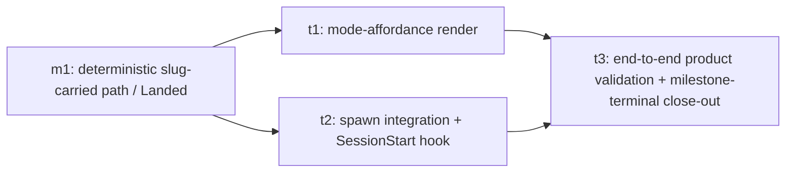

# m2 — Tool-Originated Session UX

Milestone doc for `tool-originated-task-sessions-m2`. Drafted by
this milestone-planning session against the merged code on
`origin/main` after m1 fully landed (close-out PR
[#56](https://github.com/kcrobinson-1/workstream-tracker/pull/56)).
Parent epic:
[`tool-originated-task-sessions`](../README.md) (`Proposed`).

The **WHAT** below is locked by the epic and is binding input —
not loosened here. This session re-derives the milestone's task
breakdown, cross-task contracts, cross-task decisions, and risks
against merged code. The remaining scope-locking question — the
**spawn mechanism shape** by which a contributor's click on a
node produces a real local interactive Claude Code session — is
explicitly named in Open Questions below rather than silently
resolved.

## Goal

Deliver the **tool-originated-session UX**: the explicit
contributor action on a plan-tree node — **Begin planning** (the
node's scope isn't settled yet) or **Begin implementation** (the
node is ready to build) — that spawns a real local interactive
Claude Code session, hands it a mode-appropriate prompt for that
node, and carries the node's canonical slug out-of-band so the
session-start hook registers it deterministically via m1's
proven path before the model reasons. End state: the loop
described by the epic — "click the node, pick the mode, watch the
right session start and attach itself" — closes by construction
on the page the contributor is already looking at. Origination
stays in the contributor's single local environment; the
running session remains fully observe-only.

This milestone is the determinism-resolution home: m1's
slug-carried path becomes wired by the spawn that actually
produces the slug, dissolving the registration circularity for
this class of session in the merged binary's behavior, not only
in the contract expression. The fencing properties that keep the
epic's one-way carve-out narrow — *human-initiated*, *one-shot at
session birth*, *identity-not-correction*, *running session stays
observe-only* — are load-bearing through the task set and must
hold at every site.

## Locked WHAT (inherited from the epic, not loosened)

Binding input from [`../README.md`](../README.md) "Milestone
Contracts → m2 row," "Open Questions Resolved By This Epic," and
the Cross-Cutting Invariants.

**End result.** Given a construction-known canonical slug
attached to a plan-tree node, an explicit contributor action on
that node spawns a real local interactive Claude Code session,
handed the mode-appropriate prompt, carrying the node's slug
out-of-band; a session-start hook registers it deterministically
via m1's path before the model reasons; the agent self-provisions
its worktree as ordinary agent behavior. The work-instance
appears on the very node the contributor clicked, the loop closed
by construction.

**Preserves, unchanged.** Observe-only for every session the tool
did **not** originate (the interactive best-effort grounded
narration handshake remains the path for natural-language
sessions). The deterministic register CLI surface m1 sanctioned —
`workstream-tracker register --slug <slug>` over the exact-slug
create-or-attach path — is consumed verbatim with no new
registration code surface, no new endpoint, no new schema, no
new request/response field. The four fencing properties of the
one-way carve-out hold: human-initiated, one-shot at birth,
identity-not-correction, running session stays observe-only.

**Sibling interface.** Consumes m1's slug-carried registration
entrypoint as the **real construction-time slug producer** (m1's
manual `--slug` argument was the stand-in this milestone
replaces). Produces no new registration mechanism — only the
producer that drives it.

**Constraints carried from the epic.** Origination stays in the
contributor's single local environment (no daemon, no
multi-tenant surface, no remote hosting). "Deterministic" stays
epic-scoped — identity-by-construction for a session that *did*
launch, never "the launch cannot fail," never enrichment made
load-bearing for attachment. The agent-adapter seam is kept open:
Claude Code is the concrete first launcher, and the spawn-side
integration must not bake assumptions that would make a second
agent a rewrite rather than an added adapter.

## Task Status

Three tasks. Skeletons are seeded **at this milestone's
`In draft` → `Proposed` promotion gate**, per
[`shared.md`](../../../../spec/planning/shared.md) "Parent-doc
child contracts → Parent-promotion stub seeding"; they do not
exist yet while this doc is `In draft`. The locked Cross-Task
Decision **D4 (spawn mechanism shape)** must resolve before the
promotion gate runs, because t2's WHAT contract names what t1
clicks into; an open D4 leaves t2's sibling-interface clause
under-specified for skeleton seeding. (See Open Questions
below — the user resolves D4 before promotion.)

| Task | Slug | Status |
|---|---|---|
| t1 | `tool-originated-task-sessions-m2-t1` | In draft (skeleton seeded at promotion) |
| t2 | `tool-originated-task-sessions-m2-t2` | In draft (skeleton seeded at promotion) |
| t3 | `tool-originated-task-sessions-m2-t3` | In draft (skeleton seeded at promotion) |

Task count is this session's output and is an **estimate of
scope shape**, not an epic-level commitment; per-task PR counts
are re-derived at each task's planning session per
[`task-plan.md`](../../../../spec/planning/task-plan.md)
"PR-count predictions need a branch test."

## Sequencing

**Ship order and rationale.** t1 and t2 are **independent
surfaces** that can draft and ship in parallel under
[`task-plan.md`](../../../../spec/planning/task-plan.md)
parallel-drafting citation rules: t1 touches only the page-side
render ([`internal/site/forest.go`](../../../../internal/site/forest.go) +
[`internal/site/tree.go`](../../../../internal/site/tree.go)
template surface) and the locked mode-offer table; t2 touches
only the launcher-side integration (a new launcher surface, the
Claude Code `SessionStart` hook configuration, the prompt-handover
shape). Their coupling is the locked **slug-carry contract** the
milestone names below (D1) — once that's locked, neither task
needs the other's source to draft or land. The Mermaid graph
reflects intended ship order, not strict dependency.

**t3 is a dedicated validation-and-land convergence node**, per
[`milestone.md`](../../../../spec/planning/milestone.md)
"Product acceptance and per-leaf validation → Dedicated validation
task node" and "A multi-leaf graph needs a terminal convergence
node." t3 depends on both t1 and t2, owns the milestone's
product-acceptance contract (end-to-end demo: open page → click
node → watch the right session start → see the work-instance
appear on the clicked node), and owns the milestone-terminal
close-out (batch deletion of the m2 `scoping/` subfolder, the m2
milestone doc's `Proposed → Landed` flip, the parent epic's
milestone-row advance). The graph topology this creates: t3 is
the sole leaf and carries the mandatory `Validating` per
[`shared.md`](../../../../spec/planning/shared.md) "Plan-doc
Status"; t1 and t2 are interior nodes that close on their own
technical gates.

## Task Contracts

Per-task **WHAT** contracts only; each task's **HOW** (file
inventory, signatures, validation-gate specifics, execution
ordering, risk register) is scoped at that task's own planning
session against then-merged code, per
[`shared.md`](../../../../spec/planning/shared.md) "Parent-doc child
contracts" and [`milestone.md`](../../../../spec/planning/milestone.md)
"Anti-goal: WHAT-contract each task, do not HOW-scope any task."

| Task | Short description | End result and what it preserves (WHAT) | Sibling interface | Product acceptance |
|---|---|---|---|---|
| `tool-originated-task-sessions-m2-t1` | Mode-affordance render on plan-tree nodes | The plan-tree forest renders a **mode-affordance** on each node — either **Begin planning**, **Begin implementation**, or neither — driven by the locked static map over the node's already-rendered facts (node-type + Status + has-children). A node that offers no mode renders no affordance. **Preserves**: every node still renders its existing label, Status badge, work-instance markers, progress-cell row, long description, and related-PR list — none of those are modified. The forest's expand/collapse default, the no-JavaScript posture (the page is still pure server-rendered HTML+CSS with native `
`/`
`), and the walk-on-every-request invariant are unchanged. No new endpoint, no new DB read, no new walk. | Produces the **mode-affordance render surface** t2's spawn integration wires to. The render side and the launch side are coupled only by D1's locked slug-carry contract — t1 emits the slug in the affordance's launch surface, t2 consumes it from the launched session's environment; the exact handover form is t2's WHAT to lock at D4's resolution. | A product reviewer opens the page and observes that every leaf-shape task and phase node renders the correct affordance per the locked mode map (Begin planning on `In draft` / no-doc; Begin implementation on `Proposed`; neither on `In progress`/`Validating`/`Landed`/`Deferred`); parent-shape nodes (epic/milestone, and tasks with phase children) render no affordance; the affordance is visible without expanding the node. |
| `tool-originated-task-sessions-m2-t2` | Spawn integration: click → real local interactive Claude Code session with deterministic registration | Acting on a mode-affordance launches a **real local interactive Claude Code session** in the contributor's local environment, with the clicked node's canonical slug carried out-of-band (via the existing `WST_SLUG` environment variable, per D1) and the mode-appropriate prompt handed in at session start. A **Claude Code `SessionStart` hook**, configured per D2, runs the deterministic `workstream-tracker register --slug $WST_SLUG` subcommand before the model reasons, attaching a work-instance to the clicked node by construction; the model then opens on the prompt. The agent self-provisions its worktree as ordinary in-prompt behavior (D5); the resulting worktree name returns through the **existing best-effort enrichment leg** (PR [#38](https://github.com/kcrobinson-1/workstream-tracker/pull/38)'s `--name`/`WST_NAME` metadata blob) — never load-bearing for attachment. **Preserves**: the deterministic register CLI is **unmodified** (the existing `--slug` argument and `WST_SLUG` env var are honored verbatim); the interactive best-effort handshake for natural-language sessions is **unmodified**; observe-only is preserved for every session the tool did not originate; no new endpoint, no new schema, no new request/response field is introduced into the registration surface. The fencing properties (human-initiated, one-shot at birth, identity-not-correction, running session stays observe-only) hold at every site t2 touches. | Consumes t1's mode-affordance render surface as the launch trigger; produces the **real construction-time slug producer** that drives m1's slug-carried registration path end-to-end. The seam between t2 and a hypothetical future agent adapter must be additive (a new adapter is added beside the Claude Code launcher, not by rewriting t2's structure). | Closes on technical gate; the milestone's product validation lives on t3. (Interior node — not a Mermaid-graph leaf.) |
| `tool-originated-task-sessions-m2-t3` | End-to-end product validation + milestone-terminal close-out | A product reviewer performs the **full end-to-end walkthrough** against the local server with a real Claude Code launcher available: open the page, locate a `Proposed` task/phase node, click **Begin implementation**, observe a real Claude Code session start, observe the **real register receipt** echo with the clicked node's canonical slug (per the deterministic-path handshake rule), observe the work-instance appear on the clicked node in the rendered tree, observe the session run its initial prompt; symmetrically for **Begin planning** against an `In draft`/no-doc node; symmetrically observe that nodes offering no mode (epic/milestone parents, in-flight task/phase nodes) show no affordance. The walkthrough records approval in this plan; product-validation findings are routed per [`milestone.md`](../../../../spec/planning/milestone.md) "Product-validation findings: fix now or defer." The terminal PR then performs the **milestone-terminal close-out**: batch-deletes the m2 `scoping/` subfolder (every transient scoping doc t1's and t2's planning sessions produced), de-links any inbound references to those scoping docs in any durable plan doc that survives the batch (the non-link inline-code form), flips this milestone doc's `Status` `Proposed` → `Landed`, advances the parent epic's m2 milestone row to `Landed` with its terminal PR link. **Preserves**: nothing about the production code path is touched at this stage; t3 is a validation + close-out node, not a code-producing task. The milestone retrospective (per `milestone.md` "Milestone retrospective") runs at the same boundary and routes any accumulated findings forward through the backlog — it does **not** gate t3's `Landed` flip. | Sole Mermaid-graph leaf — converges t1 and t2 and is the milestone-terminal node. | The full walkthrough above runs to completion against a live local server + Claude Code launcher, with the real register receipt observed for both modes and parent-shape nodes verified to offer no affordance; approval is recorded in this plan before its `Landed` flip. |

## Cross-Task Invariants

Rules that thread the task set; flag any task deliberation that
brushes against them.

- **No new registration surface (inherited from m1's D1).** No
  endpoint, request/response field, DB schema change,
  registration code path, or new CLI flag is added. The
  existing `workstream-tracker register --slug <slug>` over the
  exact-slug create-or-attach path is consumed verbatim. The
  spawn integration is purely a **slug producer**, not a new
  registration mechanism. (Verified by
  [`internal/api/handlers.go`](../../../../internal/api/handlers.go)
  `insertRegister` exact-slug branch;
  [`cmd/workstream-tracker/register.go`](../../../../cmd/workstream-tracker/register.go)
  `runRegister`; and the deterministic-path contract this
  consumes, [`shared.md` "Deterministic assertion when the slug
  is construction-known"](../../../../spec/planning/shared.md)
  and
  [`session-registration.md` "The deterministic path"](../../../../docs/agents/local/session-registration.md).)
- **Fencing properties hold at every site.** The one-way
  invariant carve-out is fenced by four properties — *human-
  initiated*, *one-shot at birth*, *identity-not-correction*,
  *running session stays observe-only*. Strip any one and the
  epic's invariant erodes. Each task's deliberation must read
  against the four; any decision that introduces in-session
  tool→agent flow (steering, re-prioritizing, feeding tool
  state back into agent context) is out of scope by this
  invariant, not by Out of Scope alone. (Verified by [epic
  "Open Questions Resolved By This Epic → How does
  tool-origination reconcile with the 'tool stays one-way'
  vision invariant?"](../README.md).)
- **Origination stays in the contributor's single local
  environment.** The spawned session runs locally, where the
  contributor already runs agents. The 1.0-epic's
  single-contributor / single-local invariant is unchanged.
  No daemon-for-others, no remote process, no multi-tenant
  surface is introduced by t2's launcher. (Verified by [epic
  Cross-Cutting Invariants, "Origination stays in the
  contributor's single local environment"](../README.md).)
- **Agent-adapter seam stays additive.** Claude Code is the
  concrete first launcher; the structure of t2's integration
  must not bake Claude-Code-only assumptions into shapes that
  would make a hypothetical second agent a rewrite rather than
  an added adapter. This is a structural posture, not a
  commitment to ship a second agent in this milestone.
  (Verified by [epic Cross-Cutting Invariants, "Agent-adapter
  seam"](../README.md).)
- **"Deterministic" stays epic-scoped.** No task may read
  "deterministic" as "the spawn cannot fail" or make
  enrichment load-bearing for attachment. A launch that fails
  to start must be *observable*, not silently swallowed
  (accepted-failure-with-visibility). The follow-up
  enrichment (worktree name, intended work) is best-effort and
  decorates an already-correctly-attached instance; it does not
  reintroduce the registration circularity. (Verified by [epic
  Cross-Cutting Invariants, "What 'deterministic' is scoped
  to"](../README.md).)
- **No JavaScript / no walk-on-every-request regression.** t1's
  render-side edit must not introduce client-side JavaScript or
  a second walk/query of plan-tree state per request. The
  forest is server-rendered HTML+CSS with native `
`,
  and the affordance is a render-time derivation of facts the
  page already loaded. (Verified by
  [`internal/site/render.go`](../../../../internal/site/render.go)
  no-JS template;
  [`internal/site/forest.go`](../../../../internal/site/forest.go)
  native-`
` box;
  [`internal/site/site.go`](../../../../internal/site/site.go)
  single per-request walk + DB read.)

## Cross-Task Decisions

- **D1 — Slug is carried out-of-band via the existing
  `WST_SLUG` environment variable.** *Resolved this session.*
  The deterministic register CLI already reads its slug from
  `--slug` or `WST_SLUG`; the spawn integration sets `WST_SLUG`
  in the environment of the spawned `claude` process, and the
  SessionStart hook inherits that environment and passes the
  slug into the same `workstream-tracker register --slug
  $WST_SLUG` invocation m1's deterministic-path contract
  sanctions. No new env var, no new CLI flag, no payload schema
  change. Env-var-carry is the natural fit because the
  Claude Code SessionStart hook **cannot receive
  launcher-provided prompts as input** — the hook receives a
  fixed JSON envelope (session_id, cwd, …), not arbitrary
  launcher arguments — but the **hook process inherits the
  parent environment**, so the env var is the singular
  reliable carrier from launcher to hook. *Verified by:*
  [`cmd/workstream-tracker/register.go`](../../../../cmd/workstream-tracker/register.go)
  `runRegister` reading `--slug` or `WST_SLUG`;
  [Claude Code `SessionStart` hook
  documentation](https://code.claude.com/docs/en/hooks.md)
  ("the hook process inherits the parent environment, so it
  can read any environment variables set before launching
  Claude Code").
- **D2 — The session-start integration is a Claude Code
  `SessionStart` hook (matcher `startup`) running the
  deterministic register subcommand.** *Resolved this session.*
  The hook is configured in `.claude/settings.json` (or its
  user-scoped/local-scoped peer) with `type: "command"`,
  matcher `startup`, and a command that invokes
  `workstream-tracker register --slug $WST_SLUG` (via the
  agent rule's full module-path form,
  [`session-registration.md` "The deterministic path"](../../../../docs/agents/local/session-registration.md)).
  The hook fires **before the model begins**, so the
  work-instance is attached by construction before any agent
  cognition. The hook's `validation-honesty` posture (echo the
  real receipt, narrate failure explicitly, never gate the
  session) is the deterministic-path-rule's posture already.
  The completion-side bracket of the lifecycle (the symmetric
  `complete`/`abandon` handshake added in PR
  [#45](https://github.com/kcrobinson-1/workstream-tracker/pull/45))
  is **out of t2's scope** — m2 wires the start half only; the
  completion half stays the agent-process responsibility per
  the lifecycle rule's session-end section. *Verified by:*
  [Claude Code `SessionStart` hook
  documentation](https://code.claude.com/docs/en/hooks.md)
  (the `startup` matcher fires for new sessions; configuration
  in `.claude/settings.json`; `type: "command"` is supported);
  [`session-registration.md` "The deterministic path
  (construction-known slug)"](../../../../docs/agents/local/session-registration.md)
  (the steps the hook runs).
- **D3 — Mode-offer static map.** *Resolved this session.* The
  affordance offered at a node is a deterministic lookup over
  facts the page already holds — the node's parsed node-type
  (the `PlanNode.NodeType` field from
  [`tree.go`](../../../../internal/site/tree.go)), its Status
  (the `PlanNode.Status` field, drawn from the doc's
  frontmatter), and whether the node has any children (the
  presence-or-absence of items in `PlanNode.Children`):
  - *epic / milestone* (always parent-shape) → **no
    affordance.** Their work is their children.
  - *root* (the per-epic / per-standalone-task root) → **no
    affordance.** Roots are conceptual containers; the
    affordance lives at the level a session actually drafts or
    implements.
  - *task / phase with children* (a task carrying its phase
    children) → **no affordance.** A parent-shape task's work
    is its phases; per
    [`shared.md`](../../../../spec/planning/shared.md) "Slug
    generation" the N=1 collapse means a single-phase task is
    not a parent in the tree, so this case binds only at
    N ≥ 2.
  - *task / phase without children* (the leaf-shape case),
    Status `In draft` or no Status / no doc → **Begin
    planning.**
  - *task / phase without children*, Status `Proposed` →
    **Begin implementation.**
  - *task / phase without children*, Status `In progress`,
    `Validating`, `Landed`, `Deferred — …`, or any unknown
    Status → **no affordance.** A session is already running
    or the work is done; re-offering would invite a
    drift-correction loop the fencing properties forbid.

  The map is a render-side lookup over per-node facts already
  in `PlanNode`; no new walk, no new DB read, no new
  frontmatter field. *Verified by:*
  [`internal/site/tree.go`](../../../../internal/site/tree.go)
  `PlanNode` (carries `NodeType`, `Status`, `Children`);
  [`internal/slugs/slugs.go`](../../../../internal/slugs/slugs.go)
  `NodeType` constants (epic/milestone/task/phase/root);
  [`internal/site/render.go`](../../../../internal/site/render.go)
  `statusClass` (Status canonical-prefix handling — including
  the `Deferred — <reason>` split — that the map reuses);
  [`shared.md`](../../../../spec/planning/shared.md) "Plan-doc
  Status" (the canonical lifecycle the table is keyed on);
  [`../README.md` "Open Questions Resolved By This Epic →
  Which node levels offer 'Begin planning' vs 'Begin
  implementation'"](../README.md) (the epic's resolved
  shallow-static-map framing the table implements).
- **D4 — Spawn-mechanism shape: OPEN.** *Surfaced as Open
  Question 1 below.* This is the dominant
  technical-direction call the milestone owes; it determines
  the exact form by which a contributor's click on a node's
  mode-affordance results in a real local interactive Claude
  Code session running with the slug in its environment and a
  mode-appropriate initial prompt. Three shapes are
  decomposed in Open Questions; user input required before
  the milestone's promotion gate, because t1's affordance
  render surface and t2's launcher surface must both speak
  the same handover form, and t2's WHAT clause naming that
  handover cannot lock until the shape is named. **The
  preserved cross-task invariants (no new registration
  surface, fencing properties, single-local-environment
  origination, additive agent-adapter seam, no
  walk-on-every-request regression) bind the shape choice;
  any shape that violates one of them is rejected by
  invariant, not deliberation.**
- **D5 — Worktree provisioning is prompt-instructed; the
  worktree name returns through the existing best-effort
  enrichment leg.** *Resolved this session.* The tool has no
  workspace role — per the epic's resolved "Where does a
  tool-originated session's workspace come from?", the opening
  prompt instructs the session to start its work in a fresh
  worktree off the latest `origin/main`; the agent does so as
  ordinary agent behavior. The resulting worktree name returns
  to the tool through the existing `--name`/`WST_NAME`
  enrichment leg added in PR
  [#38](https://github.com/kcrobinson-1/workstream-tracker/pull/38),
  which the deterministic-path handshake's "Invoke" /
  "Echo real output" steps already wrap (the optional `name`
  request-metadata key). The enrichment is best-effort; a
  missed enrichment degrades richness, not correctness — the
  node still shows the agent is there. No new metadata field,
  no schema change. *Verified by:*
  [epic "Open Questions Resolved By This Epic → Where does
  the workspace come from?"](../README.md);
  [`cmd/workstream-tracker/register.go`](../../../../cmd/workstream-tracker/register.go)
  `runRegister` `--name`/`WST_NAME` reading (the metadata
  carrier);
  [m1 D1's PR #38 re-verification, "the enrichment leg is the
  orthogonal second phase of the epic's two-phase
  split"](../m1/README.md).

## Cross-Task Risks

- **The spawn-mechanism choice (D4) is the largest technical-
  direction call in the project's history.** The epic resolved
  posture-level questions but not the launch mechanism; a
  wrong choice on D4 could either (a) make the tool a heavier
  surface than the carve-out justifies (a server endpoint that
  runs arbitrary local processes), (b) bake in a
  Claude-Code-only assumption the agent-adapter seam was
  meant to keep open, or (c) under-deliver the vision's
  "click the node, watch the right session start"
  experience. Mitigation: D4 is named explicitly Open and
  decomposed into named shapes in Open Questions; the
  preserved cross-task invariants act as the rejection filter
  for each shape; the resolution lands before the milestone's
  promotion gate, not later.
- **Mode-affordance map drift.** The static map (D3) is
  shallow, but a missed combinator (an unknown Status, a
  task-with-phases case the renderer mis-classifies, a
  `Deferred — <reason>` whose canonical-prefix stripping the
  affordance code re-implements rather than reusing) could
  surface an affordance on the wrong node. Mitigation: the
  render-side code derives entirely from `PlanNode` fields
  already in
  [`tree.go`](../../../../internal/site/tree.go), reuses
  [`render.go`](../../../../internal/site/render.go)'s
  canonical-prefix Status handling, and t1's own validation
  gate enumerates each row of the map as a test case (a
  template-render assertion that the correct affordance —
  or none — appears for each node-type/Status/has-children
  triple). The full map is enumerated in D3, so the
  enumeration is reviewable.
- **Hook misconfiguration silently misses the determinism
  contract.** A spawned session whose SessionStart hook
  fails to register (mis-configured command, wrong matcher,
  hook missing on the contributor's machine) leaves the
  work-instance unattached while the model runs — the
  tree shows no work where work is happening. Mitigation: the
  deterministic-path handshake rule already requires the
  agent to echo the real receipt and narrate failure
  explicitly, so a misconfigured hook is loud rather than
  silent; t3's product-validation walkthrough explicitly
  observes a real receipt before approving; the hook
  configuration is the **same `.claude/settings.json` form
  already used in this repo's existing dev setup**, which
  the contributor already runs against. The
  observability-residual entry the epic split off
  ([`unregistered-work-unobservable`](../../../../docs/backlog.md#unregistered-work-unobservable))
  remains the tracked home for the tree-side affordance gap
  this risk surfaces.
- **Wrong-by-construction slug attaches an orphan
  work-instance.** Per the m1-accepted residual, a typoed or
  mis-derived slug still attaches under the
  trust-the-caller posture; the real-receipt echo keeps it
  observable post-hoc but the orphan exists. m2's slug
  producer (the page-side render) is the producer-of-record
  for this milestone, so the protective surface is t1's
  enumerated-map test (only the correctly-rendered node
  slug ever rides into `WST_SLUG`) + t3's walkthrough
  observation. No new residual is introduced by m2; the
  existing one moves from "stand-in producer" to "real
  producer," with the same trust-the-caller property.
- **The fencing properties erode under feature pressure.**
  Future milestone or epic-adjacent work may pressure the
  spawn integration to accept "just one more" tool→agent
  feedback (drift correction, re-prioritization,
  shared-state push). Mitigation: the four properties are
  named in the Cross-Task Invariants and re-cited in each
  task's planning session; the Out of Scope section makes
  the boundary explicit; any deliberation that brushes
  against them is reviewer-flag.

## Documentation Currency

Map of which docs each task must keep accurate (per
[`milestone.md`](../../../../spec/planning/milestone.md)
required "Documentation Currency"):

- **t1 edits:** the forest template surface
  ([`internal/site/forest.go`](../../../../internal/site/forest.go))
  and any rendering test surface
  ([`internal/site/forest_test.go`](../../../../internal/site/forest_test.go)
  is the existing template-render test pattern); no spec or
  agent-rule doc edits expected (the mode-offer map is a
  product surface, not a contract under
  [`spec/**`](../../../../spec/) or
  [`docs/agents/local/**`](../../../../docs/agents/local/)).
- **t2 edits:** the launcher integration surface (location
  follows the D4 resolution — a `.claude/settings.json` hook
  configuration plus the launcher entrypoint at the resolved
  shape's home) and, if D4 lands on a shape that adds new
  surface to the existing site or CLI, those files. The
  agent rule
  [`docs/agents/local/session-registration.md`](../../../../docs/agents/local/session-registration.md)
  is currency-check no-edit-expected — m1's t1 already
  expressed the deterministic path additively, and m2
  consumes that expression verbatim. If t2 finds it must
  edit the agent rule (e.g., a prompt-handover convention
  the rule should describe), that is a signal to stop and
  reconcile, not silently diverge.
- **t3 edits:** this milestone doc's `Status` (`Proposed` →
  `Validating` → `Landed`), the parent epic's m2 milestone
  row to `Landed`, and the batch deletion of the m2
  `scoping/` subfolder. Any inbound link from a durable plan
  doc (t1's or t2's plan, this milestone doc) to a
  scoping doc must be de-linked in the same change per
  [`milestone.md`](../../../../spec/planning/milestone.md)
  "Output set" — the non-link inline-code form is the
  canonical de-link.
- **Currency check, no edit expected:**
  [`design/v0.1-design.md`](../../../../design/v0.1-design.md)
  is a frozen v0.1 end-state record and is **not**
  reconciled against (the project's standing posture per
  the memory rule); m1's
  [t1 plan](../m1/t1-deterministic-path-contract.md) and
  [t2 plan](../m1/t2-determinism-proof-harness.md) are
  landed and immutable history; the spec's
  [`shared.md`](../../../../spec/planning/shared.md)
  "Deterministic assertion when the slug is
  construction-known" subsection is the consumed contract.
  Any task that finds it must edit a landed doc must stop
  and reconcile.

## Backlog Impact

No backlog changes expected in m2's implementing PRs. The
graduate/split of
[`deterministic-interactive-registration`](../../../../docs/backlog.md#deterministic-interactive-registration)
(determinism thread → this epic) and the carve-outs
([`interactive-registration-tripwire`](../../../../docs/backlog.md#interactive-registration-tripwire),
[`unregistered-work-unobservable`](../../../../docs/backlog.md#unregistered-work-unobservable))
landed in the epic's promotion PR
[#37](https://github.com/kcrobinson-1/workstream-tracker/pull/37);
m2 delivers the determinism-resolution capability the first of
those entries graduated for, but **does not edit any backlog
entry** to record that — the graduation flip already happened.

The retrospective at this milestone's close (per
[`milestone.md`](../../../../spec/planning/milestone.md)
"Milestone retrospective") is the **forward-routing seam** for
any findings the product validation surfaces: any defer-and-
route-forward outcome lands as a new backlog entry, not as a
retrofitted task in this milestone. The retrospective itself
produces no doc artifact.

## Out of Scope

- **In-session tool→agent flow of any kind.** m2 crosses the
  one-way line only at session *origination*. Steering,
  drift-correction, re-prioritization, or any push beyond the
  spawn moment is out of scope and remains governed by the
  standing observe-only posture. (Bound by the fencing
  properties in Cross-Task Invariants.)
- **The exact wording of the planning / implementation
  prompts.** Per [epic Out of Scope](../README.md), the *shape*
  of the prompts (a planning session opens on a scoping
  prompt; an implementation session opens on an implementation
  prompt for the clicked node) is contracted; the **specific
  prompt wording is settled in the implementing PR**, not
  contracted in this milestone doc and not a separate task.
- **Shipping a second agent.** Claude Code is the first and
  only concrete launcher in m2; adding another agent adapter
  is post-epic per the agent-adapter-seam invariant.
- **Changing the interactive (contributor-opened)
  registration path.** Sessions a contributor opens outside
  the tool keep the observable best-effort grounded narration
  handshake; m2 adds the tool-originated deterministic
  *producer* for the deterministic path m1 already
  sanctioned, it does not replace, rewrite, or pull forward
  the interactive path or the independent
  [`interactive-registration-tripwire`](../../../../docs/backlog.md#interactive-registration-tripwire).
- **Tree-side observability heuristics.** A "node has a plan
  doc but no work-instance" indicator (or symmetric "a
  work-instance has no plan doc") belongs to the
  [`unregistered-work-unobservable`](../../../../docs/backlog.md#unregistered-work-unobservable)
  backlog entry, not m2. m2 closes the determinism-resolution
  thread; the observability thread remains independently
  Open.
- **The session-end completion bracket.** PR
  [#45](https://github.com/kcrobinson-1/workstream-tracker/pull/45)
  added the symmetric `complete`/`abandon` handshake; m2
  wires the *start* half (the SessionStart hook). The
  completion half stays the agent-process responsibility per
  the lifecycle rule's session-end section — m2 does not
  introduce a tool-driven completion mechanism.
- **Persistent contributor configuration on first run.** Any
  one-time-setup choreography for the
  `.claude/settings.json` hook (whether the repo ships a
  committed snippet, a per-contributor `.local.json` overlay,
  or a documented install step) is HOW for t2's planning
  session, not a milestone-level contract.

## Open Questions

These items are surfaced for the user to resolve **before**
this milestone walks its `In draft` → `Proposed` promotion
gate. Resolutions lock into the appropriate Cross-Task
Decision and/or Task Contract clauses; promotion is gated on
each item being either resolved or explicitly accepted as
deferred.

### OQ1 — Spawn-mechanism shape (locks D4)

What is the form by which a contributor's click on a
mode-affordance results in a real local interactive Claude
Code session running with `WST_SLUG` set and a mode-appropriate
initial prompt handed in? Three shapes are named below;
decomposition follows the [`shared.md`](../../../../spec/planning/shared.md)
"Decompose options into shapes before analyzing" rule. **The
cross-task invariants act as the rejection filter** — a shape
that violates one (no new registration surface, fencing
properties, single-local origination, additive agent-adapter
seam, no walk-on-every-request / no-JS regression for t1) is
rejected by invariant.

- **Shape S1 — Click-to-paste (display-only launch surface).**
  The mode-affordance click reveals an inline launch surface
  on the node (a `
`-revealable block, or a
  copy-to-clipboard control beside the affordance) carrying a
  copy-pasteable shell command line that exports `WST_SLUG`
  for the clicked slug and invokes the `claude` launcher with
  a prompt-file argument for the mode's prompt material. The
  contributor's paste-and-run **is** the spawn. **Faithful
  to:** minimal-tool framing (no new endpoint, no JavaScript,
  no subprocess from the server); the existing no-JS posture
  ([`render.go`](../../../../internal/site/render.go),
  [`forest.go`](../../../../internal/site/forest.go)) and
  walk-on-every-request invariant. **Cost:** falls short of
  the vision's "click the node, watch the right session
  start" UX — a paste step sits between click and start.
  **Open sub-question:** does this still satisfy the locked
  WHAT's "an explicit contributor action on a node spawns a
  real local interactive session" verb, or does the paste-as-
  contributor-action read as too-many-actions?

- **Shape S2 — Custom URL-handler hand-off.** The mode-
  affordance is an anchor with `href` set to a
  Claude-Code-launcher URL scheme (e.g.,
  `claude-code://launch?slug=<slug>&prompt=…`). The
  contributor's browser hands the URL to the OS, which routes
  it to a Claude-Code-aware handler that opens a real local
  interactive session with the slug in its environment.
  **Faithful to:** the vision's one-click UX; no
  JavaScript needed (it's a plain anchor); no new tool surface
  beyond the rendered link. **Cost / unresolved factual
  premise:** requires verifying whether Claude Code installs
  (or makes installable) such a URL handler in the
  contributor's local environment — the vendor docs
  surveyed in D2 do not assert it. **This is a sole
  factual-grounding question** the spec can only resolve by
  reading Claude Code's launcher / installation surface;
  surface here rather than silently presuming. **Sub-risk:**
  even if the handler exists, baking the exact URL
  scheme into the render surface couples t1 to Claude Code
  more tightly than the agent-adapter-seam invariant
  prefers — a second-agent adapter would need a different
  scheme.

- **Shape S3 — Local fetch + server-side spawn.** The mode-
  affordance is rendered as a small client-side trigger that
  POSTs (CSRF-token-protected, same-origin) to a new `/spawn`
  endpoint on the workstream-tracker local server; the
  server runs `WST_SLUG=<slug> claude <prompt args>` as a
  subprocess in the contributor's local environment.
  **Faithful to:** the vision's one-click UX. **Cost / load-
  bearing question:** introduces (a) JavaScript on the page
  for the first time (POST + CSRF), (b) a new endpoint on the
  workstream-tracker server that runs arbitrary local
  subprocesses, (c) a CSRF / same-origin posture the server
  has not previously needed. **This is the largest expansion
  of tool surface** the post-1.0 carve-out has contemplated.
  Whether the carve-out's value survives this much new
  surface — particularly the "no walk-on-every-request
  regression" and "fencing properties" invariants — is the
  load-bearing question; the four fencing properties survive
  it on a careful read (still human-initiated by the click;
  still one-shot at birth; still identity-not-correction;
  the *running* session stays observe-only since the
  POST→subprocess is a one-shot at spawn), but the cost in
  new tool surface is real.

**Recommended path for user input:** the user weighs the
vision's UX framing ("click the node, watch the right
session start") against the minimal-tool framing memory
("default is nothing — prompt + observe/display"). The two
read in different directions on this question; this
milestone-planning session cannot legitimately default
either way without the user's call. A choice of **S1** is
the safest minimal-tool path and the smallest m2 in
implementation; **S2** is the cleanest UX *if* the URL-handler
premise holds; **S3** is the most-UX-faithful path at the
cost of the largest new tool surface.

### OQ2 — Edge cases in the mode-offer static map (refines D3)

D3 names the table, but two edges are worth a deliberate
yes/no rather than a silent answer:

- **A task with phases whose phase children are themselves
  `In draft` / no-doc.** The task is parent-shape (so D3 says
  *no affordance* on the task itself), but the contributor
  might reasonably want a planning affordance on the *task*
  to draft the phase set (or rather, to draft a refined plan
  for the task). Does m2 offer a planning affordance on a
  task whose own Status is `Proposed` but whose phase
  children are `In draft`? Default answer in D3 is **no** —
  the task is parent-shape, period — but worth confirming
  rather than letting an unspoken policy bind future
  reviewers.
- **An unknown Status value (the `statusClass` "unknown"
  fallback).** The page renders an unknown Status with a
  neutral badge per
  [`shared.md` "Plan-doc Status → Unknown Status values
  render gracefully"](../../../../spec/planning/shared.md).
  D3 currently maps unknown → no affordance. This is the
  safest default (per the fencing properties — don't offer
  a re-launch into a state the spec doesn't recognize) but
  worth confirming.

### OQ3 — Task breakdown (3 vs. 4-task split)

This session proposes **three tasks** (t1 affordance render,
t2 spawn integration, t3 validation + close-out). An
alternative is a **four-task split** that pulls the
SessionStart hook configuration out of t2 into its own task
on the basis that it is the determinism-relevant integration
moment and benefits from focused review. Argument *for*
3 tasks: the hook is the moment the click-side and the
register CLI meet; it is one cohesive integration with the
launcher and benefits from being designed together.
Argument *for* 4 tasks: the hook is the m1-contract-consuming
surface and a focused task makes its discipline visible.
Default proposal **3 tasks**; user may push back to 4 if the
hook's surface warrants its own seat.

## Related Docs

- [`../README.md`](../README.md) — the parent epic; locks
  m2's WHAT contract, Cross-Cutting Invariants, and the
  resolved vision inputs (spawn shape, one-way
  reconciliation, workspace origin, level/mode) m2
  consumes.
- [`../m1/README.md`](../m1/README.md) — the m1 milestone
  doc (Landed); the cross-task contract m2 consumes (no new
  registration surface; the deterministic register CLI;
  the additive deterministic-path contract).
- [`../m1/t1-deterministic-path-contract.md`](../m1/t1-deterministic-path-contract.md) —
  t1's landed plan; the durable contract m2's spawn
  produces against.
- [`../m1/t2-determinism-proof-harness.md`](../m1/t2-determinism-proof-harness.md) —
  t2's landed plan; the proof that the deterministic path
  m2 consumes actually behaves as the contract claims.
- [`../../../../spec/planning/milestone.md`](../../../../spec/planning/milestone.md) —
  the rules this milestone doc is structured against;
  required-and-optional sections, the multi-leaf
  convergence-node rule, the product-acceptance / per-leaf
  validation rule, the milestone-retrospective seam.
- [`../../../../spec/planning/shared.md`](../../../../spec/planning/shared.md) —
  cross-level planning rules; "Deterministic assertion when
  the slug is construction-known" (the contract m2 wires
  to); "Decompose options into shapes before analyzing" (the
  rule OQ1 is structured by); "Slug generation" (the
  exact-slug create-or-attach path m2's slug-producer
  drives).
- [`../../../../docs/agents/local/session-registration.md`](../../../../docs/agents/local/session-registration.md) —
  the lifecycle rule; "The deterministic path
  (construction-known slug)" is the runtime contract
  m2's SessionStart hook satisfies.
- [Claude Code `SessionStart` hook
  documentation](https://code.claude.com/docs/en/hooks.md) —
  D2's vendor-doc grounding (matcher `startup`, env-var
  inheritance, configuration in `.claude/settings.json`).
- [`../../../../internal/site/tree.go`](../../../../internal/site/tree.go),
  [`../../../../internal/site/forest.go`](../../../../internal/site/forest.go),
  [`../../../../internal/site/render.go`](../../../../internal/site/render.go) —
  the rendering surface t1 extends; D3's reality-check
  grounding (`PlanNode.NodeType` + `PlanNode.Status` +
  `PlanNode.Children`).
- [`../../../../cmd/workstream-tracker/register.go`](../../../../cmd/workstream-tracker/register.go) —
  the deterministic register CLI m2 consumes verbatim; D1's
  reality-check grounding for `--slug` / `WST_SLUG` /
  `--name` / `WST_NAME`.
