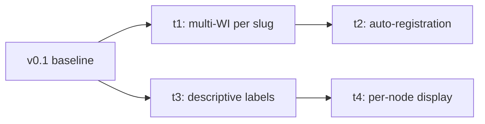

# v0.2 — Read-Experience Improvements

## Goal

The first milestone in the [parent epic](README.md) that takes
workstream-tracker from v0.1 toward 1.0. Lift the plan-tree view
from "informational" to "scannable per node," make the agent
dogfood credible, and establish the descriptive-label foundation
that m2 (activity-first ordering) and m3 (sub-stage cells) build
on.

Verifiable when v0.2 lifts v0.1's bare-bones rendering with:
multiple work-instances attachable to a single slug; agents
registering automatically on session start; plan-tree labels
reading as `<Type> <ordinal>: <short description>` rather than
full slug chains; and per-node detail rendered or PR linkage
visible.

## Task Status

| Slug                              | Title                                | Status |
|-----------------------------------|--------------------------------------|--------|
| `workstream-tracker-1-0-m1-t1`    | Multi-work-instance per slug         | [Landed](m1-t1-multi-wi-per-slug.md) |
| `workstream-tracker-1-0-m1-t2`    | Automatic agent registration         | —      |
| `workstream-tracker-1-0-m1-t3`    | Descriptive tree labels              | [Landed](m1-t3-descriptive-labels.md) |
| `workstream-tracker-1-0-m1-t4`    | Expanded per-node display            | [In draft](m1-t4-expanded-per-node-display.md) |

Status `—` indicates the task plan has not been drafted; tasks
draft just-in-time per
[`task-plan.md`](../../../spec/planning/task-plan.md)
"Just-in-time scoping and plan drafting."

**t3 phase structure (resolved at t3 drafting):** **N = 1** —
phase content absorbed inline; no separate phase plan files.
The earlier two-phase estimate (parse, then render) was
rejected because the split lacks independent value per the
level picker. The task plan is
[`m1-t3-descriptive-labels.md`](m1-t3-descriptive-labels.md)
(Status `Proposed`; promotion-gate self-review complete);
rationale and rejected alternative in its scoping doc (D1). t3 also adds an exported
`slugs.Slug.Position()` accessor — additive to the shared
`internal/slugs` package, recorded in the plan's Files to
touch and scoping D6.

**t4 phase structure (resolved at t4 drafting):** **N ≥ 2** —
P1 (inline per-node detail render: long description +
author-curated `related_prs`, pure read-path) and P2 (`gh pr
list` auto-discovery, the codebase's first subprocess
shell-out). The split is taken because P2's subprocess carries
a distinct environment-dependent Validation Gate and
Self-Review surface plus a novel-mechanism spike the
pure-template P1 does not (rationale and rejected N = 1 in
scoping D2). The task plan is
[`m1-t4-expanded-per-node-display.md`](m1-t4-expanded-per-node-display.md)
(Status `In draft` — P2's phase plan drafts just-in-time after
P1's PR merges, so the task structure has a still-pending child
plan); the P1 phase plan
[`m1-t4-p1-inline-detail-render.md`](m1-t4-p1-inline-detail-render.md)
is Status `Proposed` (promotion-gate self-review complete). t4
adds one optional, additive `related_prs` frontmatter field,
documented in `spec/planning/shared.md` adjacent to
`short_description` (scoping D3).

## Sequencing

Two parallel tracks emerge from the v0.1 baseline:

- **Foundation track** (t1 → t2). Schema relaxation and the
  create-or-attach exact-slug API in t1 unblock auto-registration
  in t2.
- **Read-experience track** (t3 → t4). Descriptive labels in t3
  introduce frontmatter parsing (`short_description` and
  markdown-body extraction for long description) and render
  labels using the parsed fields. The expanded per-node display
  in t4 consumes the parsed fields for whatever detail surface
  it picks.

The two tracks are independent at task level — each task
delivers stakeholder-facing value alone per the level-picker
rule in [`task-plan.md`](../../../spec/planning/task-plan.md).
Track-choice for the first task is sized at
just-in-time-drafting time.

## Task Contracts

Per-task **WHAT** contracts — end result, sibling interfaces,
preserves. The **HOW** (file inventory, signature shapes,
specific commands, validation gate) lives in each task's plan
when it drafts. Required section per
[`milestone.md`](../../../spec/planning/milestone.md) "Required
and optional sections" and
[`shared.md`](../../../spec/planning/shared.md) "Parent-doc
child contracts."

### t1 — Multi-work-instance per slug

- **End result.** A given slug can carry N≥1 work-instance
  rows over time, both serially (paused-then-resumed sessions)
  and concurrently (co-working agents). The register API
  exposes a create-or-attach flow at a caller-supplied exact
  slug: it registers the *first* work-instance for a
  not-yet-registered slug, or attaches an additional one to a
  slug that already has work-instances.
- **Interfaces.** `RegisterRequest` accepts a caller-supplied
  exact slug for create-or-attach, with **no precondition that
  a work-instance already exists for it** (t2 depends on
  first-registration against a freshly-drafted node's slug);
  registration is idempotent on `(slug, actor, active)`; the DB
  slug-uniqueness constraint is relaxed.
- **Preserves.** Existing root-create and descendant-create
  flows continue to work; agents using the v0.1 API shape keep
  functioning.

### t2 — Automatic agent registration

- **End result.** Agent sessions register on start without
  manual API invocation; work-instance markers shown in the
  tree are trustworthy because registration is reliable.
- **Interfaces.** Consumes t1's create-or-attach flow,
  including first-registration against a freshly-drafted
  node's slug (the first agent on a node creates that node's
  first work-instance). Derives the slug from agent context
  using a signal chosen at task drafting (candidates:
  plan-file frontmatter the agent is touching, branch name,
  explicit launch-prompt argument).
- **Preserves.** Manual API invocation remains available as a
  fallback. Server unreachability is tolerated — the session
  logs and proceeds rather than crashing.

### t3 — Descriptive tree labels

- **End result.** Tree labels render as
  `<Type> <ordinal>: <short description>` (e.g.,
  `Task 1: Wire auto-registration`) instead of full slug
  chains. Nodes without `short_description` fall back to the
  slug suffix.
- **Interfaces.** Frontmatter parser exposes an optional
  `short_description` field; the markdown body becomes a
  parsed long-description value. Spec change in
  `spec/planning/shared.md` documents the new field.
- **Preserves.** The full slug stays accessible via tooltip or
  copy affordance — it remains the stable identity for URLs
  and git refs. Existing tree rendering paths continue to
  work for unchanged plan-tree docs.

### t4 — Expanded per-node display

- **End result.** Each node surfaces detail beyond the status
  badge: short description, long description, and related
  PRs. Surface shape (inline rendering or detail-on-click
  panel) drafted when t4 plans.
- **Interfaces.** Consumes parsed `short_description` and
  long-description fields from t3 (or implements parsing if
  shipped first). Reads `related_prs` from frontmatter and
  auto-discovers via `gh pr list` grep against the slug.
- **Preserves.** Existing tree rendering. The additional
  detail is additive — slug-only nodes without descriptions
  or related PRs continue to render correctly.

## Cross-Task Invariants

Rules that thread multiple tasks. Reviewer-flag candidates when
any per-task drafting brushes against these.

- **New frontmatter fields are optional.** t3 adds
  `short_description` as an optional field; existing plan-tree
  docs without it must continue to render correctly. t3's label
  rendering falls back to the slug suffix; t4's detail surface
  falls back to slug-only display.
- **Backward-compatible API extension.** t1 and t2 extend the
  register flow without breaking v0.1's existing root-create or
  descendant-create flows. Verified by:
  [`registerWorkInstance` in handlers.go](../../../internal/api/handlers.go)
  dispatches on `RegisterRequest.ParentPath` (defined in
  [`api.go`](../../../internal/api/api.go)) to root-create when
  nil and descendant-create when non-nil.
- **Render path stays walk-on-every-request.** The website walks
  `docs/plans/` on each request. Verified by:
  [`Server.index` in site.go](../../../internal/site/site.go)
  calls `walkPlans(s.plansPath)` per HTTP handler invocation
  (v0.1-design §3 codifies this as intent). No task in m1
  introduces caching, file watching, or in-memory build-up; that
  optimization is deferred until a real performance pain point
  surfaces.
- **Spec changes stay additive.** Per the parent epic's
  cross-cutting invariant, mid-milestone spec changes (e.g.,
  t3's `short_description` addition) are additive only — no
  breaking changes to vendored spec consumers.

## Cross-Task Decisions

No cross-task contracts required locking at milestone-planning
time. Two were resolved later, at the relevant task's drafting:

- **t1↔t2 registration contract: create-or-attach, no prior-WI
  precondition (LOCKED at t1 drafting).** t1's exact-slug flow
  must support first-registration against a freshly-drafted
  node's slug, because t2 auto-registers the first agent on a
  node and that agent is the one that creates the node's first
  work-instance. An "attach-to-existing-only" precondition would
  be a chicken-and-egg that blocks t2 entirely. Reflected in the
  t1 and t2 contracts above; rationale in
  [`scoping/m1-t1-multi-wi-per-slug.md`](scoping/m1-t1-multi-wi-per-slug.md)
  Decision 6.

- **Long-description rendering location: inline static HTML, no
  panel (RESOLVED at t4 drafting).** The deferred call between
  tree-inline expansion, a dedicated detail panel, or both is
  resolved to inline static server-rendered HTML with no
  JavaScript, no panel, and no expand/collapse — a detail-on-
  click panel would be the first JavaScript and first non-`/`
  route in the codebase, disproportionate to the bare-bones
  v0.2 render for a single-user local tool. Rationale and
  rejected alternatives in
  [`scoping/m1-t4-expanded-per-node-display.md`](scoping/m1-t4-expanded-per-node-display.md)
  D1; reflected in the t4 task plan and its P1 phase plan.

Decisions still deferred to per-task drafting:

- **Slug derivation strategy for auto-registration (t2).**
  Candidates: read from the plan-file frontmatter the agent is
  touching, infer from branch name, or accept an explicit
  launch-prompt argument. Decided when t2 drafts; t1's
  create-or-attach flow doesn't depend on which signal is
  chosen.
- **Spec change PR shape (t3).** Whether the
  `spec/planning/shared.md` edit lives in the same PR as t3's
  parser change or as a separate spec-only PR. Decided when t3
  drafts.

## Cross-Task Risks

Milestone-level risks. Per-task risks belong in the per-task
plans.

- **Slug derivation in t2 harder than estimated.** Reliable
  inference from agent context may resist the candidate signals.
  Mitigation: t2 drafts pick a primary signal plus a fallback;
  if neither holds, t2 escalates to its own milestone before m1
  ships.
- **v0.1 schema enforces ≤1 work-instance per slug.** Verified
  by: the [`ux_work_instances_slug` index in
  schema.go](../../../internal/db/schema.go) declares uniqueness
  on `work_instances(slug)`. t1's relaxation may surface
  downstream assumptions that were quietly relying on the
  constraint (in [`internal/site/`](../../../internal/site/)
  render code or test fixtures). The current render path
  already builds a slice per slug — verified by:
  [`loadActiveWorkInstances` in
  site.go](../../../internal/site/site.go) appends per slug into
  a `map[string][]*ActiveWorkInstance`, and the template in
  [`render.go`](../../../internal/site/render.go) ranges over
  `.WorkInstances` — so the read side appears multi-WI-safe.
  Write-side and test-side assumptions still need a walk.
  Mitigation: t1 drafts include a sweep of every read and write
  site consuming `work_instances.slug`.
- **Spec change for `short_description` ripples to adjacent
  rules.** t3's spec edit touches frontmatter rules consumer
  projects vendor. Mitigation: t3 drafts walk
  [`shared.md`](../../../spec/planning/shared.md) for adjacent
  references to frontmatter shape, audit for breaking
  implications, and keep the change purely additive.

## Documentation Currency

Status-bearing or contract-bearing docs the milestone's tasks
touch:

- [`../../../spec/planning/shared.md`](../../../spec/planning/shared.md)
  — add `short_description` to the frontmatter field list (t3);
  add the optional, additive `related_prs` field adjacent to it
  (t4 P1, scoping D3).
- [`../../../design/v0.1-design.md`](../../../design/v0.1-design.md)
  — reflect the multi-work-instance schema relaxation (t1) and
  the API shape extension (t1, t2). Update on the same PR that
  lands the change. §7 "What the Website Renders" updated for
  inline per-node detail (t4 P1) and the `gh` auto-discovery
  source (t4 P2).
- [`../../dev.md`](../../dev.md) — note that registration is
  automatic; manual API calls become a fallback path (t2).
- Shared agent rules under
  [`../../agents/shared/`](../../agents/shared/) — wire
  auto-registration into the relevant module (t2). Specific
  module path TBD at t2 drafting.
- [`../../../AGENTS.md`](../../../AGENTS.md) — reflect the
  auto-registration flow if agent-facing instructions change
  (t2).

## Backlog Impact

No backlog entries graduate, get deleted, split, or shift as
part of this milestone. The
[`repo-rooted-doc-links`](../../backlog.md#repo-rooted-doc-links)
entry (created during parent-epic deliberation) is post-1.0
work, not touched by m1.

## Out of Scope

Section added to the milestone-doc shape (variance from
[`milestone.md`](../../../spec/planning/milestone.md) required +
optional list) to record the boundary calls drawn from m1's
original v0.2 candidate list.

- **Activity-first ordering** (tier-based sorting, collapse
  inactive branches). Moves to
  [`workstream-tracker-1-0-m2`](README.md#milestone-structure)
  as its own milestone. Trade-off accepted: without it, v0.2's
  tree is still alphabetical and active work stays buried in
  noise across the forest.
- **Richer work-instance states** (`awaiting-user`,
  `awaiting-external`, `backgrounded`). Moves to
  [`workstream-tracker-1-0-m3`](README.md#milestone-structure)
  with the sub-stage cell work.
- **Editorial fields beyond `short_description`:** owner, dates,
  dependencies, tags, acceptance criteria. Deferred until the
  read experience is solid.
- **Status filter, PR-state cross-check, polished empty/loading
  states.** Candidates from the earlier v0.2 list that didn't
  make the locked scope; revisit during validation or in a
  later milestone.
- **Schema migration system.** v0.2's single schema relaxation
  inlines into the existing setup; a real migration framework
  lands when a non-trivial schema change requires it.

## Related Docs

- [`README.md`](README.md) — parent epic
  (`workstream-tracker-1-0`).
- [`../../../design/vision.md`](../../../design/vision.md) —
  the long-term vision; m1's intent is anchored to it.
- [`../../../design/v0.1-design.md`](../../../design/v0.1-design.md)
  — the design v0.1 ships against; m1's tasks build on its data
  model and API shape.
- [`../../../spec/planning/milestone.md`](../../../spec/planning/milestone.md)
  — the rules this milestone doc is structured against.
- [`../../../spec/planning/shared.md`](../../../spec/planning/shared.md)
  — cross-level planning rules.
