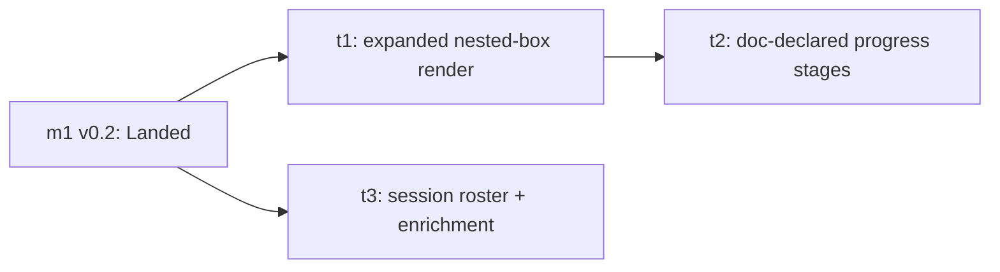

# v0.3 — In-Root Expanded View, Doc-Declared Progress Boxes, and Session Roster

## Status

`In draft`. This milestone doc is in multi-pass drafting per
[`shared.md`](../../../spec/planning/shared.md) "Parent-doc
`In draft` → `Proposed` promotion gate." The task breakdown
below is **proposed and presented for review**; it locks on
review sign-off, after which the PR that flips this doc to
`Proposed` seeds the task skeleton docs per
[`shared.md`](../../../spec/planning/shared.md) "Parent-doc
child contracts" (Parent-promotion stub seeding). Nothing here
is flipped to `Proposed` before that review.

This milestone REPLACES the early-estimate `m2`
("activity-first ordering") and folds the across-roots
tier-ordering and cell-level actor-presence estimates into a
later milestone; the parent epic's Milestone Structure,
Milestone Contracts, and Sizing are reworked in the same change
that creates this doc, and the epic's "Triage zone in 1.0?"
open question is resolved here (see Backlog Impact and the epic
[`README.md`](README.md)).

## Goal

Take the v0.2 tree from "scannable per node" to "the
parallel-agent picture is legible at a glance" — the
qualitative 1.0 criterion the parent epic names. Three
movements, deliberately carrying two opposite spec postures
(see Cross-Task Invariants — the posture-tension invariant):

1. **In-root expanded view.** A root's contents render as
   nested epic → milestone → task → phase boxes *inside* the
   active-work surface, each box carrying its own Status, each
   collapsible — replacing v0.1's flat nested-bullet list.
   Conveyed by the mockup
   [`design/workstreams-view.svg`](../../../design/workstreams-view.svg)
   ("ACTIVE WORK" card).
2. **Progress boxes driven by the doc.** Each node renders a
   row of progress boxes whose count and order come from the
   plan doc itself, at every node level (not just phases). A
   stub (`slug` + `Status: In draft` only) renders only the
   Drafting box; the remaining boxes appear once the doc
   reaches `Proposed`. This *requires* an additive `spec/`
   change — no field today lets a doc declare its own progress
   stages — and the milestone treats that change as in-scope
   and spec-first.
3. **Session roster.** A new surface listing all registered
   active sessions, both bound (attached to a plan-tree node)
   and unbound (registered against a slug not in the tree).
   Roster entries are expandable, showing session name, the
   PRs the session reports, and other reported data, rendered
   as a **deliberately unstructured JSON view** — schema-loose
   on purpose so the reported shape can be experimented with
   before deciding what is required.

Verifiable when: opening the page renders an active root's
internal structure as nested per-node Status boxes with
working collapse; every node level shows doc-driven progress
boxes (a stub showing only Drafting); and a roster lists bound
and unbound sessions with an expandable raw-JSON detail view —
all while v0.1's existing actor tags on nodes still render and
the walk-on-every-request render path is unchanged.

## Task Status

| Slug                              | Title                                                | Status |
|-----------------------------------|------------------------------------------------------|--------|
| `workstream-tracker-1-0-m2-t1`    | Expanded in-root nested-box render                   | —      |
| `workstream-tracker-1-0-m2-t2`    | Doc-declared progress stages (spec-first)            | —      |
| `workstream-tracker-1-0-m2-t3`    | Session roster + work-item enrichment                | —      |

Status `—` indicates the task plan has not been drafted; tasks
draft just-in-time per
[`task-plan.md`](../../../spec/planning/task-plan.md)
"Just-in-time scoping and plan drafting." The task set is
**proposed pending review** (see Status above); it is not yet
locked, so per
[`shared.md`](../../../spec/planning/shared.md) "Parent-doc
child contracts" the Task Contracts below are presented for
review rather than treated as a sealed contract — they lock,
and stubs seed, at the `Proposed` flip.

## Sequencing

Task numbering reflects intended ship order, **not** strict
dependency (per
[`milestone.md`](../../../spec/planning/milestone.md) the graph
is authoritative for parallelism; the prose carries rationale):

- **t1 first.** The nested-box layout is the surface the
  progress boxes (t2) render *inside*. Shipping t1 alone has
  independent value — a root's structure becomes legible as
  collapsible per-node Status boxes even before any progress
  boxes exist.
- **t2 after t1.** Doc-declared progress boxes render within
  the per-node box t1 establishes; t2 consumes t1's expanded
  node render surface. Sequential dependency, not parallel.
- **t3 in parallel with t1/t2.** The roster is a distinct
  surface that consumes only m1's landed multi-work-instance
  schema, not t1 or t2. It can draft and ship independently;
  the graph makes that parallelism explicit so it is not
  serialized by default `N.k`-depends-on-`N.(k-1)` reading.

All three tasks have independent stakeholder-facing value
relative to their siblings per the level picker in
[`task-plan.md`](../../../spec/planning/task-plan.md); none is
a sequence-step of another. Per-task phase splits (t2 and t3
each plausibly N ≥ 2) are estimates re-derived at task-drafting
time per
[`milestone.md`](../../../spec/planning/milestone.md) "PR-count
predictions are not contracts" — see Cross-Task Decisions.

## Task Contracts

Per-task **WHAT** contracts — end result, sibling interfaces,
preserves. The **HOW** (file inventory, frontmatter-field
spelling, template structure, schema/column decisions,
validation gate) lives in each task's plan when it drafts.
Required-when-locked section per
[`milestone.md`](../../../spec/planning/milestone.md) "Required
and optional sections" and
[`shared.md`](../../../spec/planning/shared.md) "Parent-doc
child contracts"; presented here as the proposed contract
pending review (Status section above).

| Slug | Short | Long (end result + preserves) | Feeds siblings |
|------|-------|-------------------------------|----------------|
| `workstream-tracker-1-0-m2-t1` | Expanded in-root nested-box render | A root's descendants render as nested epic → milestone → task → phase boxes, each carrying its own Status badge, each independently collapsible, inside the active-work surface — replacing the flat nested-`<ul>` bullet list. Preserves: v0.1's actor tags on nodes still render on each box (the deferred actor-icons-on-progress-boxes work assumes node actor tags remain — they must not regress); the walk-on-every-request render path is unchanged (no caching, file-watch, or in-memory build-up); a stub and any node without rich data still render. | Provides the per-node expanded box surface t2 renders progress boxes *inside*. Independent of t3. |
| `workstream-tracker-1-0-m2-t2` | Doc-declared progress stages (spec-first) | An additive `spec/` frontmatter affordance lets a plan doc declare its own progress stages; the parser reads it; every node level (root, milestone, task, phase) renders a row of progress boxes whose count and order come from the doc. A stub (`slug` + `Status: In draft`, no declared stages) renders only the Drafting box; the rest appear once the doc reaches `Proposed`. Preserves: the spec change is optional and additive (a doc omitting the field renders with no error/skip, falling back to the Drafting-box-only / bare shape — the already-supported stub render case `stub-children-on-parent-promotion` relies on); existing vendored consumers are unaffected; walk-on-every-request unchanged. | Consumes t1's expanded per-node box as the render host for the box row. Does not feed t3. The declared-stages spec field is the spec-first deliverable; t3 deliberately does **not** consume or schematize it (posture-tension invariant). |
| `workstream-tracker-1-0-m2-t3` | Session roster + work-item enrichment | A new roster surface lists every registered active session — bound (slug matches a plan-tree node) and unbound (slug absent from the tree, the accepted orphan/typoed-slug residual) — that v0.1's render currently drops. The register client/CLI sends richer per-session data; roster entries are expandable, showing session name, reported PRs, and other reported fields rendered as a deliberately unstructured raw-JSON view (schema-loose on purpose; "what is required" is intentionally deferred). Preserves: registration stays observable best-effort and opt-in — the roster surfaces sessions that chose to register and never claims to see all of them (the existing best-effort/observable registration tenet); walk-on-every-request unchanged; richer data is additive (a session reporting only the v0.2 minimum still lists). | Consumes only m1's landed multi-work-instance schema. Independent of t1/t2; ships in parallel. Delivers the "every session can be accounted for" observability surface the `deterministic-interactive-registration` backlog entry's mitigation direction names (see Backlog Impact). |

## Cross-Task Invariants

Rules that thread multiple tasks. Reviewer-flag candidates when
any per-task drafting brushes against these.

- **Opposite spec postures are intentional — do not
  homogenize.** t2 *tightens* the spec (a doc must be able to
  declare its progress stages, a checkable additive field).
  t3 *deliberately avoids* a schema (arbitrary reported JSON;
  "what is required" deferred until it is known what is
  useful). Both are intended. No task's drafting may schematize
  t3's reported data to look like t2's declared stages, nor
  loosen t2's declared-stages field into free-form JSON, to
  make them consistent. Reviewer-flag any drafting that
  reconciles the two postures.
- **v0.1 actor tags on nodes must not regress.** The deferred
  "actor icons positioned on individual progress boxes" work is
  deferred *on the assumption* node-level actor tags remain
  present. Every task that touches the render path preserves
  the existing per-node actor-marker render. Verified by:
  [`indexTmpl` "node" template in render.go](../../../internal/site/render.go)
  ranges `.WorkInstances` into `actor-marker` spans;
  [`buildTree` in tree.go](../../../internal/site/tree.go)
  attaches `active[d.Slug]` to each node.
- **Render path stays walk-on-every-request.** No task
  introduces caching, file-watching, or in-memory build-up.
  Verified by:
  [`Server.index` in site.go](../../../internal/site/site.go)
  calls `walkPlans` and `loadActiveWorkInstances` per HTTP
  request; this milestone preserves that (parent-epic and m1
  cross-cutting invariant).
- **Spec changes stay additive.** t2's frontmatter affordance
  is optional and additive only — no breaking change to
  vendored spec consumers, consistent with the parent epic's
  "Spec contract is additive across this epic" invariant. Each
  spec-touching task carries an explicit "is this additive?"
  check (parent-epic Risk Register mitigation). Verified by:
  the optional/additive precedent for `short_description` and
  `related_prs` in
  [`shared.md` "Plan-doc identity (slug)"](../../../spec/planning/shared.md).
- **Stub render case is preserved, not pre-empted.** A
  `slug` + `Status: In draft` stub remains a valid render with
  no error/skip; t2 makes it render exactly the Drafting box.
  Seeding a stub still creates no work-instance and does not
  resolve the deferred triage-*action* question. Verified by:
  [`stub-children-on-parent-promotion` README "Stub ≠
  work-instance"](../../stub-children-on-parent-promotion/README.md).

## Cross-Task Decisions

No cross-task contract requires locking at milestone-planning
time; the surfaces are independent. The following are recorded
as deliberately deferred to the resolving task's drafting per
[`milestone.md`](../../../spec/planning/milestone.md) "Defer
rather than over-resolve," each with the code surface where the
decision will be grounded.

- **Collapsible mechanism (decide when t1 drafts).** v0.2
  locked "no JavaScript, no panel, no expand/collapse" for the
  bare-bones render (m1-t4). t1 reintroduces collapse;
  HTML-native `
`/`
` is collapse without
  JavaScript, but whether t1 stays no-JS or revisits that
  posture is a HOW call for t1 scoping, which must record the
  decision against the v0.2 no-JS posture explicitly rather
  than regress it silently. Verified by:
  [the v0.2 no-JS decision in m1-v0-2.md "Cross-Task
  Decisions"](m1-v0-2.md);
  [`indexTmpl` in render.go](../../../internal/site/render.go)
  (the static-HTML template t1 restructures).
- **Doc-declared-stages frontmatter shape (decide when t2
  drafts).** The field name, structure, and whether it encodes
  per-stage counts or an ordered stage list is the spec-change
  surface itself; the milestone states only WHAT it must enable
  (a doc declares its own progress boxes; box count + order
  come from the doc; all node levels; stub ⇒ Drafting only).
  The spelling is deferred to t2 scoping under
  [`shared.md`](../../../spec/planning/shared.md) "Decompose
  options into shapes before analyzing" and the exact-match
  label discipline (do not invent the token here). Grounded
  against:
  [`parsePlanDoc`/`parsedDoc` in walker.go](../../../internal/site/walker.go)
  (goldmark-meta frontmatter read this field is added to);
  the vision's own open question on prose-to-data extraction in
  [`design/vision.md` §7](../../../design/vision.md).
- **Where richer session data is stored/read (decide when t3
  drafts).** A free-form `metadata` JSON column already exists
  on `events` but not on `work_instances`, and
  `loadActiveWorkInstances` selects only `slug, actor`. Whether
  t3 reads enriched data by joining the event log or by an
  additive `work_instances` column is a HOW call for t3,
  bounded by the additive-spec/additive-schema invariant.
  Verified by:
  [`schema.go`](../../../internal/db/schema.go) (`events` has
  `metadata`, `work_instances` does not);
  [`loadActiveWorkInstances` in site.go](../../../internal/site/site.go)
  (selects `slug, actor` only, filters `state = active`,
  drops nothing about unbound at query time — the drop is in
  `buildTree`);
  [`RegisterRequest.Metadata` in api.go](../../../internal/api/api.go)
  and
  [`registerclient.Register` in client.go](../../../internal/registerclient/client.go)
  (client currently sends only `{exact_slug, actor}`).
- **Per-task phase splits (decide at each task's drafting).**
  t2 (spec/parser, then render) and t3 (bare bound+unbound
  roster, then enrichment + expandable JSON) each plausibly
  resolve to N ≥ 2. This is an estimate, not a contract, and
  the split is re-derived at task-drafting per
  [`task-plan.md`](../../../spec/planning/task-plan.md)
  "PR-count predictions need a branch test."

## Cross-Task Risks

Milestone-level risks. Per-task risks belong in the per-task
plans.

- **Render restructure regresses an existing surface.** t1
  rewrites the only render template; the v0.2 actor tags, long
  description, and `related_prs` rendering must survive.
  Mitigation: the actor-tag and walk-on-every-request
  invariants above are reviewer-flag candidates; t1's
  Validation Gate renders against the existing dogfood tree
  and the demo workstream and confirms no node-level surface
  is lost ("Bans on surface require rendering the consequence"
  applies at t1 plan time).
- **t2's spec change is read as breaking by a vendored
  consumer.** A milestone that introduces a frontmatter field
  could ripple if a consumer treats unknown fields strictly.
  Mitigation: the additive-spec invariant + explicit
  "is this additive?" check (parent-epic mitigation); the
  field is optional with a defined absent-behavior (Drafting
  box only / bare), mirroring the landed `short_description`
  and `related_prs` additive precedent.
- **The two spec postures get homogenized under review
  pressure.** A reviewer or a later task may "tidy" t3's
  arbitrary JSON toward t2's declared schema (or vice versa).
  Mitigation: the posture-tension cross-task invariant names
  this explicitly so self-review and reviewers treat
  reconciliation as the defect, not the fix.
- **Unbound-session roster re-opens the deferred triage
  question.** Listing unbound sessions is adjacent to the
  deferred triage *action*. Mitigation: the milestone commits
  only the roster (listing); the triage *action*
  (promote-into-tree / dismiss) stays deferred past 1.0 (Out
  of Scope, and the resolved epic open question). Reviewer-flag
  any t3 drafting that adds a promote/dismiss affordance.

## Documentation Currency

Status-bearing or contract-bearing docs this milestone's tasks
and the same-change epic rework touch:

- [`README.md`](README.md) — parent epic. Reworked in the
  change that creates this doc: Milestone Structure and
  Milestone Contracts supersede the early-estimate `m2`/`m3`;
  the across-roots tier ordering and cell-level actor presence
  re-home to a later milestone; Sizing Summary updated; the
  "Triage zone in 1.0?" open question resolved (roster is a
  committed 1.0 goal via this m2; triage *action* deferred
  past 1.0).
- [`../../../design/vision.md`](../../../design/vision.md) §4
  — the narrow "Triage zone for uncategorized work" paragraph
  is replaced with the broader **session presence** concept
  (principle: *every session can be accounted for* — opt-in,
  best-effort, never claims to see all sessions; a roster
  lists bound + unbound sessions; triage demoted to a deferred
  future *action*). Same change as this doc per the
  parent-doc-currency rule.
- [`m1-v0-2.md`](m1-v0-2.md) — its "Out of Scope" section
  points "Activity-first ordering → m2" and "Richer
  work-instance states → m3"; those pointers are reconciled to
  the reworked milestone homes in the same change (a
  cross-reference currency fix to a Landed sibling, not a
  scope change).
- [`../../../spec/planning/`](../../../spec/planning/) — t2
  adds the optional/additive doc-declared-stages frontmatter
  affordance to the plan-doc spec (field documented adjacent
  to `short_description`/`related_prs` in
  [`shared.md`](../../../spec/planning/shared.md), exact home
  decided at t2 drafting).
- [`../../../spec/planning/milestone.md`](../../../spec/planning/milestone.md)
  — "Out of Scope" is now used by two milestone docs
  (`m1-v0-2.md` and this doc); per
  [`shared.md`](../../../spec/planning/shared.md) "Section
  variance disclosure" recurrence rule, the same change that
  adds the second occurrence updates milestone.md's
  "Required and optional sections" to list "Out of Scope" as
  optional-when-applicable rather than letting the variance
  accrete as one-off prose.
- [`../../../design/v0.1-design.md`](../../../design/v0.1-design.md)
  — §7 "What the Website Renders" is updated by t1/t2/t3 on
  the PRs that land them (expanded nested render, doc-driven
  progress boxes, roster surface) per the design-currency
  rule; the data-model section reflects any t3 storage call.

## Backlog Impact

Per [`spec/backlog.md`](../../../spec/backlog.md) effect
taxonomy (graduate / delete / split / shift). This milestone is
framed directly as a milestone of the parent epic and does not
graduate from a backlog entry.

- [`deterministic-interactive-registration`](../../backlog.md#deterministic-interactive-registration)
  — **referenced as a deliberated intersection, effect
  decided when t3 drafts.** t3's bound+unbound roster delivers
  the "surface unregistered/unbound work in the view"
  observability mitigation direction this Open entry names.
  Whether that reframes the entry (a `shift`, since the
  observability gap gets a concrete home while the determinism
  gap stays Open with its neighborly-events tripwire intact)
  or is only a deliberated intersection (the
  `stub-children-on-parent-promotion` precedent — referenced,
  not shifted) is a minimal-surface call deferred to t3's
  Backlog Impact, not over-resolved here. Either way the
  entry stays Open and its integration-milestone tripwire is
  untouched by this milestone. **Named open question:** the
  precise effect (shift vs. reference-only).
- [`stale-skeleton-on-parent-reopen`](../../backlog.md#stale-skeleton-on-parent-reopen),
  [`repo-rooted-doc-links`](../../backlog.md#repo-rooted-doc-links),
  [`tool-originated-task-sessions`](../../backlog.md#tool-originated-task-sessions)
  — not touched by this milestone (open, post-1.0 or
  unrelated). No backlog entry graduates, gets deleted, or is
  split by this milestone doc.

## Out of Scope

Section added to the milestone-doc shape (variance from
[`milestone.md`](../../../spec/planning/milestone.md) required
+ optional list, disclosed per
[`shared.md`](../../../spec/planning/shared.md) "Section
variance disclosure"; this is the recurrence that triggers the
milestone.md list update noted in Documentation Currency).
Boundary calls the parent-epic rework re-homes rather than
loses:

- **Forest activity-sections (across-roots tier ordering).**
  The Active / In-flight / Landed & Abandoned grouping *across*
  roots — the old `m2` "activity-first ordering" estimate. Not
  in this milestone; re-homed to a later milestone in the epic
  rework. This milestone expands work *within* an active root;
  it does not reorder the forest of roots.
- **Actor icons positioned on individual progress boxes.**
  Deferred to a later milestone, *on the assumption* node-level
  actor tags remain (the no-regress cross-task invariant). Part
  of the old `m3` estimate.
- **Richer work-instance state vocabulary**
  (`awaiting-user`, `awaiting-external`, `backgrounded`). Part
  of the old `m3` estimate; re-homed to a later milestone.
- **Triage *action* (promote-into-tree / dismiss).** The
  roster *lists* bound + unbound sessions; acting on an unbound
  session to attach or discard it is deferred past 1.0 (the
  resolved epic "Triage zone in 1.0?" open question — the
  roster is the committed 1.0 goal, the triage action is not).
- **Intent strip / proposals row.** The mockup shows an intent
  strip above the forest; the intent layer was resolved at the
  m1 retrospective as deferred past 1.0 (parent epic Out of
  Scope), so it is out of scope here by that decision, not
  merely unscheduled.

## Related Docs

- [`README.md`](README.md) — parent epic
  (`workstream-tracker-1-0`), reworked in the same change.
- [`m1-v0-2.md`](m1-v0-2.md) — prior milestone (Landed); this
  milestone preserves its labels, per-node detail, and
  multi-work-instance schema, and reconciles its Out-of-Scope
  pointers.
- [`../../stub-children-on-parent-promotion/README.md`](../../stub-children-on-parent-promotion/README.md)
  — the landed stub render case (`slug` + `Status: In draft`)
  t2's Drafting-box-only behavior anchors to.
- [`../../../design/vision.md`](../../../design/vision.md) —
  the long-term vision; §4 is reworked here (session presence),
  and §2/§3 frame the roster and progress-cell concepts this
  milestone delivers a first cut of.
- [`../../../design/workstreams-view.svg`](../../../design/workstreams-view.svg)
  — the strawman mockup conveying the in-root expanded layout
  and progress-box row.
- [`../../../design/v0.1-design.md`](../../../design/v0.1-design.md)
  — the design v0.1 ships against; §5 (data model) and §7
  (render scope) are the surfaces this milestone extends.
- [`../../../spec/planning/milestone.md`](../../../spec/planning/milestone.md)
  — the rules this milestone doc is structured against.
- [`../../../spec/planning/shared.md`](../../../spec/planning/shared.md)
  — cross-level planning rules (promotion gate, parent-doc
  child contracts, additive-spec posture).
