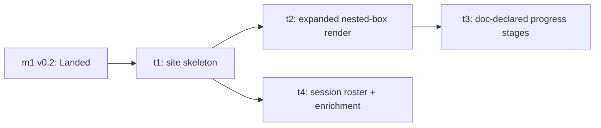

# v0.3 — In-Root Expanded View, Doc-Declared Progress Boxes, and Session Roster

## Status

`Proposed`. Drafting is complete and the
[`shared.md`](../../../../spec/planning/shared.md) "Parent-doc
`In draft` → `Proposed` promotion gate" was walked before this
flip: read end-to-end for cross-section coherence; Task
Contracts decision-complete (no deferral names this milestone
session as resolver — remaining HOW deferrals are bound to each
child task's own drafting); `Verified by:` and reality-check
inputs re-confirmed against current code; required sections
present with the "Out of Scope" variance now carried in
milestone.md's optional list; no content descended to
implementation prescription. The child set is **locked at four
tasks**, and the PR that carries this flip seeds their
parent-promotion stubs per
[`shared.md`](../../../../spec/planning/shared.md) "Parent-doc
child contracts":
[`m2-t1`](t1-site-skeleton.md),
[`m2-t2`](t2-expanded-render.md),
[`m2-t3`](t3-doc-declared-stages.md),
[`m2-t4`](t4-session-roster.md).

**Target mockup approved; the "how to get there" gate is
resolved.** The finished-page target — plan-tree forest and
session roster **side-by-side** (forest ~2/3, roster ~1/3), a
single page scroll with the roster placed to be visible
without scrolling when window height allows, and the
stacked-row narrow-window degrade — is **approved**:
[`design/workstreams-view-m2.svg`](../../../../design/workstreams-view-m2.svg).
The mockup's forest renders **no activity-tier sections**
(Active / In-flight / Landed & Abandoned); that across-roots
tier grouping is the re-homed m3 work, not m2 (see Out of
Scope), and was only ever strawman filler — its prior presence
in the mock never put it in scope.

The page-shell / merge-order question is resolved by a
**dedicated site-skeleton task (t1)** that ships the
two-region shell with the *existing* forest render in the
forest region and a deliberate placeholder in the roster
region. This converts the cross-task shell contract into a
shipped artifact: no task owns a shell it shares with another,
no first-lander-builds-skeleton ambiguity, and t2 (forest
enrichment) and t4 (roster) build into pre-existing,
independently-owned regions. The task set is therefore
**lockable** and presented for review.

This milestone REPLACES the early-estimate `m2`
("activity-first ordering") and folds the across-roots
tier-ordering and cell-level actor-presence estimates into a
later milestone; the parent epic's Milestone Structure,
Milestone Contracts, and Sizing are reworked in the same change
that creates this doc, and the epic's "Triage zone in 1.0?"
open question is resolved here (see Backlog Impact and the epic
[`README.md`](../README.md)).

## Goal

Take the v0.2 tree from "scannable per node" to "the
parallel-agent picture is legible at a glance" — the
qualitative 1.0 criterion the parent epic names. A
**site-skeleton task (t1)** first ships the approved
two-region page shell (existing forest in the forest region,
placeholder in the roster region); the three product movements
below then build into it, deliberately carrying two opposite
spec postures (see Cross-Task Invariants — the posture-tension
invariant):

1. **In-root expanded view.** A root's contents render as
   nested epic → milestone → task → phase boxes *inside* the
   active-work surface, each box carrying its own Status, each
   collapsible — replacing v0.1's flat nested-bullet list.
   Conveyed by the mockup
   [`design/workstreams-view.svg`](../../../../design/workstreams-view.svg)
   ("ACTIVE WORK" card).
2. **Progress boxes driven by the doc.** Each node renders a
   row of progress boxes whose count and order come from the
   plan doc itself, at every node level (not just phases). A
   stub (`slug` + `Status: In draft` only) renders only the
   Drafting box; the remaining boxes appear once the doc
   reaches `Proposed`. This *requires* an additive `spec/`
   change — no field today lets a doc declare its own progress
   stages — and the milestone treats that change as in-scope
   and spec-first.
3. **Session roster.** A new surface listing all registered
   active sessions, both bound (attached to a plan-tree node)
   and unbound (registered against a slug not in the tree).
   Roster entries are expandable, showing session name, the
   PRs the session reports, and other reported data, rendered
   as a **deliberately unstructured JSON view** — schema-loose
   on purpose so the reported shape can be experimented with
   before deciding what is required.

Verifiable when: opening the page renders an active root's
internal structure as nested per-node Status boxes with
working collapse; every node level shows doc-driven progress
boxes (a stub showing only Drafting); and a roster lists bound
and unbound sessions with an expandable raw-JSON detail view —
all while v0.1's existing actor tags on nodes still render and
the walk-on-every-request render path is unchanged.

## Task Status

| Slug                              | Title                                                | Status |
|-----------------------------------|------------------------------------------------------|--------|
| `workstream-tracker-1-0-m2-t1`    | Site skeleton (two-region shell)                     | [Landed](t1-site-skeleton.md) |
| `workstream-tracker-1-0-m2-t2`    | Expanded in-root nested-box render                   | [Landed](t2-expanded-render.md) |
| `workstream-tracker-1-0-m2-t3`    | Doc-declared progress stages (spec-first)            | [Proposed](t3-doc-declared-stages.md) |
| `workstream-tracker-1-0-m2-t4`    | Session roster + work-item enrichment                | [Proposed](t4-session-roster.md) |
| `workstream-tracker-1-0-m2-t4-p1` | ↳ Bare bound/unbound roster                          | [Landed](t4-p1-bare-roster.md) |
| `workstream-tracker-1-0-m2-t4-p2` | ↳ Enrichment + named sessions                        | [In draft (stub)](t4-p2-enrichment.md) |

t1 ([`m2-t1-site-skeleton.md`](t1-site-skeleton.md)) is
`Landed` (drafted, promoted, and implemented — the two-region
shell shipped). t2
([`m2-t2-expanded-render.md`](t2-expanded-render.md)) is
`Landed` (drafted, promoted, and implemented — the forest
region's flat bullet render replaced by nested, independently
collapsible per-node boxes with active-work default-open; its
collapse mechanism resolved to native `
` — see
Cross-Task Decisions; phase split resolved to N = 1 via the
branch test). **t4**
([`t4-session-roster.md`](t4-session-roster.md))
is a **`Proposed` N ≥ 2 task plan** (drafted, scoping complete,
gate re-walked after two review findings each regressed a
premature `Proposed` — a decision-completeness gap and a
cross-doc-currency gap; the latter is why this milestone's
Cross-Task Invariant carries the data-path carve-out below — see
the plan's Status history). Its two phases were seeded as
parent-promotion **stubs**; phase 1
[`t4-p1`](t4-p1-bare-roster.md) is **`Landed`** (drafted,
promoted, and implemented — the bare bound/unbound roster shipped:
every active session listed and classified against the
in-request walked parsed-doc set, replacing t1's placeholder, no
event join / no client change); phase 2
[`t4-p2`](t4-p2-enrichment.md) remains a seeded parent-promotion
**stub**, scoped just-in-time at its own drafting. **t3**
([`t3-doc-declared-stages.md`](t3-doc-declared-stages.md)) is now
a **`Proposed` N = 1 task plan**: a spawned just-in-time drafting
session replaced the stub with a full task plan and a paired
[`scoping/t3-doc-declared-stages.md`](scoping/t3-doc-declared-stages.md)
that decomposed the deferred frontmatter-shape decision into
candidate shapes with trade-offs; the contributor resolved the
decisions in-loop (2026-05-18; D1 = shape A2, `progress_stages`
key, render-side Drafting cell, field-presence-gated, no
inheritance; per-stage counts deferred as an additive future
migration) and then directed the session to walk the
`` `In draft` → `Proposed` `` promotion gate in-session,
consciously extending past the spawn's original "stop at
`In draft`" bound at the contributor's explicit direction. The
gate was walked (end-to-end coherence, decision-completeness,
universal `Verified by:`, reality-check re-confirmation, always-on
rules, the D6 branch-test sketch resolving N = 1) and the plan
flipped to `Proposed`; phase split N = 1 so no phase stubs to
seed (see the t3 plan's Status section and the "Doc-declared-stages
frontmatter shape" Cross-Task Decisions entry below). The
remaining not-yet-drafted child (t4-p2) is scoped just-in-time at
its own drafting session per
[`task-plan.md`](../../../../spec/planning/task-plan.md)
"Just-in-time scoping and plan drafting"; a remaining stub is
exempt from the required-sections rule until then per
[`shared.md`](../../../../spec/planning/shared.md) "Parent-doc
child contracts." The Task Contracts below are the locked WHAT
each task inherited.

## Sequencing

Task numbering reflects intended ship order, **not** strict
dependency (per
[`milestone.md`](../../../../spec/planning/milestone.md) the graph
is authoritative for parallelism; the prose carries rationale):

- **t1 first (site skeleton).** Ships the approved two-region
  shell with the *existing* forest render in the forest region
  and a deliberate placeholder in the roster region. It gates
  t2 and t4 because both build into the regions it establishes.
  Shipping t1 alone has an observable end state (the page
  adopts its final two-column shape with the real tree visible)
  and its own Validation Gate, so it is a task, not a
  value-less sequence-step — see the level-picker note below.
- **t2 after t1 (expanded nested-box render).** Replaces the
  forest region's flat bullet render with nested collapsible
  per-node Status boxes. Builds into t1's forest region.
- **t3 after t2 (doc-declared progress stages).** Progress
  boxes render within the per-node box t2 establishes; t3
  consumes t2's expanded node render surface. Sequential
  dependency, not parallel.
- **t4 after t1, parallel to t2/t3 (session roster).** Fills
  t1's roster region. Consumes only m1's multi-work-instance
  schema and t1's roster region — not t2 or t3 — so it drafts
  and ships in parallel with the t2 → t3 chain. The graph makes
  that parallelism explicit so it is not serialized by default
  `N.k`-depends-on-`N.(k-1)` reading.

**Level-picker note (records the classification so a reviewer
need not re-flag it).** Per
[`task-plan.md`](../../../../spec/planning/task-plan.md) the
level picker is independent value vs. sequence-step, and the
recurring trap is mis-classification in *either* direction. t1
is a thin but genuine task, not over-decomposition: it ships
an observable end state (the page in its final two-column
shape with the real current tree), has an independent
Validation Gate, and its value is de-risking — it converts the
shared-page-shell cross-task contract into a shipped artifact
so t2 and t4 can build into independently-owned regions in
parallel with no shell-ownership or merge-order coordination.
That coordination-elimination is the independent value; the
alternative (no skeleton task) was rejected because it forces
either a serialized t2-owns-shell ordering or a first-lander
re-home. t2, t3, t4 carry independent stakeholder-facing value
in the usual sense. Per-task phase splits (t2, t3, t4 each
plausibly N ≥ 2) are estimates re-derived at task-drafting
time per
[`milestone.md`](../../../../spec/planning/milestone.md) "PR-count
predictions are not contracts" — see Cross-Task Decisions.

## Task Contracts

Per-task **WHAT** contracts — end result, sibling interfaces,
preserves. The **HOW** (file inventory, frontmatter-field
spelling, template structure, schema/column decisions,
validation gate) lives in each task's plan when it drafts.
Required-when-locked section per
[`milestone.md`](../../../../spec/planning/milestone.md) "Required
and optional sections" and
[`shared.md`](../../../../spec/planning/shared.md) "Parent-doc
child contracts"; presented here as the proposed contract
pending review (Status section above).

| Slug | Short | Long (end result + preserves) | Feeds siblings |
|------|-------|-------------------------------|----------------|
| `workstream-tracker-1-0-m2-t1` | Site skeleton (two-region shell) | The page renders as the approved two-region layout — a forest region (~2/3, left) and a roster region (~1/3, right), single page scroll, roster placed to be visible without scrolling when window height allows; a too-narrow viewport stacks roster below forest (mobile out of scope). The **existing** plan-tree forest render is placed in the forest region unchanged; the roster region renders a deliberate, intentional placeholder (an observed state, not a blank/broken gap). Preserves: the current forest rendering behavior verbatim (no node-shape change — that is t2); v0.1's actor tags on nodes; the walk-on-every-request render path. | Establishes the two named regions every later task builds into: t2 enriches the *forest region*'s internals; t4 replaces the roster region placeholder. No later task owns or alters the shell or a sibling's region. The narrow-window *per-node-row* degrade is **not** here (t1 ships the existing flat render, which has no right-aligned collision) — it is t2's. |
| `workstream-tracker-1-0-m2-t2` | Expanded in-root nested-box render | Within t1's forest region, a root's descendants render as nested epic → milestone → task → phase boxes, each carrying its own Status badge, each independently collapsible — replacing the flat nested-`<ul>` bullet render. Owns the stacked-row narrow-window degrade (it introduces the right-aligned Status/progress that can collide with left-aligned label text). Preserves: v0.1's actor tags on nodes still render on each box (the deferred actor-icons-on-progress-boxes work assumes node actor tags remain — they must not regress); walk-on-every-request unchanged; a stub and any node without rich data still render. | Builds into t1's forest region. Provides the per-node expanded box surface t3 renders progress boxes *inside*. Independent of t4. |
| `workstream-tracker-1-0-m2-t3` | Doc-declared progress stages (spec-first) | An additive `spec/` frontmatter affordance lets a plan doc declare its own progress stages; the parser reads it; every node level (root, milestone, task, phase) renders a row of progress boxes whose count and order come from the doc. A doc with no declared-stages field (the `slug` + `Status: In draft` stub case) renders only the Drafting box; a doc that declares the field renders the reserved Drafting box followed by its declared stages. (t3 drafting resolved this contract's earlier "the rest appear once the doc reaches `Proposed`" phrasing to **field-presence** gating, Status-independent — D5; the typical stub is `In draft` and field-less, so the observable behavior is unchanged. See the "Doc-declared-stages frontmatter shape" Cross-Task Decisions entry.) Preserves: the spec change is optional and additive (a doc omitting the field renders with no error/skip, falling back to the Drafting-box-only / bare shape — the already-supported stub render case `stub-children-on-parent-promotion` relies on); existing vendored consumers are unaffected; walk-on-every-request unchanged. | Consumes t2's expanded per-node box as the render host for the box row. Does not feed t4. The declared-stages spec field is the spec-first deliverable; t4 deliberately does **not** consume or schematize it (posture-tension invariant). |
| `workstream-tracker-1-0-m2-t4` | Session roster + work-item enrichment | Replacing t1's roster-region placeholder, a roster lists every registered active session — bound (slug matches a plan-tree node) and unbound (slug absent from the tree, the accepted orphan/typoed-slug residual) — that v0.1's render currently drops. The register client/CLI sends richer per-session data; roster entries are expandable, showing session name, reported PRs, and other reported fields rendered as a deliberately unstructured raw-JSON view (schema-loose on purpose; "what is required" is intentionally deferred). Preserves: registration stays observable best-effort and opt-in — the roster surfaces sessions that chose to register and never claims to see all of them (the existing best-effort/observable registration tenet); walk-on-every-request unchanged; richer data is additive (a session reporting only the v0.2 minimum still lists). | Builds into t1's roster region (replaces its placeholder); does not touch the forest region. Independent of t2/t3; ships in parallel with the t2 → t3 chain. Delivers the "every session can be accounted for" observability surface the `deterministic-interactive-registration` backlog entry's mitigation direction names (see Backlog Impact). |

## Cross-Task Invariants

Rules that thread multiple tasks. Reviewer-flag candidates when
any per-task drafting brushes against these.

- **The shell is t1's; siblings build into regions, never the
  shell.** t1 establishes the two named regions (forest ~2/3,
  roster ~1/3) and the approved page-shell behavior (single
  page scroll, roster-visible-without-scroll-when-possible,
  narrow-viewport stacking). After t1: t2 changes only the
  forest region's internals, t3 only adds the progress-box row
  within the forest region's per-node box, t4 only replaces the
  roster region's placeholder. No task after t1 alters the
  shell, the region boundary, or a sibling's region — a PR that
  does is reworking another task's surface and is reviewer-flag.
  Both regions share one visual vocabulary anchored to
  [`design/workstreams-view-m2.svg`](../../../../design/workstreams-view-m2.svg);
  neither region invents a divergent card/box/spacing/type
  language. Verified by: t1 (PR #26) made this **file-enforced**
  — [`render.go`](../../../../internal/site/render.go) is the
  shell (the `.layout` container + `{{template "forest" .}}` /
  `{{template "roster" .}}` composition, one parsed `indexTmpl`
  tree), [`forest.go`](../../../../internal/site/forest.go) owns
  the forest/`node` region (t2's surface), and
  [`roster.go`](../../../../internal/site/roster.go) owns the
  roster region (t4's surface); a later-task diff crossing
  those file boundaries is the reviewer-flag signal.
  **Data-path carve-out (resolved at t4 drafting, the consequence
  of the deferred storage decision above).** This file-enforcement
  governs *region bodies* and the *shell layout / region
  boundary*, not the shared request-time data path. A later task
  editing `render.go`'s shared `indexData` / `renderIndex`
  plumbing (e.g. t4 adding a roster data field) or `site.go`'s
  loader is **expected and not reviewer-flag** — the milestone
  named the data path as t4's surface. What stays reviewer-flag: a
  later task changing a *region body* other than its own
  (`render.go` shell composition, `forest.go`, another's
  `roster.go`) or altering the shell layout / region boundary.
  [`Server.index` in site.go](../../../../internal/site/site.go)
  is the single `/` handler.
- **Opposite spec postures are intentional — do not
  homogenize.** t3 *tightens* the spec (a doc must be able to
  declare its progress stages, a checkable additive field).
  t4 *deliberately avoids* a schema (arbitrary reported JSON;
  "what is required" deferred until it is known what is
  useful). Both are intended. No task's drafting may schematize
  t4's reported data to look like t3's declared stages, nor
  loosen t3's declared-stages field into free-form JSON, to
  make them consistent. Reviewer-flag any drafting that
  reconciles the two postures.
- **v0.1 actor tags on nodes must not regress.** The deferred
  "actor icons positioned on individual progress boxes" work is
  deferred *on the assumption* node-level actor tags remain
  present. Every task that touches the render path preserves
  the existing per-node actor-marker render. Verified by:
  [the `node` template in forest.go](../../../../internal/site/forest.go)
  ranges `.WorkInstances` into `actor-marker` spans (relocated
  unedited from `render.go` by t1 PR #26);
  [`buildTree` in tree.go](../../../../internal/site/tree.go)
  attaches `active[d.Slug]` to each node.
- **Render path stays walk-on-every-request.** No task
  introduces caching, file-watching, or in-memory build-up.
  Verified by:
  [`Server.index` in site.go](../../../../internal/site/site.go)
  calls `walkPlans` and `loadActiveWorkInstances` per HTTP
  request; this milestone preserves that (parent-epic and m1
  cross-cutting invariant).
- **Spec changes stay additive.** t3's frontmatter affordance
  is optional and additive only — no breaking change to
  vendored spec consumers, consistent with the parent epic's
  "Spec contract is additive across this epic" invariant. Each
  spec-touching task carries an explicit "is this additive?"
  check (parent-epic Risk Register mitigation). Verified by:
  the optional/additive precedent for `short_description` and
  `related_prs` in
  [`shared.md` "Plan-doc identity (slug)"](../../../../spec/planning/shared.md).
- **Stub render case is preserved, not pre-empted.** A
  `slug` + `Status: In draft` stub remains a valid render with
  no error/skip; t3 makes it render exactly the Drafting box.
  Seeding a stub still creates no work-instance and does not
  resolve the deferred triage-*action* question. Verified by:
  [`stub-children-on-parent-promotion` README "Stub ≠
  work-instance"](../../stub-children-on-parent-promotion/README.md).

## Cross-Task Decisions

**RESOLVED — page layout and the forest/roster composition
(locked at milestone planning).** Step 1: the finished-page
target is approved
([`design/workstreams-view-m2.svg`](../../../../design/workstreams-view-m2.svg))
— forest (~2/3) and roster (~1/3) **side-by-side**, single
page scroll, roster placed to be visible without scrolling
when window height allows, stacked-row narrow-window degrade,
and **no activity-tier sections in the forest** (that
across-roots grouping is m3, per Out of Scope — its presence
in earlier strawman iterations never put it in scope). Step 2
("how to get there"): rather than make one task own a shell a
sibling fits into, a **dedicated site-skeleton task (t1)**
ships the two-region shell with the *existing* forest render
in the forest region and a deliberate placeholder in the
roster region; t2/t3 then build into the forest region and t4
into the roster region. **Rejected alternatives:** (a) t2
owns the shell, t4 fills a declared region — order-dependent,
and a t4-first reality forces a re-home; (b) the first of
t2/t4 to merge builds the skeleton, the second fills its
region — order-independent but leaves a soft
first-lander-builds-skeleton coordination and an interim
single-column render; (c) a standalone shell with two empty
placeholders — rejected as value-less (level picker), but the
*non-empty* skeleton (existing tree in the forest region)
clears that bar. The skeleton task converts the shell
cross-task contract into a shipped artifact: each of t1, t2,
t4 is independently verifiable when it lands (the prior ones'
regions are untouched; the not-yet-built region is a
deliberate placeholder), and the change a later task makes is
bounded to its own region — directly satisfying the
"first-to-land must work as expected, then change again when
the other lands" requirement. The cost (t2/t4 serialized
behind t1) is recorded in Sequencing and accepted.

No further cross-task contract requires locking at
milestone-planning time. The following were recorded as
deliberately deferred to the resolving task's drafting per
[`milestone.md`](../../../../spec/planning/milestone.md) "Defer
rather than over-resolve," each with the code surface where the
decision is grounded; resolved entries are marked inline as
their tasks draft.

- **Collapsible mechanism — RESOLVED at t2 drafting.** v0.2
  locked "no JavaScript, no panel, no expand/collapse" for the
  bare-bones render (m1-t4). t2 resolves this to **native
  HTML `
`/`
`, zero JavaScript, no new
  route**: the durable architectural tenet (server-rendered,
  refresh-to-update, no read API, no push) is *preserved*, and
  only the narrower m1-t4 task-scoped "no expand/collapse"
  decision is *superseded* — its stated rationale ("first
  JavaScript and first non-`/` route") is moot under
  `
`. The decision against the v0.2 posture is
  recorded explicitly, not regressed silently, in
  [`m2-t2-expanded-render.md`](t2-expanded-render.md) C2 and
  [`scoping/t2-expanded-render.md`](scoping/t2-expanded-render.md)
  S1. Verified by:
  [the v0.2 no-JS decision in m1-v0-2.md "Cross-Task
  Decisions"](../m1/README.md);
  [the `node` template in forest.go](../../../../internal/site/forest.go)
  (t1 PR #26 split the regions into their own files; t2 changes
  the forest region's node render here, not in the `render.go`
  shell).
- **Doc-declared-stages frontmatter shape (decide when t3
  drafts).** The field name, structure, and whether it encodes
  per-stage counts or an ordered stage list is the spec-change
  surface itself; the milestone states only WHAT it must enable
  (a doc declares its own progress boxes; box count + order
  come from the doc; all node levels; stub ⇒ Drafting only).
  The spelling is deferred to t3 scoping under
  [`shared.md`](../../../../spec/planning/shared.md) "Decompose
  options into shapes before analyzing" and the exact-match
  label discipline (do not invent the token here). Grounded
  against:
  [`parsePlanDoc`/`parsedDoc` in walker.go](../../../../internal/site/walker.go)
  (goldmark-meta frontmatter read this field is added to);
  the vision's own open question on prose-to-data extraction in
  [`design/vision.md` §7](../../../../design/vision.md).
  **Status: RESOLVED by human input (2026-05-18); promotion gate
  walked in-session, t3 plan now `Proposed`.** t3's just-in-time
  drafting session decomposed
  this into candidate shapes (ordered stage-label list A1/A2/A3
  vs. per-stage counts B1/B2 vs. richer records C) with cited
  trade-offs in
  [`scoping/t3-doc-declared-stages.md`](scoping/t3-doc-declared-stages.md)
  "Decisions resolved by human input" (D1–D6). The human resolved
  it: **D1 = A2** (ordered list of stage-label strings, one cell ≈
  one PR in the typical case); **D2** frontmatter key
  `progress_stages`, rendered element a "progress cell"
  (reconciles toward
  [`design/vision.md` §7](../../../../design/vision.md)'s
  established "cell" vocabulary; this milestone's WHAT prose
  intentionally keeps "progress boxes" as the umbrella concept
  term — the contract language is not churned, only the
  rendered-element name is t3's); **D3** render-side reserved Drafting cell,
  no doc-visible token; **D4** no inheritance; **D5** row gated by
  field-presence (Status-independent); **D6** phase split resolved
  **N = 1** by the branch-test sketch at the in-session gate.
  Per-stage counts (B2) are deferred as an additive-linear future
  migration, not designed out. The t3 plan's Contracts are locked
  to these; the contributor directed the
  `` `In draft` → `Proposed` `` promotion gate to be walked
  in-session (extending past the spawn's original "stop at
  `In draft`" bound at the contributor's explicit direction), and
  the plan is now `Proposed`. No PR is opened by this session
  (separately out of scope).
- **Where richer session data is stored/read — RESOLVED at t4
  drafting: join the event log (no schema change).** A free-form
  `metadata` JSON column already exists on `events` but not on
  `work_instances`, and `loadActiveWorkInstances` selects only
  `slug, actor`. t4 reads enriched data by **joining the event
  log**, not by adding a `work_instances` column: the write path
  is already plumbed to `events.metadata`, no migration runner
  exists, and the event log stays the single append-only source
  of truth. See
  [`t4-session-roster.md`](t4-session-roster.md) Contracts
  ("Reported data") and
  [`scoping/t4-session-roster.md`](scoping/t4-session-roster.md)
  decision D1. Verified by:
  [`schema.go`](../../../../internal/db/schema.go) (`events` has
  `metadata`, `work_instances` does not);
  [`loadActiveWorkInstances` in site.go](../../../../internal/site/site.go)
  (selects `slug, actor` only, filters `state = active`,
  drops nothing about unbound at query time — the drop is in
  `buildTree`);
  [`RegisterRequest.Metadata` in api.go](../../../../internal/api/api.go)
  and
  [`registerclient.Register` in client.go](../../../../internal/registerclient/client.go)
  (client currently sends only `{exact_slug, actor}`).
- **Per-task phase splits (decide at each task's drafting).**
  t2 (nested-box render, then the narrow-window degrade), t3
  (spec/parser, then progress-box render), and t4 (bare
  bound+unbound roster, then enrichment + expandable JSON) each
  plausibly resolve to N ≥ 2. t1 (site skeleton) is most likely
  N = 1. This is an estimate, not a contract, and
  the split is re-derived at task-drafting per
  [`task-plan.md`](../../../../spec/planning/task-plan.md)
  "PR-count predictions need a branch test."

## Cross-Task Risks

Milestone-level risks. Per-task risks belong in the per-task
plans.

- **Render restructure regresses an existing surface.** t1
  reshapes the single render template into the two regions and
  must keep the *existing* forest render verbatim (actor tags,
  long description, `related_prs`); t2 then rewrites the
  node-shape inside the forest region and must preserve the
  same surfaces. Mitigation: the actor-tag and
  walk-on-every-request invariants are reviewer-flag
  candidates; t1's Validation Gate renders against the existing
  dogfood tree and the demo workstream and confirms the forest
  region is byte-for-intent the prior render plus the region
  frame, and t2's confirms no node-level surface is lost
  ("Bans on surface require rendering the consequence" applies
  at both plan times).
- **The skeleton placeholder ships as a blank/broken gap.** t1's
  roster region must render a deliberate, observed placeholder,
  not an empty div that reads as a bug while t4 is unbuilt.
  Mitigation: the shell cross-task invariant requires the
  placeholder be an intentional rendered state; t1's Validation
  Gate observes it ("Bans on surface require rendering the
  consequence").
- **t3's spec change is read as breaking by a vendored
  consumer.** A milestone that introduces a frontmatter field
  could ripple if a consumer treats unknown fields strictly.
  Mitigation: the additive-spec invariant + explicit
  "is this additive?" check (parent-epic mitigation); the
  field is optional with a defined absent-behavior (Drafting
  box only / bare), mirroring the landed `short_description`
  and `related_prs` additive precedent.
- **The two spec postures get homogenized under review
  pressure.** A reviewer or a later task may "tidy" t4's
  arbitrary JSON toward t3's declared schema (or vice versa).
  Mitigation: the posture-tension cross-task invariant names
  this explicitly so self-review and reviewers treat
  reconciliation as the defect, not the fix.
- **Unbound-session roster re-opens the deferred triage
  question.** Listing unbound sessions is adjacent to the
  deferred triage *action*. Mitigation: the milestone commits
  only the roster (listing); the triage *action*
  (promote-into-tree / dismiss) stays deferred past 1.0 (Out
  of Scope, and the resolved epic open question). Reviewer-flag
  any t4 drafting that adds a promote/dismiss affordance.

## Documentation Currency

Status-bearing or contract-bearing docs this milestone's tasks
and the same-change epic rework touch:

- [`README.md`](../README.md) — parent epic. Reworked in the
  change that creates this doc: Milestone Structure and
  Milestone Contracts supersede the early-estimate `m2`/`m3`;
  the across-roots tier ordering and cell-level actor presence
  re-home to a later milestone; Sizing Summary updated; the
  "Triage zone in 1.0?" open question resolved (roster is a
  committed 1.0 goal via this m2; triage *action* deferred
  past 1.0).
- [`../../../design/vision.md`](../../../../design/vision.md) §4
  — the narrow "Triage zone for uncategorized work" paragraph
  is replaced with the broader **session presence** concept
  (principle: *every session can be accounted for* — opt-in,
  best-effort, never claims to see all sessions; a roster
  lists bound + unbound sessions; triage demoted to a deferred
  future *action*). Same change as this doc per the
  parent-doc-currency rule.
- [`m1-v0-2.md`](../m1/README.md) — its "Out of Scope" section
  points "Activity-first ordering → m2" and "Richer
  work-instance states → m3"; those pointers are reconciled to
  the reworked milestone homes in the same change (a
  cross-reference currency fix to a Landed sibling, not a
  scope change).
- [`../../../spec/planning/`](../../../../spec/planning/) — t3
  adds the optional/additive doc-declared-stages frontmatter
  affordance to the plan-doc spec (field documented adjacent
  to `short_description`/`related_prs` in
  [`shared.md`](../../../../spec/planning/shared.md), exact home
  decided at t3 drafting).
- [`../../../spec/planning/milestone.md`](../../../../spec/planning/milestone.md)
  — "Out of Scope" is now used by two milestone docs
  (`m1-v0-2.md` and this doc); per
  [`shared.md`](../../../../spec/planning/shared.md) "Section
  variance disclosure" recurrence rule, the same change that
  adds the second occurrence updates milestone.md's
  "Required and optional sections" to list "Out of Scope" as
  optional-when-applicable rather than letting the variance
  accrete as one-off prose.
- [`../../../design/v0.1-design.md`](../../../../design/v0.1-design.md)
  — §7 "What the Website Renders" is updated by t1–t4 on the
  PRs that land them (two-region shell, expanded nested render,
  doc-driven progress boxes, roster surface) per the
  design-currency rule; the data-model section reflects any t4
  storage call.

## Backlog Impact

Per [`spec/backlog.md`](../../../../spec/backlog.md) effect
taxonomy (graduate / delete / split / shift). This milestone is
framed directly as a milestone of the parent epic and does not
graduate from a backlog entry.

- [`deterministic-interactive-registration`](../../../backlog.md#deterministic-interactive-registration)
  — **RESOLVED at t4 drafting: split** (the effect this milestone
  deferred to t4's Backlog Impact). The milestone named only
  "shift vs. reference-only"; t4 drafting resolved it to a
  **split** because the contributor will take
  `deterministic-interactive-registration` up as its own
  independent workstream — splitting makes the two plans
  structurally unable to couple. The entry is reduced to the
  **determinism gap only** (registration circularity,
  sole-consumer compensation, the neighborly-events tripwire),
  stays `Open`, and is the entry the independent determinism
  workstream graduates; a **new entry** captures the
  observability residual t4 narrows (registered-but-unbound is
  now surfaced by the roster; the residual is *unregistered* work
  only), also `Open`. The entry stays `Open` and its
  integration-milestone tripwire is untouched by this milestone.
  The split exceeds the two options this milestone enumerated and
  is authorized by the milestone's explicit deferral of the
  effect to t4 plus the new independent-workstream premise; the
  backlog-file mutation executes in t4's implementing PR. See
  [`t4-session-roster.md`](t4-session-roster.md) Backlog Impact
  and [`scoping/t4-session-roster.md`](scoping/t4-session-roster.md)
  decision D2.
- [`stale-skeleton-on-parent-reopen`](../../../backlog.md#stale-skeleton-on-parent-reopen),
  [`repo-rooted-doc-links`](../../../backlog.md#repo-rooted-doc-links),
  [`tool-originated-task-sessions`](../../../backlog.md#tool-originated-task-sessions)
  — not touched by this milestone (open, post-1.0 or
  unrelated). No backlog entry graduates, gets deleted, or is
  split **by this milestone doc itself**; the
  `deterministic-interactive-registration` split resolved above
  is performed by t4's implementing PR, not by this doc.

## Out of Scope

Section added to the milestone-doc shape (variance from
[`milestone.md`](../../../../spec/planning/milestone.md) required
+ optional list, disclosed per
[`shared.md`](../../../../spec/planning/shared.md) "Section
variance disclosure"; this is the recurrence that triggers the
milestone.md list update noted in Documentation Currency).
Boundary calls the parent-epic rework re-homes rather than
loses:

- **Forest activity-sections (across-roots tier ordering).**
  The Active / In-flight / Landed & Abandoned grouping *across*
  roots — the old `m2` "activity-first ordering" estimate. Not
  in this milestone; re-homed to a later milestone in the epic
  rework. This milestone expands work *within* an active root;
  it does not reorder the forest of roots.
- **Actor icons positioned on individual progress boxes.**
  Deferred to a later milestone, *on the assumption* node-level
  actor tags remain (the no-regress cross-task invariant). Part
  of the old `m3` estimate.
- **Richer work-instance state vocabulary**
  (`awaiting-user`, `awaiting-external`, `backgrounded`). Part
  of the old `m3` estimate; re-homed to a later milestone.
- **Triage *action* (promote-into-tree / dismiss).** The
  roster *lists* bound + unbound sessions; acting on an unbound
  session to attach or discard it is deferred past 1.0 (the
  resolved epic "Triage zone in 1.0?" open question — the
  roster is the committed 1.0 goal, the triage action is not).
- **Intent strip / proposals row.** The mockup shows an intent
  strip above the forest; the intent layer was resolved at the
  m1 retrospective as deferred past 1.0 (parent epic Out of
  Scope), so it is out of scope here by that decision, not
  merely unscheduled.

## Related Docs

- [`README.md`](../README.md) — parent epic
  (`workstream-tracker-1-0`), reworked in the same change.
- [`m1-v0-2.md`](../m1/README.md) — prior milestone (Landed); this
  milestone preserves its labels, per-node detail, and
  multi-work-instance schema, and reconciles its Out-of-Scope
  pointers.
- [`../../stub-children-on-parent-promotion/README.md`](../../stub-children-on-parent-promotion/README.md)
  — the landed stub render case (`slug` + `Status: In draft`)
  t3's Drafting-box-only behavior anchors to.
- [`../../../design/vision.md`](../../../../design/vision.md) —
  the long-term vision; §4 is reworked here (session presence),
  and §2/§3 frame the roster and progress-cell concepts this
  milestone delivers a first cut of.
- [`../../../design/workstreams-view.svg`](../../../../design/workstreams-view.svg)
  — the strawman mockup conveying the in-root expanded layout
  and progress-box row.
- [`../../../design/v0.1-design.md`](../../../../design/v0.1-design.md)
  — the design v0.1 ships against; §5 (data model) and §7
  (render scope) are the surfaces this milestone extends.
- [`../../../spec/planning/milestone.md`](../../../../spec/planning/milestone.md)
  — the rules this milestone doc is structured against.
- [`../../../spec/planning/shared.md`](../../../../spec/planning/shared.md)
  — cross-level planning rules (promotion gate, parent-doc
  child contracts, additive-spec posture).
